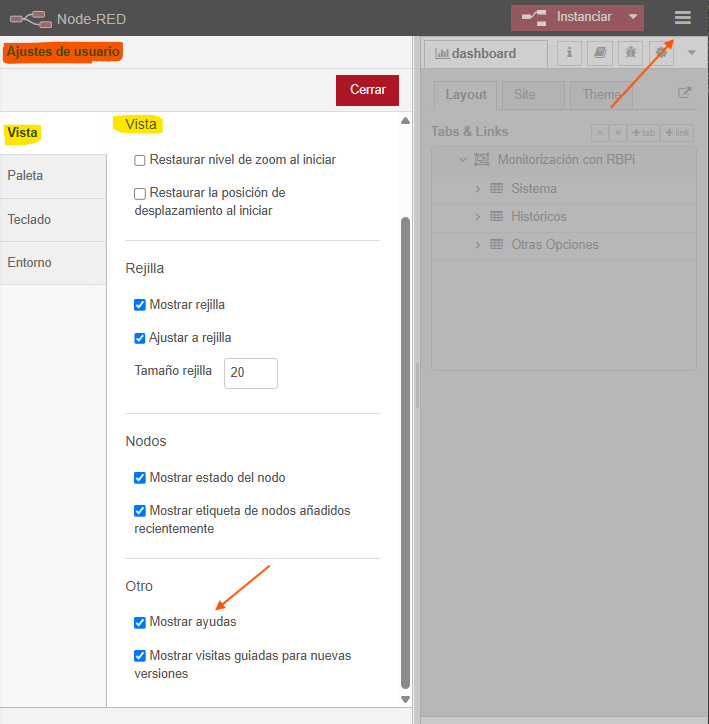

# NODE-RED EN LA INDUSTRIA 4.0 COMUNICACIONES IOT

- [NODE-RED EN LA INDUSTRIA 4.0 COMUNICACIONES IOT](#node-red-en-la-industria-40-comunicaciones-iot)
  - [Industria 4.0 IoT y Node-RED](#industria-40-iot-y-node-red)
  - [Introducción a Node-RED](#introducción-a-node-red)
  - [Instalación y Ejecución de Node-RED](#instalación-y-ejecución-de-node-red)
  - [Entorno de desarrollo de Node-RED](#entorno-de-desarrollo-de-node-red)
  - [Ejercicio - El entorno de desarrollo de Node-RED](#ejercicio---el-entorno-de-desarrollo-de-node-red)
  - [Elementos Básicos](#elementos-básicos)
    - [Los Flujos](#los-flujos)
    - [Los Subflujos](#los-subflujos)
    - [Los Nodos](#los-nodos)
    - [Los Conectores](#los-conectores)
      - [Insertar un nodo entre conectores](#insertar-un-nodo-entre-conectores)
    - [El Mensaje](#el-mensaje)
    - [Almacenes de Información](#almacenes-de-información)
  - [Ejercicio: Export e Import](#ejercicio-export-e-import)
    - [Ejercicio con Export](#ejercicio-con-export)
    - [Ejercicio con Import](#ejercicio-con-import)
  - [Nodos Básicos de Node-RED](#nodos-básicos-de-node-red)

- - -

## Industria 4.0 IoT y Node-RED

Es una revolución industrial en la que la comunicación entre los dispositivos es un factor clave para la eficiencia y la eficacia de las operaciones. Node-RED es una herramienta poderosa para la integración de la industria 4.0 que permite integrar el hardware y el software de forma eficiente.

## Introducción a Node-RED

Node-RED es un entorno de desarrollo de flujo de datos que permite crear, visualizar y administrar flujos de datos en tiempo real. Permite la programación orientada a eventos.

Cada dispositivo: PLC, RBPi, Arduino, etc. para interactuar e intercambiar información con el resto de dispositivos, se realiza a través de los llamados _nodos_ en Node-RED.

- **Nodos** son los dispositivos que se conectan con Node-RED y se utilizan para procesar la información y enviarla a otros nodos.
- **Flujos de datos** son las conexiones entre los nodos que permite el flujo de la información.
- **Mensajes** son los datos que se transmiten entre los nodos.

El entorno de desarrollo de Node-RED permite crear, visualizar y administrar flujos de datos en tiempo real. Permite la programación orientada a eventos:

- Utiliza un navegador de internet.
- Muy intuitivo.
- Rápico y fácil de utilizar.

## Instalación y Ejecución de Node-RED

- [Node.js](https://nodejs.org/es/download/)
- [npm](https://www.npmjs.com/)
- [node-red](https://github.com/node-red/node-red)
- [node-red-admin](https://github.com/node-red/node-red-admin)
- [Node-RED](https://nodered.org/)

Como primer paso, se debe instalar Node.js y npm.

- Node.js:
  - Es un entorno de ejecución de JavaScript.
  - Orientado a eventos asíncronos.
  - Es de código abierto y multiplataforma.

En Windows una vez instalado _Node.js_ ejecutar el siguiente comando: `npm install -g node-red`. Al terminar de ejecutar el proceso se verá algo similar a: _nore-red@1.0.0_ added 332 packages from 1 contributor_.

Una vez instalado, para iniciar el programa: lo podemos hacer desde la línea de comandos escribiendo: _`node-red`_. 

En el arranque realiza un proceso de comprobaciones:

Una vez que finaliza el arranque, nos dirigimos a la URL: _`http://localhost:1880`_.

## Entorno de desarrollo de Node-RED

Node-RED es una herramienta para la gestión de flujos de información. Para ello se utiliza un entorno de desarrollo en el que se pueden crear, visualizar y administrar flujos de datos en tiempo real. Orientado a eventos.

Los **nodos** son los dispositivos que se conectan con Node-RED y se utilizan para procesar la información y enviarla a otros nodos.

Los **flujos de datos** son las conexiones entre los nodos origen con los nodos destinos, permitiendo el flujo de la información entre ellos.

Los **mensajes** son los datos que se transmiten entre los nodos, es decir, la información que se pasa de un nodo a otro.

## Ejercicio - El entorno de desarrollo de Node-RED

El entorno de funcionamiento de Node-RED.

Del menú principal _Export_ permite la exportación del nodo seleccionado, también puede ser el flujo actual o todos los flujos. Con la exportación de todos los flujos _All flows_ se guarda la aplicación completa.

El proceso _Import_ permite la importación de nodos o flujos de Node-RED. Este proceso se puede realizar desde archivos JSON o copiando y pegando el contenido del código JSON.

## Elementos Básicos

- Abrir la ventana de línea de comandos (CMD)
- Teclear la palabra Node-Red.
- Abrir el navegador Web.
- Ingresar a la URL: _`http://localhost:1880`_.

### Los Flujos

**Flujos**. Segmento que contiene un conjunto de nodos interconectados o no, que brindan una determinada funcionalidad.

Cada **flujos** pueden contener:

- Subflujos.
- Nodos.

Las propiedades de un **flujo**, dando doble clic al nombre del flujo, son:

- Nombre.
- Delete.
- Cancel.
- Done.
- Description.
- Enabled.

### Los Subflujos

Los **subflujos** son una colección de nodos agrupados en un nodo simple.

- Permiten que exista funcionalidad agrupada.
- Esta funcionalidad puede ser llamada o ejecutada en múltiples ocasiones.
- Reducen la complejidad visual del flujo.
- Solo aceptan una conexión de entrada. Es obligatorio contar con una.
- Permiten la definición de propiedades que se convertirán en variables que comparten información con el exterior.

Para crear un **subflujo**:

- Un nuevo subflujo vacío: Menú _Subflow > Create Subflow_.
- Seleccionando nodos:
  - Seleccionar los nodos que se desea convertir en subflujo.
  - Seleccionar la opción _Subflow > Selectrion to Subflow_.

Propiedades de un **subflujo**:

- Se crea un nodo en la paleta de nodos.
- Cuenta con propiedades como cualquier nodo.

Editar el contenido del **subflujo**:

- Se selecciona la opción.

### Los Nodos

El **nodo** esun bloque de información que realiza una actividad específica.

- Base del funcionamiento de Node-RED.
- Existen los fundamentales y los externos.
- Contienen:
  - Identificador de nodo.
  - Un tipo.
  - Descripción.

### Los Conectores

Los **conectores** son las líneas que unen los nodos.

- Indican de dónde a dónde viaja el mensaje.
- Siempre tienen un solo sentido.

#### Insertar un nodo entre conectores

- Cuando se tiene dos nodos unidos por un conector.
- Se arrastra otro nodo entre ambos.
- Al aparecer la línea punteada, soltamos el clic del mouse y el nodo se interta entre los dos nodos.

Para mover el conector a otro nodo:

- Se oprime la tecla _Shift_ y se da clic con el mouse, se suelta _Shift_ y se puede mover el conector a otro nodo.

### El Mensaje

El **mensaje** es la información que se pasa de un nodo a otro.

- Su cuerpo está construido como un objeto de JavaScript.
- Sus principales propiedades son:
  - _Payload_. Contiene el cuerpo del mensaje. Se puede cambiar.
  - _Topic_. Indica el tópico del mensaje. Se puede cambiar.
  - Msg_id. Identificador del mensaje. No se puede cambiar.
- Es posible agregarles propiedades personalizadas.

### Almacenes de Información

El **almacen de información** son lugares permitidos por Node-RED para almacenar información de manera temporal o permanente.

- Permiten que pequeños bloques de información sean almacenados.
- Permiten que la información sea compartida entre flujos o nodos.
- Tienen alcance:
  - Global.
  - Flujo.
  - Nodo.

## Ejercicio: Export e Import

1. Añadir nodo _inject_.
2. Añadir nodo _debug_.
3. Unir ambos nodos.
4. Cambiar el _Payload_ del nodo _inject_ y elegir que sea de tipo _String_ para poder enviar una cadena de textos.
5. Escribir el texto _Hello World_ en el _Payload_ del nodo _inject_.
6. Hacer un _Deploy_.
7. En la ventana de _Debug_ observar la cadena de textos recibida, tras la ejecución del flujo.

### Ejercicio con Export

Para que se grabe toda la pantalla del flujos. Seleccionar la opcion _File > Export_. Aparece el siguiente cuadro:

En cuadro anterior, aparece la opción de copiar al portapapeles o de descargar.

### Ejercicio con Import

Para que se importe toda la pantalla del flujos. Seleccionar la opcion _File > Import_. Aparece el siguiente cuadro:

Se puede seleccionar un archivo para importar o copiar y pegar el contenido del cuadro el código JSON.

- - -

## Nodos Básicos de Node-RED