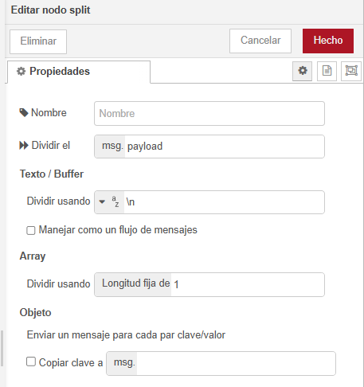

# NODE-RED EN LA INDUSTRIA 4.0 COMUNICACIONES IOT

- [NODE-RED EN LA INDUSTRIA 4.0 COMUNICACIONES IOT](#node-red-en-la-industria-40-comunicaciones-iot)
  - [Industria 4.0 IoT y Node-RED](#industria-40-iot-y-node-red)
  - [Introducción a Node-RED](#introducción-a-node-red)
  - [Instalación y Ejecución de Node-RED](#instalación-y-ejecución-de-node-red)
  - [Entorno de desarrollo de Node-RED](#entorno-de-desarrollo-de-node-red)
  - [Ejercicio - El entorno de desarrollo de Node-RED](#ejercicio---el-entorno-de-desarrollo-de-node-red)
  - [Elementos Básicos](#elementos-básicos)
    - [Los Flujos](#los-flujos)
    - [Los Subflujos](#los-subflujos)
    - [Los Nodos](#los-nodos)
    - [Los Conectores](#los-conectores)
      - [Insertar un nodo entre conectores](#insertar-un-nodo-entre-conectores)
    - [El Mensaje](#el-mensaje)
    - [Almacenes de Información](#almacenes-de-información)
  - [Ejercicio: Export e Import](#ejercicio-export-e-import)
    - [Ejercicio con Export](#ejercicio-con-export)
    - [Ejercicio con Import](#ejercicio-con-import)
  - [Nodos Básicos de Node-RED](#nodos-básicos-de-node-red)
    - [Nodos Comunes](#nodos-comunes)
      - [Puertos de un Nodo](#puertos-de-un-nodo)
      - [Etiqueta del Puerto](#etiqueta-del-puerto)
      - [Nodos con Status](#nodos-con-status)
      - [Cambios sin Deploy](#cambios-sin-deploy)
      - [Errores de configuración](#errores-de-configuración)
      - [Propiedades y Operaciones de los Nodos](#propiedades-y-operaciones-de-los-nodos)
      - [Iconografía del nodo](#iconografía-del-nodo)
      - [Nodo INJECT](#nodo-inject)
      - [Nodo DEBUG](#nodo-debug)
      - [Nodo COMPLETE](#nodo-complete)
      - [Nodo CATCH](#nodo-catch)
      - [Nodo STATUS](#nodo-status)
      - [Nodo LINK IN y LINK OUT](#nodo-link-in-y-link-out)
      - [Nodo COMMENT](#nodo-comment)
    - [Ejercicio con nodos INJECT y DEBUG](#ejercicio-con-nodos-inject-y-debug)
    - [Nodos FUNCTIONS](#nodos-functions)
      - [Nodo SWITCH](#nodo-switch)
      - [Nodo CHANGE](#nodo-change)
      - [Nodo RANGE](#nodo-range)
      - [Nodo TEMPLATE](#nodo-template)
      - [Nodo DELAY](#nodo-delay)
      - [Nodo TRIGGER](#nodo-trigger)
      - [Nodo EXEC](#nodo-exec)
  - [Ejercicios con Nodos FUNCTION y COMMONS](#ejercicios-con-nodos-function-y-commons)
  - [Ejercicio Switch](#ejercicio-switch)
  - [Ejercicio Change](#ejercicio-change)
  - [Ejercicio Delay y Máquina de Estados](#ejercicio-delay-y-máquina-de-estados)
  - [Nodo Template](#nodo-template-1)
  - [Nodo RBE](#nodo-rbe)
  - [Ejercicio Split](#ejercicio-split)

- - -

## Industria 4.0 IoT y Node-RED

Es una revolución industrial en la que la comunicación entre los dispositivos es un factor clave para la eficiencia y la eficacia de las operaciones. Node-RED es una herramienta poderosa para la integración de la industria 4.0 que permite integrar el hardware y el software de forma eficiente.

## Introducción a Node-RED

Node-RED es un entorno de desarrollo de flujo de datos que permite crear, visualizar y administrar flujos de datos en tiempo real. Permite la programación orientada a eventos.

Cada dispositivo: PLC, RBPi, Arduino, etc. para interactuar e intercambiar información con el resto de dispositivos, se realiza a través de los llamados _nodos_ en Node-RED.

- **Nodos** son los dispositivos que se conectan con Node-RED y se utilizan para procesar la información y enviarla a otros nodos.
- **Flujos de datos** son las conexiones entre los nodos que permite el flujo de la información.
- **Mensajes** son los datos que se transmiten entre los nodos.

El entorno de desarrollo de Node-RED permite crear, visualizar y administrar flujos de datos en tiempo real. Permite la programación orientada a eventos:

- Utiliza un navegador de internet.
- Muy intuitivo.
- Rápico y fácil de utilizar.

## Instalación y Ejecución de Node-RED

- [Node.js](https://nodejs.org/es/download/)
- [npm](https://www.npmjs.com/)
- [node-red](https://github.com/node-red/node-red)
- [node-red-admin](https://github.com/node-red/node-red-admin)
- [Node-RED](https://nodered.org/)

Como primer paso, se debe instalar Node.js y npm.

- Node.js:
  - Es un entorno de ejecución de JavaScript.
  - Orientado a eventos asíncronos.
  - Es de código abierto y multiplataforma.

En Windows una vez instalado _Node.js_ ejecutar el siguiente comando: `npm install -g node-red`. Al terminar de ejecutar el proceso se verá algo similar a: _nore-red@1.0.0_ added 332 packages from 1 contributor_.

Una vez instalado, para iniciar el programa: lo podemos hacer desde la línea de comandos escribiendo: _`node-red`_.

En el arranque realiza un proceso de comprobaciones:


Una vez que finaliza el arranque, nos dirigimos a la URL: _`http://localhost:1880`_.


## Entorno de desarrollo de Node-RED

Node-RED es una herramienta para la gestión de flujos de información. Para ello se utiliza un entorno de desarrollo en el que se pueden crear, visualizar y administrar flujos de datos en tiempo real. Orientado a eventos.

Los **nodos** son los dispositivos que se conectan con Node-RED y se utilizan para procesar la información y enviarla a otros nodos.

Los **flujos de datos** son las conexiones entre los nodos origen con los nodos destinos, permitiendo el flujo de la información entre ellos.

Los **mensajes** son los datos que se transmiten entre los nodos, es decir, la información que se pasa de un nodo a otro.


## Ejercicio - El entorno de desarrollo de Node-RED

El entorno de funcionamiento de Node-RED.


Del menú principal _Export_ permite la exportación del nodo seleccionado, también puede ser el flujo actual o todos los flujos. Con la exportación de todos los flujos _All flows_ se guarda la aplicación completa.


El proceso _Import_ permite la importación de nodos o flujos de Node-RED. Este proceso se puede realizar desde archivos JSON o copiando y pegando el contenido del código JSON.


## Elementos Básicos

- Abrir la ventana de línea de comandos (CMD)
- Teclear la palabra Node-Red.
- Abrir el navegador Web.
- Ingresar a la URL: _`http://localhost:1880`_.

### Los Flujos

**Flujos**. Segmento que contiene un conjunto de nodos interconectados o no, que brindan una determinada funcionalidad.

Cada **flujos** pueden contener:

- Subflujos.
- Nodos.

Las propiedades de un **flujo**, dando doble clic al nombre del flujo, son:

- Nombre.
- Delete.
- Cancel.
- Done.
- Description.
- Enabled.

### Los Subflujos

Los **subflujos** son una colección de nodos agrupados en un nodo simple.

- Permiten que exista funcionalidad agrupada.
- Esta funcionalidad puede ser llamada o ejecutada en múltiples ocasiones.
- Reducen la complejidad visual del flujo.
- Solo aceptan una conexión de entrada. Es obligatorio contar con una.
- Permiten la definición de propiedades que se convertirán en variables que comparten información con el exterior.

Para crear un **subflujo**:

- Un nuevo subflujo vacío: Menú _Subflow > Create Subflow_.
- Seleccionando nodos:
  - Seleccionar los nodos que se desea convertir en subflujo.
  - Seleccionar la opción _Subflow > Selectrion to Subflow_.


Propiedades de un **subflujo**:

- Se crea un nodo en la paleta de nodos.
- Cuenta con propiedades como cualquier nodo.

Editar el contenido del **subflujo**:

- Se selecciona la opción.

### Los Nodos

El **nodo** esun bloque de información que realiza una actividad específica.

- Base del funcionamiento de Node-RED.
- Existen los fundamentales y los externos.
- Contienen:
  - Identificador de nodo.
  - Un tipo.
  - Descripción.

### Los Conectores

Los **conectores** son las líneas que unen los nodos.

- Indican de dónde a dónde viaja el mensaje.
- Siempre tienen un solo sentido.

#### Insertar un nodo entre conectores

- Cuando se tiene dos nodos unidos por un conector.
- Se arrastra otro nodo entre ambos.
- Al aparecer la línea punteada, soltamos el clic del mouse y el nodo se interta entre los dos nodos.


Para mover el conector a otro nodo:

- Se oprime la tecla _Shift_ y se da clic con el mouse, se suelta _Shift_ y se puede mover el conector a otro nodo.

### El Mensaje

El **mensaje** es la información que se pasa de un nodo a otro.

- Su cuerpo está construido como un objeto de JavaScript.
- Sus principales propiedades son:
  - _Payload_. Contiene el cuerpo del mensaje. Se puede cambiar.
  - _Topic_. Indica el tópico del mensaje. Se puede cambiar.
  - Msg_id. Identificador del mensaje. No se puede cambiar.
- Es posible agregarles propiedades personalizadas.

### Almacenes de Información

El **almacen de información** son lugares permitidos por Node-RED para almacenar información de manera temporal o permanente.

- Permiten que pequeños bloques de información sean almacenados.
- Permiten que la información sea compartida entre flujos o nodos.
- Tienen alcance:
  - Global.
  - Flujo.
  - Nodo.


## Ejercicio: Export e Import

1. Añadir nodo _inject_.
2. Añadir nodo _debug_.
3. Unir ambos nodos.
4. Cambiar el _Payload_ del nodo _inject_ y elegir que sea de tipo _String_ para poder enviar una cadena de textos.
5. Escribir el texto _Hello World_ en el _Payload_ del nodo _inject_.
6. Hacer un _Deploy_.
7. En la ventana de _Debug_ observar la cadena de textos recibida, tras la ejecución del flujo.

### Ejercicio con Export

Para que se grabe toda la pantalla del flujos. Seleccionar la opcion _File > Export_. Aparece el siguiente cuadro:


En cuadro anterior, aparece la opción de copiar al portapapeles o de descargar.

### Ejercicio con Import

Para que se importe toda la pantalla del flujos. Seleccionar la opcion _File > Import_. Aparece el siguiente cuadro:


Se puede seleccionar un archivo para importar o copiar y pegar el contenido del cuadro el código JSON.

- - -

## Nodos Básicos de Node-RED

### Nodos Comunes

Para incluir un nodo, existen dos formas de agragarlo:

- Seleccionar el nodo en la paleta de nodos y arrastrarlo al flujo.
- Desde la ventana de acceso rápido.
  - Oprimiendo la tecla Ctrl+Clic con el mouse.

#### Puertos de un Nodo

- Son los cuadros que aparecen en el borde del nodo.
- Los nodos se unen uno con otro por medio de líneas llamadas _wire_ (cables) que salen de sus puertos.
- Por convención:
  - El puerto de entrada (lado izquierdo) se llama _In_.
  - El puerto de salida (lado derecho) se llama _Out_.

#### Etiqueta del Puerto

El puerto muestra una etiqueta al pasar el mouse sobre el recuadro del puerto.

Esta etiqueta se puede modificar en la sección de apariencia en el interior del nodo.

#### Nodos con Status

Algunos nodos muestran su estado con un icono en su parte inferior.


El icono muestra su estado en el entorno de ejecución.

> [!NOTE]
>
> Entorno de ejecución es el proceso oculto que ejecuta los flujos.

#### Cambios sin Deploy

Cuando un nodo tiene un círculo azul en la zona superior significa que existe modificaciones que no se han actualizado al entorno de ejecución.


#### Errores de configuración

Si el nodo muestra un triángulo naranja en su parte superior, significa que hay un error en su configuración.


#### Propiedades y Operaciones de los Nodos

Al dar doble clic sobre un nodo:

- **Delete**. Borra el nodo actual.
- **Cancel**. Cancela la edición de las propiedades del nodo.
- **Done**. Guarda las propiedades del nodo.
- **Enabled**. Habilita o deshabilita el nodo seleccionado.

Dentro de las propiedades de los nodos una de las más importantes es:

- **Description**. Descripción del nodo.

En esta sección permite capturar la descripción de la funcionalidad del nodo. Tienen elementos que permiten dar formato enriquecido al texto.

#### Iconografía del nodo

La mayor parte de los nodos comparten opciones de personalización y configuración:

- _Configuration_. Configuración de las propiedades y acciones del nodo.
- _Description_. Descripción de la funcionalidad y objetivo del nodo.
- _Apariencia_. Apariencia gráfica del nodo.


#### Nodo INJECT


- Permite enviar mensajes al entorno de ejecución.
- Dispara la ejecución.
- Puede ejecutar en automático o de forma manual.
- El mensaje que envía puede tener las propiedades _payload_ y _topic_ establecidas.


- _Payload_. Es el cuerpo del mensaje y la propiedad principal.
- _Topic_. Es el tema del mensaje y es complementaria al mensaje.
- _Repeat_. Indica el número de veces que se repite el mensaje.
- _Name_. Es el nombre del nodo.

#### Nodo DEBUG


- Utilizado para depurar el entorno de ejecución.
- Permite enviar mensajes al entorno de ejecución.


- _Output_. Es el cuerpo del mensaje y la propiedad principal, es decir, lo que queremos ve.
- _To_. Configuramos la salida o ventana donde queremos que nos muestre la información. Existen tres tipos de ventanas:
  - _debug windows_.
  - _system console_.
  - _node status (32 characters)_.
- _Name_. Es el nombre del nodo.

#### Nodo COMPLETE


- Ejecuta un nodo al terminar la ejecución de otro.


- _Select nodes_. Selección de nodos que dispararán su ejecución.
- _Name_. Es el nombre del nodo.

> [!NOTE]
>
> No todos los nodos permiten la ejecución de COMPLETE, esto depende de la codificación del nodo.

#### Nodo CATCH


- Permite capturar mensajes del entorno de ejecución.
- Atrapa errores en los nodos de la misma pestaña.
- Permite la ejecución de flujo de corrección del error.
- Genera las siguientes propiedades:
  - _Error.message_.
  - _Error.source.id_.
  - _Error.source.type_.
  - _Error.source.name_.


- _Catch errors from_. Lista de nodos a monitorizar.
- _Ignore errors_. Ignora errores atrapados en otro nodo.
- _Name_. Es el nombre del nodo.

#### Nodo STATUS


- Atrapa el estado de ciertos nodos, normalmente los que aceptan comunicaciones.
- Genera las siguientes propiedades:
  - _Status.text_.
  - _Status.source.id_.
  - _Status.source.type_.
  - _Status.source.name_.


- _Report status from_. Lista de nodos a monitorizar.
- _Name_. Es el nombre del nodo.

> [!NOTE]
>
> No todos los nodos permiten la ejecución de STATUS, esto depende de la codificación del nodo.


#### Nodo LINK IN y LINK OUT


- Establecen uniones virtuales entre flujos.
- Dan claridad en el entorno gráfico.
- Permiten unir flujos en diferentes pestañas.


- _Name_. Nombre del nodo.
- _Flujo_. Flujo e identificador de la liga. Debe ser el mismo en Link IN y Link OUT.

#### Nodo COMMENT


- Sirve para documentar la funcionalidad del flujo.
- Se puede usar texto enriquecido o HTML.
- El texto aparece del lado derecho en la zona de descripción.


- _Name_. Nombre del nodo.
- _Editor_. Editor de texto.

### Ejercicio con nodos INJECT y DEBUG

Ejemplo I:

1. Nodo INJECT con _payload_ &rarr; `timestamp`. Envía un mensaje con la propiedad _payload_ con la fecha y hora actual.
2. Nodo DEBUG con _Output_ &rarr; `payload` y _debug windows_. Recibe el mensaje enviado por el nodo INJECT. Fecha en formato numérico.

Ejemplo II:

1. Nodo INJECT con _payload_ &rarr; `cadena`. Envía un mensaje con la propiedad _payload_ de tipo string "cadena". _Repeat_ por _interval_.
2. Nodo DEBUG con _Output_ &rarr; `` y _debug windows_. Recibe el mensaje enviado por el nodo INJECT. Cadena de textos.
  
Ejemplo III:

1. Nodo INJECT con _payload_ &rarr; `{{"valor1}:"123","valor2":"456"}}}`. Envía un objeto JSON con la propiedad _payload_. _Repeat_ por _interval_ de 5 segundos.
2. Nodo DEBUG con _Output_ &rarr; `payload` y _debug windows_. Recibe el mensaje enviado por el nodo INJECT. Objeto JSON.

Ejemplo IV:

1. Nodo INJECT con _payload_ &rarr; `[49,44,55]`. Envía un dato de tipo ARRAY con la propiedad _payload_. _Repeat_ por _interval_ de 5 segundos.
2. Nodo DEBUG con _Output_ &rarr; `payload` y _debug windows_. Recibe el mensaje enviado por el nodo INJECT. Array.

Ejemplo V:

1. Nodo INJECT con _payload_ &rarr; `true`. Envía un dato de tipo BOOLEAN con la propiedad _payload_. _Repeat_ por _interval_ de 5 segundos.
2. Nodo DEBUG con _Output_ &rarr; `payload` y _debug windows_. Recibe el mensaje enviado por el nodo INJECT. Booleano.

Ejemplo VI:

1. Nodo INJECT con _payload_ &rarr; `null`. Envía un dato de tipo NULL con la propiedad _payload_. _Repeat_ por _interval_ de 5 segundos.
2. Nodo DEBUG con _Output_ &rarr; `payload` y _debug windows_. Recibe el mensaje enviado por el nodo INJECT. NULL.

### Nodos FUNCTIONS


- Permite la ejecución de código JavaScript.
- Los mensajes llegan como un objeto llamado **msg**.


- _Name_. Nombre del nodo.
- _Function_. Cuerpo de la función, es el código que realiza alguna acción. Código JavaScript.
- Ejemplo de _Function_: `return msg;`.
- _Output_. Es el cuerpo del mensaje y la propiedad principal, es decir, lo que queremos ve. Pueden regresar más de un valor.

#### Nodo SWITCH


- Rutea mensajes basándose en sus propiedades o en posiciones.
- Genera distintos puertos y dependiendo de si la condición es válida o no, se va por uno o por el otro.
- Este nodo permite la ejecución de diferentes flujos dependiendo del mensaje.


- _Name_. Nombre del nodo.
- _Property_. Propiedad base a evaluar para la comparación y posterior conmutación.
- _Add_. Agrega otra regla de comparación.
- _Checking all rules_. Validación de todas las reglas o cuando se cumple la primera regla salir por ese puerto en particular.

#### Nodo CHANGE


- Cambia los valores de las propiedades, contexto de flujos o globales.


- _Name_. Nombre del nodo.
- _Rules_. Reglas en las que se va a realizar el cambio. Permite cuatro operaciones básicas:
  - _Set_. Establece el valor de la propiedad.
  - _Change_. Busca y reemplaza partes de la propiedad.
  - _Delete_. Borra la propiedad.
  - _Move_. Mueve el valor de una propiedad a otra propiedad.
- _Add_. Agrega otra regla.

#### Nodo RANGE


- Convierte un valor numérico en otro rango.


- _Property_. Propiedad a convertir. Ejemplo: `msg.payload`.
- _Action_. Acción a realizar.
- _Mapeo_. Valor de entrada y salida que se quiere aplicar.
- _Name_. Nombre del nodo.

#### Nodo TEMPLATE


- Muestra una propiedad basándose en la plantilla establecida.


- _Name_. Nombre del nodo.
- _Property_. Propiedad a ser mapeada.
- _Template_. Plantilla que se va a utilizar_.
- _Format_. Formato que se requiere aplicar.
- _Output_. Es el cuerpo del mensaje y la propiedad principal, es decir, lo que queremos ve.

Ejemplo del uso del nodo TEMPLATE:

- Entradas:
  - msg : contiene la información para llenar la plantilla.
  - template
- Salidas:
  - msg

- Plantilla: `Hola {{payload.name}}. Hoy es {{date}}`.
- Recibe: `{date : 'Lunes', payload : {name : 'Alex'}}`.
- Resultado: `Hola Alex. Hoy es Lunes.`

#### Nodo DELAY


- Retrasa el tiempo en que pasa cada mensaje.


- _Action_. Retraso en tiempo o detener el flujo a intervalor.
- _For_. Periodo de tiempo de tiempo de espera.
- _Name_. Nombre del nodo.

#### Nodo TRIGGER


- Dispara un mensaje.


- _Send_. Enviar el mensaje.
- _Then_. Configurar la acción a realizar posterior al envío del mensaje.
- _Then send_. Segundo mensaje a ser enviado.
- _Reset the trigger if_. Forma en la que se reinicia el trigger.
- _Handling_. Manejo del trigger de manera síncrona.

#### Nodo EXEC


- Ejecuta un proceso de sistema operativo.
- Permite intercambiar información con otro programa del sistema.

 

- _Command_. Mensaje para ser enviado.
- _Append_. Adjunta parámetros de inicio.
- _Output_. Configuración para el tipo de salida que se requiere.
- _Timeout_. Tiempo de espera en segundos.
- _Name_. Nombre del nodo.

## Ejercicios con Nodos FUNCTION y COMMONS


1. Nodo _Inject_ pasa mensaje a nodo _Function_ y éste a nodo _Debug_.
2. Nodo _Catch_ pasa mensaje a nodo _Function_ y éste a nodo _Debug_.
3. Nodo _Status_ pasa mensaje a nodo _Function_ y éste a nodo _Debug_.
4. Nodo _Complete_ se conecta a nodo _Debug_.

Código del nodo _Function_ de la conexión número 1:

```javascript
node.log("Mensaje a Consola");
node.warn("Advertencia");
node.error("Error", msg);
msg.payload = "Continúa la ejecución";
node.status({fill:"red",shape:"ring",text:"disconnected"});
return msg;
```

Código de la _Function_ de la conexión número 2:

```javascript
msg.payload = "Terminó el flujo";
node.send(msg);
msg.payload = "Se atrapó el error";
return msg;
```

Código de la _Function_ de la conexión número 3:

```javascript
msg.payload = "Estátus Activado";
return msg;
```


## Ejercicio Switch

En este ejercicio se utiliza el nodo _Switch_. Para ello se incluyen cinco nodos _Inject_ y en cada uno:

- `Payload = 1` de tipo _string_.
- `Payload = 2` de tipo _string_.
- `Payload = 3` de tipo _string_.
- `Payload = hola mundo` de tipo _string_.
- `Payload = Esto es una prueba` de tipo _string_.


Dentro del nodo _Switch_ que nos sirve para filtrar las entradas, tenemos la siguiente configuración:


```json
Property: msg.payload
== 1 (String)
!= 2 (String)
is between 3 and 5 (Number)
contains hola (String)
matches regex ((\w+)\s(\w+)\s(\w+)) (String)

checking all rules
```

## Ejercicio Change

Para realizar este ejercicio se utilizarán varios nodos de tipo _Change_. Cuya función es cambiar el contenido de las propiedades del mensaje.


Las opciones que presenta el nodo _Change_ son:

- _Set_. Establece el valor de la propiedad.
- _Change_. Busca y reemplaza el valor.
- _Delete_. Borra la propiedad.
- _Move_. Mueve el valor de una propiedad a otra propiedad.


Se puede aplicar sobre el mensaje de entrada `msg`, sobre una variable en el contexto de flujo presente `flow` o sobre una variable global `global`.

Se puede cambiar a todos los valores que aparecen en la lista desplegable:


En el nodo _Debug_ marcar a opción `complete msg object` para que puede mostrar todo el contenido del mensaje.

Configuración de los nodos _Change_:


## Ejercicio Delay y Máquina de Estados

Una máquina de estados es un sistema que realiza la ejecución por pasos.


1. Nodo _Inject_.
2. Nodo _Change_.
3. Nodo _Function_ (parámetros iniciales). Nodo _Link IN_.
4. Nodo _Function_.
5. Ndodo _Delay_.
6. Nodo _Switch_. Conecta con los siguientes nodos:
   1. Nodo _Change_ nº1. &rarr; Nodo _Link OUT_.
   2. Nodo _Change_ nº2. &rarr; Nodo _Link OUT_.
   3. Nodo _Change_ nº3. &rarr; Nodo _Link OUT_.
   4. Nodo _Change_ nº4. &rarr; Nodo _Link OUT_.
   5. Nodo _Change_ nº5. &rarr; Nodo _Link OUT_.
   6. Nodo _Function_ &rarr; Nodo _Debug_.

El funcionamiento, es que cada segundo va disparando un mensaje incremental.

En el primer _Change_ se valida la variable `set: flow.ProcesoCiclico to false`.

En el nodo _Function_ se establecen los parámetros de inicio:

```javascript
msg.payload = 0;  //SET del primer paso
msg.delay = 1000; //Tiempo de espera en milisegundos
msg.resetProceso = false; //Define si el proceso entra en un ciclo infinito
return msg;
```

El otro nodo _Function_ está vacío. Únicamente se dispone de la línea de código `return msg;`.

El nodo _Delay_ se configura para que espere 2 segundos, configuración: `delay each message`.

El nodo _Switch_ se configura para que se disparen los nodos _Change_:

- Property = `msg.payload`.
- `== 0 (Number)`. &rarr; regla 1
- `== 1 (Number)`. &rarr; regla 2
- `== 2 (Number)`. &rarr; regla 3
- `== 3 (Number)`. &rarr; regla 4
- `== 4 (Number)`. &rarr; regla 5
- `== 5 (Number)`. &rarr; regla 6

Configuración del primer nodo _Change_:

- Set: `msg.payload`.
- to: `$number(msg.payload) + 1` (J: expresión).

Configuración del nodo _Function_:

```javascript
var varProcesoCiclico = flow.get('ProcesoCiclico');

if (varProcesoCiclico === true) {
    msg.payload = 0;
    return [msg,null];
} else {
    msg.payload = "Terminado el proceso";
    return [null,msg];
}
```

## Nodo Template

El nodo _Template_ es una plantilla.


- Nodo _Inject_. Propiedad `Payload = (string) Prueba`.
- Nodo _Template_. Template: `Mensaje recibido: {{payload}}`.


## Nodo RBE

El nodo _RBE_ (Rule Based Engine) es un motor de reglas. Está en el grupo de nodos de funciones. Aparece con el nombre de _Filter_ (filtrar)

")


- Nodo _Inject_. Propiedad `Payload = (string) Mensaje 1`. Repetir `intervalo` 1 segundo.
- Nodo _Inject_. Propiedad `Payload = (string) Mensaje 2`. Repetir `none`.
- Nodo _RBE_. Propiedad: `msg.payload`.

El objetivo del nodo _RBE_ es limitar el número de mensajes entrantes que sean iguales. Solo deja pasar uno de los dos mensajes. Es útil cuando se tienen dos sensores y uno de ellos está arrojando información de manera constante.

## Ejercicio Split

El nodo de secuencia _Split_ (dividir).

 conectado para ejemplo")

- Nodo _Inject_. Propiedad `Payload = (string) Curso IoT4`.
- Nodo _Split_. Propiedad: `Dividir usando: \n` es el valor por defecto. Si lo cambiamos por un espacio en blanco: `Split using: Espacios en blanco`. La frase de entrada la dividimos en palabras.

