# Índice EMQX

- [Índice EMQX](#índice-emqx)
  - [S1 - INTRODUCCIÓN AL SERVICIO IOT CON MQTT Y EL BROKER EMQX](#s1---introducción-al-servicio-iot-con-mqtt-y-el-broker-emqx)
    - [Recursos de Aprendizaje](#recursos-de-aprendizaje)
    - [Introducción al EMQX](#introducción-al-emqx)
    - [IoT Internet de las Cosas](#iot-internet-de-las-cosas)
      - [Concepto de planeta más inteligente](#concepto-de-planeta-más-inteligente)
    - [Telemetría e Internet](#telemetría-e-internet)
  - [S2 - CARACTERÍSTICAS DEL PROTOCOLO MQTT](#s2---características-del-protocolo-mqtt)
    - [MQTT Protocol - Inicios](#mqtt-protocol---inicios)
    - [MQTT Publicación-Suscripción](#mqtt-publicación-suscripción)
    - [MQTT Publicar - Suscribirse - Desuscribirse](#mqtt-publicar---suscribirse---desuscribirse)
      - [Conexión MQTT](#conexión-mqtt)
      - [Publicación MQTT](#publicación-mqtt)
      - [Suscribirse MQTT](#suscribirse-mqtt)
      - [Desuscribirse MQTT](#desuscribirse-mqtt)
    - [MQTT Estructura de los Tópicos](#mqtt-estructura-de-los-tópicos)
      - [Tópicos](#tópicos)
      - [Comodines](#comodines)
      - [Cómo Planificar un Tópico](#cómo-planificar-un-tópico)
    - [MQTT Calidad de Servicio QoS](#mqtt-calidad-de-servicio-qos)
      - [Calidad del Servicio QoS 0](#calidad-del-servicio-qos-0)
      - [Calidad del Servicio QoS 1](#calidad-del-servicio-qos-1)
      - [Calidad del Servicio QoS 2](#calidad-del-servicio-qos-2)
      - [Impacto del nivel de QoS en el rendimiento](#impacto-del-nivel-de-qos-en-el-rendimiento)
    - [MQTT Keep Alive y Mensajes](#mqtt-keep-alive-y-mensajes)
      - [Keep Alive](#keep-alive)
      - [Mensajes Retenidos en Broker MQTT](#mensajes-retenidos-en-broker-mqtt)
    - [El identificador de cliente MQTT](#el-identificador-de-cliente-mqtt)
    - [Sesiones sin Estado y con Estado (CleanSession)](#sesiones-sin-estado-y-con-estado-cleansession)
    - [MQTT Bibliografía](#mqtt-bibliografía)
  - [S3 - TODO SOBRE EL BROKER EMQX V4.4.X](#s3---todo-sobre-el-broker-emqx-v44x)
    - [EMQX V4.4.X - INTRODUCCIÓN](#emqx-v44x---introducción)
    - [INSTALACIÓN BROKER EMQX V4.4.X EN W10](#instalación-broker-emqx-v44x-en-w10)
    - [DASHBOARD Y PÁGINAS HTTP](#dashboard-y-páginas-http)
    - [CONEXIÓN POR WEBSOCKETS](#conexión-por-websockets)
    - [CLIENTE MQTT X](#cliente-mqtt-x)
    - [CONEXIÓN CON EL CLIENTE MQTTX](#conexión-con-el-cliente-mqttx)
    - [DOCUMENTACIÓN VERSIÓN V4.4.7 DEL BROKER Y CLIENTE EMQX](#documentación-versión-v447-del-broker-y-cliente-emqx)
    - [INSTALAR OPEN SSL EN WINDOWS](#instalar-open-ssl-en-windows)
    - [GENERAR LOS CERTIFICADOS AUTOFIRMADOS SSL PARA EL BROKER EMQX](#generar-los-certificados-autofirmados-ssl-para-el-broker-emqx)
      - [GENERATE SERVER CERTIFICATE](#generate-server-certificate)
    - [CONEXIÓN SEGURA SSL CON EL CLIENTE MQTTX](#conexión-segura-ssl-con-el-cliente-mqttx)
    - [CONEXIÓN SEGURA HTTPS EN DASHBOARD EMQX BROKER](#conexión-segura-https-en-dashboard-emqx-broker)
    - [PREPARAR EL ENTORNO DE AUTENTICACIÓN MySQL CON LARAGON](#preparar-el-entorno-de-autenticación-mysql-con-laragon)
      - [LARAGON](#laragon)
    - [AUTENTICACIÓN CON EL PLUGIN EMQX AUTH MYSQL](#autenticación-con-el-plugin-emqx-auth-mysql)
      - [CREAR UNA BASE DE DATOS](#crear-una-base-de-datos)
    - [EVITAR CONEXIÓN ANÓNIMAS AL BROKER EMQX](#evitar-conexión-anónimas-al-broker-emqx)
    - [LISTA DE CONTROL DE ACCESO (ACL)](#lista-de-control-de-acceso-acl)
    - [ACL - EJEMPLOS](#acl---ejemplos)
    - [INSTALAR PHPMYADMIN EN LARAGON](#instalar-phpmyadmin-en-laragon)
    - [INSTALACIÓN MQTTX BROKER EN LINUX UBUNTU 20.04.4](#instalación-mqttx-broker-en-linux-ubuntu-20044)
      - [PASOS DE LA INSTALACIÓN EN UBUNTU SERVER](#pasos-de-la-instalación-en-ubuntu-server)
    - [INSTALAR CYBERDUCK PARA FTP - SFTP EN LINUX](#instalar-cyberduck-para-ftp---sftp-en-linux)
    - [USAR CERTIFICADOS SSL AL SERVIDOR USANDO CYBERDUCK](#usar-certificados-ssl-al-servidor-usando-cyberduck)
    - [CONFIGURAR CERTIFICADOS SSL EN EL SERVIDOR EMQX BROKER EN UBUNTU SERVER](#configurar-certificados-ssl-en-el-servidor-emqx-broker-en-ubuntu-server)
    - [CONFIGURAR CERTIFICADOS SSL AL DASHBOARD EMQX BROKER EN UBUNTU SERVER](#configurar-certificados-ssl-al-dashboard-emqx-broker-en-ubuntu-server)
    - [LINUX CONFIGURAR LAMP EN UBUNTU](#linux-configurar-lamp-en-ubuntu)
    - [LINUX AUTENTICACIÓN MYSQL](#linux-autenticación-mysql)
    - [LINUX ACL CON MYSQL](#linux-acl-con-mysql)
  - [S4 - TODO SOBRE EL BROKER EMQX V5.X.X](#s4---todo-sobre-el-broker-emqx-v5xx)
    - [INSTALACIÓN EN LINUX UBUNTU](#instalación-en-linux-ubuntu)
    - [LINUX SERVER-ESTIMATE](#linux-server-estimate)
    - [LINUX RECONOCIMIENTO DEL DASHBOARD EMQX V5.X.X O SUPERIOR](#linux-reconocimiento-del-dashboard-emqx-v5xx-o-superior)
    - [CERTIFICADOS AUTOFIRMADOS PARA LINUX CON OPENSSL](#certificados-autofirmados-para-linux-con-openssl)
      - [CREAR CERTIFICADOS CA AUTOFIRMADOS CON OPENSSL](#crear-certificados-ca-autofirmados-con-openssl)
      - [EMITIR CERTIFICADOS DE SERVIDOR](#emitir-certificados-de-servidor)
    - [AGREGAR CCERTIFICADOS AL BROKER EMQX V5.8.0 EN LINUX](#agregar-ccertificados-al-broker-emqx-v580-en-linux)
    - [AUTENTICARNOS CON MYSQL EN EMQX V5.8.0](#autenticarnos-con-mysql-en-emqx-v580)
      - [CONFIGURAR CON EL PANEL DE CONTROL](#configurar-con-el-panel-de-control)
    - [REGLAS ACL EN EMQX V5.8.0 CON MYSQL EN LINUX](#reglas-acl-en-emqx-v580-con-mysql-en-linux)
  - [S5 - ANÁLISIS DEL TRÁFICO MQTT CON WIRESHARK](#s5---análisis-del-tráfico-mqtt-con-wireshark)
  - [S6 - EMQX MODO DE PRODUCCIÓN EN NUBE](#s6---emqx-modo-de-producción-en-nube)
  - [S7 - CLIENTE ESP32](#s7---cliente-esp32)
  - [S8 - CLIENTE ARDUINO UNO](#s8---cliente-arduino-uno)
  - [S9 - CLIENTE PHP](#s9---cliente-php)
  - [S10 - CLIENTE MQTT CON VUE.JS V3 POR WS Y WSS](#s10---cliente-mqtt-con-vuejs-v3-por-ws-y-wss)
  - [S11 - CLIENTE MQTT CON NODE.JS](#s11---cliente-mqtt-con-nodejs)
  - [S12 - INSTALACIÓN EMQX CON DOCKER](#s12---instalación-emqx-con-docker)
  - [S13 - INSTALACIÓN EMQX V5.8.0 USANDO DOCKER COMPOSE](#s13---instalación-emqx-v580-usando-docker-compose)
  - [S14 - PLATAFORMA IOT CLOUD V1 CONTROL CON ESP32 Y MQTT](#s14---plataforma-iot-cloud-v1-control-con-esp32-y-mqtt)
  - [S15 - PLATAFORMA IOT CLOUD V1 PROGRAMACIÓN ESP32](#s15---plataforma-iot-cloud-v1-programación-esp32)
  - [S16 - PLATAFORMA IOT CLOUD V1 PROYECTO PLATAFORMA IOT CON PHP](#s16---plataforma-iot-cloud-v1-proyecto-plataforma-iot-con-php)
  - [S17 - PRODUCCIÓN PLATAFORMA IOT CON NUBE ORACLE CLOUD](#s17---producción-plataforma-iot-con-nube-oracle-cloud)
  - [MOSQUITTO](#mosquitto)
    - [ARGUMENTOS ÚTILES PARA LA SUSCRIPCION CON MOSQUITTO](#argumentos-útiles-para-la-suscripcion-con-mosquitto)
    - [COMODINES EN MOSQUITTO](#comodines-en-mosquitto)
    - [EJEMPLOS PRÁCTICOS CON MOSQUITTO](#ejemplos-prácticos-con-mosquitto)
    - [MQTT BROKER MOSQUITTO CON CERTIFICADO SERVIDOR (SELF-SIGNED)](#mqtt-broker-mosquitto-con-certificado-servidor-self-signed)
      - [CONFIGURACIÓN DE MOSQUITTO CON CERTIFICADOS](#configuración-de-mosquitto-con-certificados)
      - [CLIENTES MOSQUITO](#clientes-mosquito)
    - [CERTIFICADOS CON EASY-RSA EN LINUX](#certificados-con-easy-rsa-en-linux)
      - [INSTALAR EASY-RSA](#instalar-easy-rsa)
      - [CREAR UN DIRECTORIO DE CERTIFICADOS](#crear-un-directorio-de-certificados)
      - [INICIAR LA INFRAESTRUCTURA DE CLAVE PÚBLICA (PKI)](#iniciar-la-infraestructura-de-clave-pública-pki)
      - [CREAR UNA AUTORIDAD DE CERTIFICACIÓN (CA)](#crear-una-autoridad-de-certificación-ca)
    - [OBTENCIÓN DE CERTIFICADOS CON EASY-RSA EN UBUNTU SERVER](#obtención-de-certificados-con-easy-rsa-en-ubuntu-server)

- - -

## S1 - INTRODUCCIÓN AL SERVICIO IOT CON MQTT Y EL BROKER EMQX

### Recursos de Aprendizaje

[IotHot GitHub](https://github.com/yamir84?tab=repositories)
[IotHost YouTube](https://www.youtube.com/@iothost/videos)
[YamirTV YouTube](https://www.youtube.com/@YamirTV/videos)

Esquema del circuito con el ESP32 usado en el proyecto.

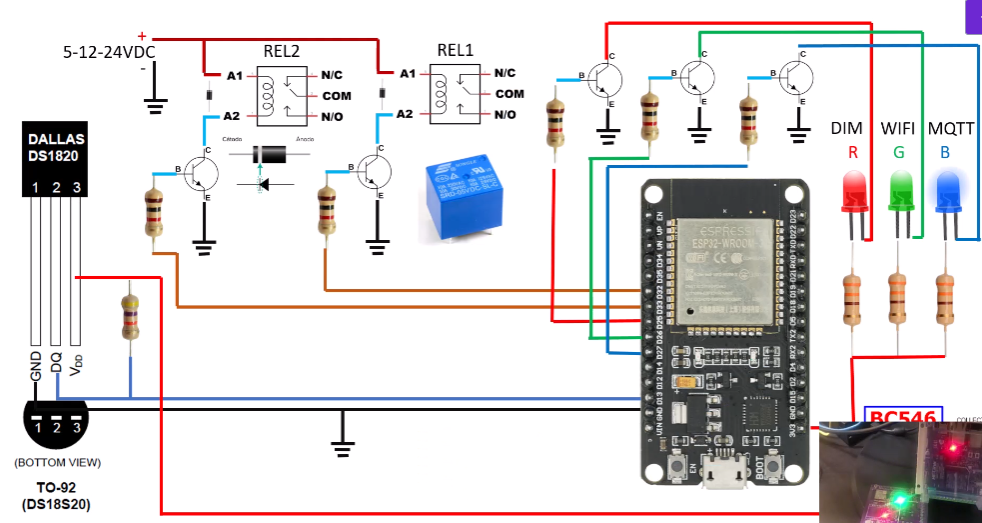

Plataforma IoT Cloud V1 en GitHub.

[IoTCloud](https://github.com/yamir84/esp32_generico_cloud)

### Introducción al EMQX

EMQX Broker MQTT, implementa tu servicio IoT Online. Puedes usarlo como broker MQTT para tu servicio IoT, tambien puedes usarlo como broker MQTT para tu servicio IoT en la nube.

Contenidos:

- MQTT historio, influencia en el IoT y comparación con otros protocolos.
- Publicación/Subscripción MQTT.
- Broker mas conocidos.
- Conexión.
- Publicar.
- Subscribe/Unsubscribe.
- Tópicos/Comodines.
- Calidad de Servicio.
- Keep Alive.
- Definición de EMQX.
- Instalación en W10 y Ubuntu. En local y nube.
- Instalación con Docker entorno local.
- Configuración de Archivos en la última versión del broker.
- Seguridad con Auth & ACL.
- Pruebas de conexión con distintos clientes.
- Cliente Oficial MQTT de EMQ X v3.1 y v5 Broker.
- Modo puente entre Broker Local/Nube.
- Uso de la API REST del Broker.

Seguridad en el MQTT:

- Uso de Wireshark.
- Análisis de las capas OSI del protocolo MQTT.
- Conexión insegura puerto 1883, análisis de los Data.
- Conexión segura TLSv1.2 puerto 8883, análisis de la data transmitida.
- Programar el ESP32 con conexión segura (8883) e insegura (1883) usando certificados generados en el Broker.

Modo Producción:

- Servidor VPS Linux (VPS Oracle Cloud).
- Dominios (Freenom/Otros)
- Panel Administrativo en Linux (Hestia Panel)

Creando Clientes Varios:

- Crear la conexión con MQTT desde Javascript.
- Cliente desde Node.js
- Cliente desde VUE.js
- Conexión desde Arduino.
- Conexión desde ESP32.

### IoT Internet de las Cosas

El internet de las cosas (IoT Internet of Things) es una red de dispositivos conectados a Internet y que se comunican entre si.

- Internet: red interconectada de dispositivos para compartir información.
- Cosa: dispositivo capaz de realizar alguna cosa.

Con el surgimiento de varios dispositivos inteligentes, Internet evoluciona para convertirse en el IoT, en el que miles de millones de dispositivos inteligentes interconectados miden, mueven y actúan de forma independiente todos los bits de datos que conforman la vida diaria.

Una compañía de energía puede monitorear molinos de viento en medio del océano y diagnosticar y desconectar de forma remota las unidades problemáticas.

El IoT irá más allá de conectar a las personas con la informacion y con otras personas. Los dispositivos interactúan con los dispositivos, creando lo que eventualmente podría convertirse en un sistema nervioso central global.

#### Concepto de planeta más inteligente

El concepto de IBM Smarter Planet, se basa en un conjunto de pilares llamados las Tres I:

- **Instrumental**: La información se captura dondequiera que exista, mediante el uso de sensores remotos.
- **Interconectado**: La información se mueve desde el punto de recopilación a cualquier lugar donde se pueda consumir de manera útil.
- **Inteligente**: La información se procesa, analiza y actúa para obtener el máximo valor y conocimiento.
  
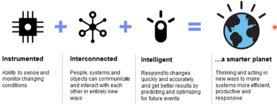

### Telemetría e Internet

Permite medir o monitorizar cosas a distancia. Además, las mejoras en la tecnología de telemetría permiten interconectar dispositivos y sistemas de manera eficiente en diferentes ubicaciones, permitiendo la creación de un entorno de telemetría inteligente y de alta calidad.

MQTT proporciona la tecnología de telemetría para enfrentar los desafíos de información de los usuarios en el mundo real.

- - -

## S2 - CARACTERÍSTICAS DEL PROTOCOLO MQTT

### MQTT Protocol - Inicios

**MQTT** es el estándar para mensajería **IoT**. Es un protocolo de OASIS para Internet de las Cosas. Está diseñado como un transporte de mensajería de publicación/suscripción extremadamente ligero que es ideal para conectar dispositivos remotos con un espacio de código pequeño y un ancho de banda de red mínimo.

[MQTT](https://mqtt.org/)

Evolución del protocolo MQTT:

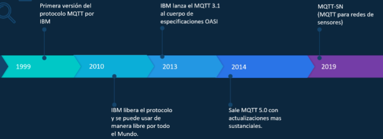

¿Por qué utilizar MQTT?

- Liviano y eficiente.
- Comunicaciones bidireccionales.
- Escala a millones de cosas.
- Entrega de mensajes confiables. MQTT tiene tres niveles de calidad de servicio definidos: 0 como máximo una vez, 1 al menos una vez y 2 exactamente una vez.
- Soporte para redes no confiables. El soporte de MQTT para sesiones persistentes reduce e tiempo para volver a conectar al cliente con el intermediario.
- Seguridad habilitada. Facilita el cifrado de mensajes mediante TLS y a autenticación de clientes mediante protocolos de autenticación modernos, como OAuth 2.0.

Los _Brokers_ MQTT más conocidos:


**EMQ** es un _Broker_ MQTT gratuito con versión de pago.

### MQTT Publicación-Suscripción

Protocolo de mensajería ligero basado en la arquitectura de Publicación/Suscripción.

Características básicas:

- Basado en TCP/IP
- Fácil de implementar, ligero y eficiente con encabezados de 2 bytes.

Patrón de Publicación/Suscripción:

- Modo Publicar/Suscribir.
- Distribución de uno a muchos.

Funciones Avanzadas:

- Proporcionado por QoS (Calidad de Servicio), Legacy (LWT)
- Retención de información, Keep-Alive y otros mecanismos.

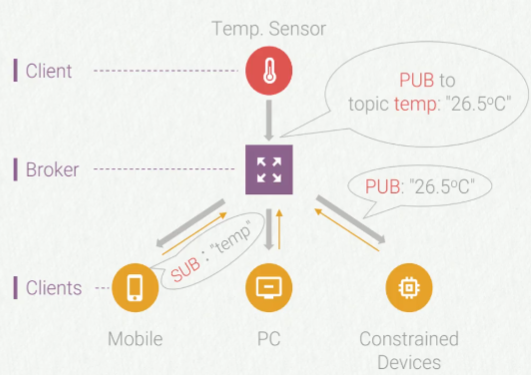
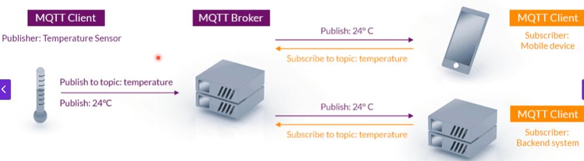

### MQTT Publicar - Suscribirse - Desuscribirse

#### Conexión MQTT

Tanto el Broker como el cliente tienen que tener la pila TCP/IP.

- La conexión entre el Cliente y el Broker.
- Los Clientes no se pueden conectar directamente a los Clientes, se tiene que realizar mediante el Broker.

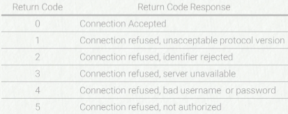

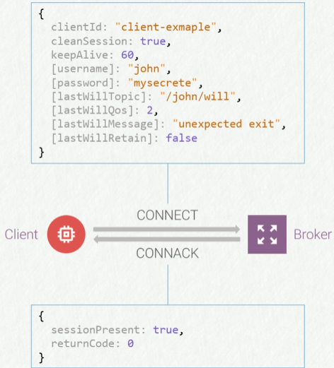

#### Publicación MQTT

El cliente envía el mensaje al _tópico + payload_.

Filtrado basado en Tópicos:

- Cada mensaje tiene un tópico asignado.
- El _Broker_ confía en el Tópico para asignar el mensaje a los Clientes.
- El _Payload_ (carga útil) es independiente de los datos.

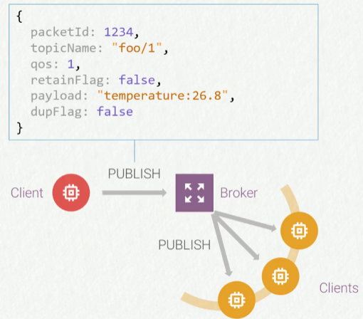

#### Suscribirse MQTT

El cliente se suscribe a los tópicos del Broker para recibir información.

Suscribirse a un Tópico:

- Cada suscripción consta de pares _Topic-QoS_ (**QoS 0, 1 o 2** calidad de servicio).
- Se puede suscribir usando comodines (`#` o `+`).
- En caso de tópico duplicados, los QoS altos son los principales.

SUBACK:

- El _Broker_ envía un mensaje SUBACK al Cliente para reportar la confirmación de suscripción.

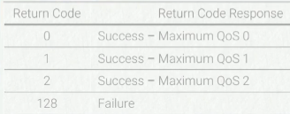

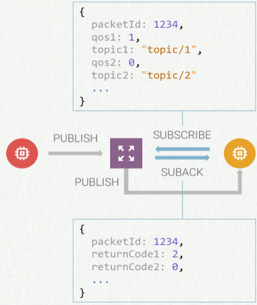

#### Desuscribirse MQTT

Darse de baja de un Tópico, proporcionando la información del Tópico al _Broker_.

Cancelar suscripción:

- Eliminar el registro en el Broker.
- Puede brindar una lista de Tópicos para darse de baja de todos.
- No es necesario especificar el QoS, solo Tópicos.

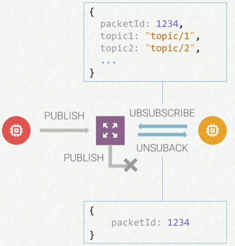

### MQTT Estructura de los Tópicos

#### Tópicos

Un Tópico es solo una cadena de texto.

- Los clientes se suscriben y publican información usando los Tópicos.

Características:

- Son una cadena UTF-8.
- El tópico se puede planificar en varios niveles.
- Un tópico requiere al menos un carácter.
- Las mayúsculas y minúsculas no son lo mismo (key sensitive).
- La `/` es tópico permitido. También es un separador de niveles.


#### Comodines

El uso de caracteres universales le permite usar patrones para leer tópicos.

Usar la cadena exacta para suscribirse a un Tópico:

- Solo se puede suscribir a un Tópico a la vez.

Uso de patrones para suscribirse a los temas:

- Con los comodines se puede suscribir a muchos Tópicos a la vez.
- Sólo se puede usar en SUB no en PUB.

Un solo Nivel:

- Nivel único: `+`.

Multinivel:

- Nivel 1: `#` (solo se puede colocar al final del tópico).

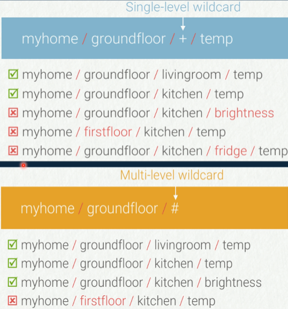

#### Cómo Planificar un Tópico

Reglas recomendadas:

- No comenzar con `/`. Por defecto sale `/mytopic`. Al comenzar por `/` quedaría de la siguiente manera `//mytopic`
- No utilizar espacios en blanco, UTF8 ya se utiliza.
- Utilizar sólo caracteres ASCII.
- Martener el tópico corto y lo más significativo posible.
- Usar tópicos ejemplo (`iddispositivo/idcliente`) para identificar aun más el origen del mensaje y limitar el control.
- No suscribirse a `#` ya que el cliente tendrá problemas con el rendimiento.
- Aunque los tópicos puedan contener cadenas arbitrarias, solo debe tenerse en cuenta para futuros crecimientos al formular una estructura.
- Usar temas específicos, como temperatura, humedad, luminosidad, en lugar de solo `home/room/valores` que sería equivalente a transmitir un paquete con varios valores, algo más específico sería `home/room/temperatura`, `home/room/humedad` y `home/room/luminosidad`.

### MQTT Calidad de Servicio QoS

La calidad de servicio (QoS) es un parámetro de publicación y suscripción. Mecanismo para garantizar la entrega de los mensajes. Existen tres niveles:

- QoS 0 -> Como máximo una vez (0) va a llegar la información.
- QoS 1 -> Al menos una vez (1).
- QoS 2 -> Exactamente una vez (2).

La transmisión de información se puede ver en dos piezas:

- Cliente al Broker( Client PUB - QoS)
- Broker a Cliente(s) ( Client SUB - QoS)

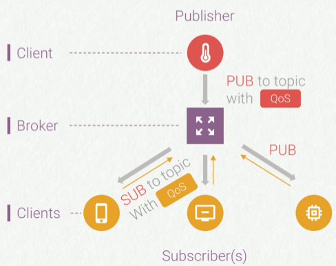

#### Calidad del Servicio QoS 0

- Los mensajes que se seleccionan se entregan como máximo una vez de acuerdo con el mejor esfuerzo de la red subyacente.
- No se espera una respuesta y no se requiere semántica de reintento definitivo en el protocolo.
- El mensaje llega al servidor MQTT una vez o nunca llega.
- Este es el nivel de QoS más bajo.
- El cliente o servidor MQTT intenta enviar el mensaje sin esperar una confirmación de recibo.
- No se toman medidas para asegurar que se entrega el mensaje, además de las funciones proporcionadas por la capa TCP/IP.
- Además, si el mensaje no se entrega, no hay un reintento realizado por la capa MQTT.
- Por lo tanto, si el cliente está enviando un mensaje, llegará al servidor MQTT una vez o nunca.
- El mensaje QoS 0 puede perderse si el cliente se desconecta inesperadamente o si falla el servidor MQTT.
- Desde una perspectiva de desempeño, esto agrega valor porque es la forma más rápida de enviar un mensaje.


#### Calidad del Servicio QoS 1

- El mensaje se entrega al menos una vez.
- El cliente MQTT o el servidor intenta entregar el mensaje al menos una vez, pero también puede haber un duplicado de mensajes.
- La recepción de un mensaje por parte del servidor MQTT es reconocida por un mensaje _PUBACK_. Si se identifica una falla en el enlace de comunicaciones o en el envío, o si el mensaje de reconocimiento no se recibe después de un periodo de tiempo especificado, el remitente vuelve a enviar el mensaje con el bit _DUP_ estabecido en el encabezado del mensaje.
- Si el cliente no recibe un mensaje _PUBACK_ (ya sea dentro de un periodo de tiempo definido en la aplicación, o si se detecta una falla y se reinicia la sesión de comunicaciiones), el cliente reenvía el mensaje _PUBLISH_ con el indicador _DUP_ establecido. Cuando recibe un mensaje duplicado del cliente, el servidor MQTT vuelve a publicar el mensaje a los suscriptores y envía otro mensaje _PUBACK_ (PUBLICATION-ACKNOWLEDGE).
- Un mensaje con QoS 1 tiene un _Id_ en el encabezado del mensaje.

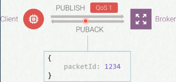

#### Calidad del Servicio QoS 2

- Este es el nivel más alto de QoS.
- Los flujos del protocolo adicionales con más altos que QoS 1 aseguran que los mensajes duplicados no se entreguen a la aplicación receptora.
- Cuando se utiliza QoS 2, el mensaje se entrega una sola vez. El cliente MQTT o el servidor asegura que el mensaje se envía una sola vez.
- Esta QoS debe usarse sólo cuando se envía mensajes duplicados no deseados, desde una perspectiva de rendimiento, hay un precio a pagar en términos de tráfico de red y poder de procesamiento.
- Un mensaje con QoS 2 tiene un Id en el encabezado del mensaje.
- Los mensajes de comando MQTT utilizados son: PUBLISH, PUBREC, PUBREL y PUBCOMP.
- El mensaje se envía en el flujo PUBLISH y el cliente almacena ese mensaje MQTT en la capa de persistencia, si se utiliza. El mensaje permanece bloqueado en el servidor. PUBREC es enviado por el servidor en respuesta a PUBLISH. PUBREL se despacha al servidor desde el cliente en respuesta a PUBREC. Una vez que el servidor MQTT recibe PUBREL, los mensajes se pueden enviar a los suscriptores y PUBCOMP se devuelve en respuesta a PUBREL.
- Los mensajes de QoS 2 tienen un Id en el encabezado del mensaje.
- Si se detecta una falla, o después de un periodo de tiempo definido, se vuelve a intentar cada parte del flujo del protocolo con el bit DUP establecido. Los flujos de protocolo adicionales aseguran que el mensaje se entregue a suscriptores una sola vez.

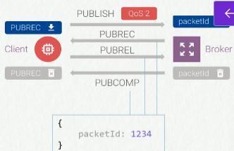

#### Impacto del nivel de QoS en el rendimiento

Hay una regla simple cuando se considera el impacto en el rendimiento de QoS: cuanto mayor sea QoS menor será el rendimiento.

Supongamos que el tiempo necesario para enviar un mensaje PUBLISH es _pt_:

- Si se utiliza QoS 0, el tiempo total tomado para transferir _n_ número de mensajes es _$n·pt$_.
- Para QoS 1, el mensaje PUBACK (respuesta al mensaje PUBLISH) fluye del servidor al cliente. Éste es de 2 bytes mensaje y generalmente toma menos tiempo que _pt_. Por lo tanto, el tiempo para la respuesta al mensaje PUBLISH se llama _mt_. Entonces, el timepo necesario para transferir _n_ mensajes es _$n·(pt+mt)$_.
- Para QoS 2, los menajes PUBREC, PUBREL y PUBCOMP fluyen. Por lo tanto, _n_ número de mensajes toma aproximadamente _$n·(pt+3·mt)$_.

_Ejemplo_: si se necesitan $n=10$ mensajes para ser transferido del cliente al servidor, y _pt_ es 1 segundo y _mt_ es 0.4 segundos, entonces el tiempo necesario para cada uno de los QoS es:

| QoS | Tiempo | Inconvenientes |
| --- | --- | --- |
| 0 | $10·1 =10s$ | los mensajes puede que no lleguen |
| 1 | $10·(1+0.4) = 14s$ | los mensajes pueden llegar duplicados |
| 2 | $10·(1+1.2) = 22s$ | se garantiza la entrega, pero se tarda más tiempo |

### MQTT Keep Alive y Mensajes

#### Keep Alive

Mantenerse vivo:

- Un servidor MQTT puede determinar si el cliente MQTT todavía está en la red (y viceversa). Mediante el uso del temporizador de mantener vivo.
- Los mecanismos de gestión de errores y tiempo de espera de TCP/IP son en la capa de red, pero el ciente y el servidor MQTT no necesitan depender de eso.
- El cliente dice hola al servidor, y el servidor responde, reconociéndolo. Así de sencillo es, el temporizador de mantener vivo.

Hay dos mensajes que constituyen la interacción de mantener vivo:

- PINGREQ (enviado por el cliente al servidor): El cliente envía la solicitud al servidor cuando el temporizador de mantenimiento caduca.
- PINGRESP (enviado por el servidor al cliente): La respuesta de de ping es la respuesta enviada por el servidor a una solicitud de ping del cliente.


#### Mensajes Retenidos en Broker MQTT

MQTT proporciona una función en la que retiene un mensaje para un tópico, incluso después de que el mensaje sea entregado a los suscriptores conectados. Esta función se logra mediante el uso de una bandera de retención en el mensaje cuando se publica.

_El publicador del mensaje establece esta marca en el mensaje durante la publicación_.

El siguiente flujo de ejemplo muestra cómo comprender los mensajes retenidos:

- El cliente A se conecta al servidor y se suscribe al tópico a/b.
- El cliente B se conecta al servidor y publica el mensaje "Hola" con el indicador de retención para el tópico a/b.
- El cliente A recibe el mensaje sin el indicador de retención establecido en 0.
- El cliente C se conecta al servidor y se suscribe al tópico a/b.
- El cliente C recibe el mensaje con el indicador de retención establecido en 1.

Incluso si se reinicia el Broker MQTT, el mensaje retenido no se perderá.

_Solo se retiene un mensaje por tópico_.

Las publicaciones retenidas se utilizan principalmente para mantener la información del estado. Si se usa un tópico en particular para publicar un mensaje de estado desde un dispositivo, los mensajes pueden ser mensajes retenidos.

Una ventaja es que, un programa de monitoreo que se conecta puede suscribirse a este tópico y obtener información sobre los últimos mensajes de estado publicados desde el dispotivo de posicionamiento.

### El identificador de cliente MQTT

El protocolo MQTT requiere que el cliente defina un ID de cliente, de modo que el cliente se defina de forma única en una red. En términos simples, el cliente especifica una cadena única para conectarse al servidor MQTT. Hay varias formas de elegir un ID de cliente, por ejemplo:

- Un sensor instalado en una ubicación particular puede usar el código de ubicación como ID de cliente.
- Un dispositivo móvil con una conexión de red puede usar la dirección de control de acceso a medios MAC o la identificación única del dispositivo como la identificación del cliente.
  - MQTT restringe la longitud del ID del cliente a 23 caracteres.
  - La ID del cliente no puede ser la misma que cualquier otra ID de cliente en la red.

Si dos clientes tuvieran el mismo identificador de cliente, uno de los clientes podría recibir un mensaje y el otro no. El servidor MQTT realiza un seguimiento de los mensajes pendientes que se enviarán a un cliente en función de la ID del cliente. Por lo tanto, si un cliente ha estado usando QoS 1 o 2, y se ha suscrito a cualquier tema y se ha desconectado del servidor, el servidor guarda los mensajes que le llegaron al cliente cuando se desconectó. Después de que el cliente se vuelve a conectar, el servidor envía esos mensajes al cliente. Si un segundo dispositivo MQTT usa la misma ID de cliente y se conecta al servidor, el servidor enviará los mensajes guardados al segundo dispositivo.

Otro escenario relacionado con los ID de ciente son las conexiones duplicadas.Suponga que un dispositivo en particular que usa el ID de cliente DeviceA está conectado al servidor MQTT. Si otro cliente inicia sesión con el mismo ID de cliente DeviceA, el primer cliente (más antiguo) debe ser desconectado por el servidor antes de completar el flujo de CONEXIÓN del segundo (nuevo) cliente. Esta es una características opcional de un servidor MQTT.

### Sesiones sin Estado y con Estado (CleanSession)

El servidor MQTT identifica la conexión del cliente mediante el identificador del cliente. El servidor comprueba si la información de la sesión se ha guardado desde una conexión anterior al servidor.

El parámetro _CleanSession_ en las opciones de conexión indica si la conexión es sin estado o con estado. Si aún existe una sesión anterior y `cleanSession=true` se borra la información de la sesión anterior en el cliente y el servidor. Si `cleanSession=false`, se reanuda la sesión anterior. Si no existe una sesión anterior, se inicia una nueva sesión. El valor predeterminado de `cleanSession` es `true`.

- Para publicaciones, la configuración de sesión limpia solo afecta las publicaciones enviadas con designación de QoS=1 y QoS=2. El uso de `cleanSession=true` puede provocar la pérdida de una publicación, ya que descarta todas las publicaciones que no han sido recibidas.
- Para las suscripciones, si `cleanSession=true`, las suscripciones antiguas del cliente se eliminan cuando el cliente se conecta. Cualquier suscripción nueva que el cliente realice durante la sesión se eliminará cuando se desconecte.

### MQTT Bibliografía

- [MQTT v3.1.1 Specification](https://www.hivemq.com/hivemq-mqtt-3-1-1-specification/)
- [MQTT v5.0 Specification](https://docs.oasis-open.org/mqtt/mqtt/v5.0/os/mqtt-v5.0-os.html)
- [MQTT v5.0.1 Specification](https://docs.oasis-open.org/mqtt/mqtt/v5.0.1/os/mqtt-v5.0.1-os.html)
- [MQTT v5.0.2 Specification](https://docs.oasis-open.org/mqtt/mqtt/v5.0.2/os/mqtt-v5.0.2-os.html)
- [MQTT v5.0.3 Specification](https://docs.oasis-open.org/mqtt/mqtt/v5.0.3/os/mqtt-v5.0.3-os.html)
- [MQTT v5.0.4 Specification](https://docs.oasis-open.org/mqtt/mqtt/v5.0.4/os/mqtt-v5.0.4-os.html)
- [MQTT v5.0.5 Specification](https://docs.oasis-open.org/mqtt/mqtt/v5.0.5/os/mqtt-v5.0.5-os.html)
- [MQTT v5.0.6 Specification](https://docs.oasis-open.org/mqtt/mqtt/v5.0.6/os/mqtt-v5.0.6-os.html)
- [MQTT v5.0.7 Specification](https://docs.oasis-open.org/mqtt/mqtt/v5.0.7/os/mqtt-v5.0.7-os.html)
- [MQTT v5.0.8 Specification](https://docs.oasis-open.org/mqtt/mqtt/v5.0.8/os/mqtt-v5.0.8-os.html)
- [MQTT v5.0.9 Specification](https://docs.oasis-open.org/mqtt/mqtt/v5.0.9/os/mqtt-v5.0.9-os.html)
- [MQTT v5.0.10 Specification](https://docs.oasis-open.org/mqtt/mqtt/v5.0.10/os/mqtt-v5.0.10-os.html)
- [RedBooks](chrome-extension://efaidnbmnnnibpcajpcglclefindmkaj/https://www.redbooks.ibm.com/redbooks/pdfs/sg248228.pdf)

- - -

## S3 - TODO SOBRE EL BROKER EMQX V4.4.X

### EMQX V4.4.X - INTRODUCCIÓN

[EMQX](https://emqx.io) es un Broker MQTT open source, de bajo costo y bajo mantenimiento. Puede ser usado para la gestión de datos, IoT, IoT de la nube, IoT de la nube y IoT de la nube, etc.

### INSTALACIÓN BROKER EMQX V4.4.X EN W10

- [emqx.io](https://emqx.io)
- [emqx.com](https://emqx.com)
- [https://github.com/emqx/emqx/releases/tag/v4.4.7](https://github.com/emqx/emqx/releases/tag/v4.4.7)

En la web [emqx.io](https://emqx.io) hacer clic en _Download_, seleccionar _Windows_ y seleccionar la versión 4.4.7. Tras la descarga, extraer en una carpeta en el directorio raiz de Windows.

Abrimos la consola como Administrador y entramos en la carpeta 'bin' de la carpeta extraida. Y ejecutamos el comando `emqx console` para comprobar que se ha instalado correctamente. Habilitar los permisos del Firewall para los puertos en TCP 18083 y 8883 además de otros.

Para comprobar que funciona, en el navegador escribir en la URL: `http://localhost:18083`. El usuario es `admin` y la password `public`.

- El siguiente comando `/emqx/bin/emqx start` sirve para iniciar el servicio.
- El siguiente comando `/emqx/bin/emqx stop` sirve para parar el servicio.
- El siguiente comando `/emqx/bin/emqx restart` sirve para reiniciar el servicio.
- El siguiente comando `/emqx/bin/emqx status` sirve para comprobar el estado del servicio.
- El siguiente comando `/emqx/bin/emqx console` sirve para entrar a la consola.

### DASHBOARD Y PÁGINAS HTTP

Dentro de la carpeta `/bin` ejecutar el archivo: `emqx start`, el cual tiene todos los scripts para la gestión del servicio, iniciando el Dashboard.

1. Ejecutar el comando: `emqx start`, dentro de la carpeta `/bin`.
2. En el navegador escribir la URL: `http://localhost:18083`.
3. Ingresar con el usuario `admin` y la password `public`.

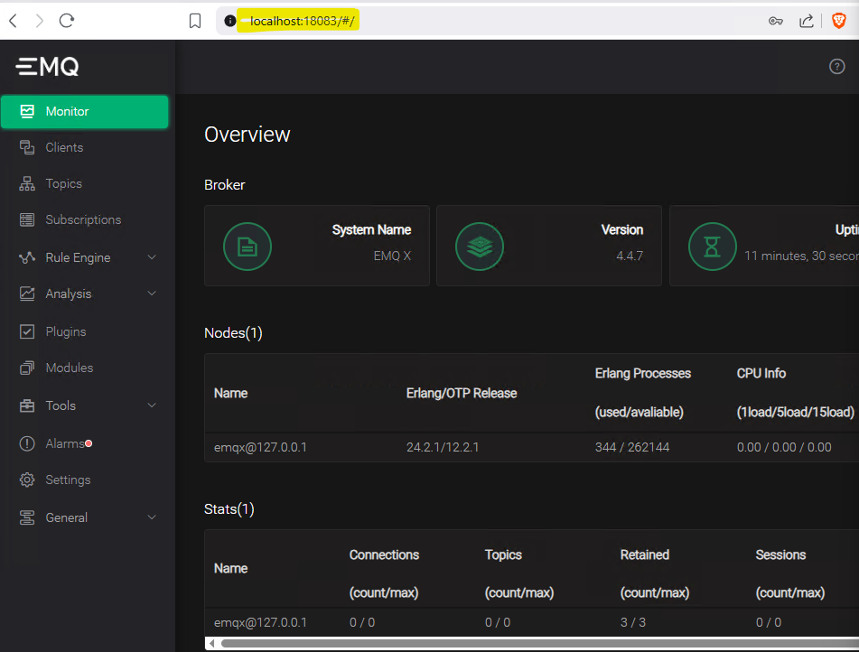

### CONEXIÓN POR WEBSOCKETS

Desde la plataforma MQTT en _Tools_ se puede hacer la conexión por WebSockets.

Una vez conectado, solo nos queda, subcribirnos a los tópicos y publicar mensajes.

- Topic = 'testtopic/#' (`/#` indica que se recibe todo el contenido de ese tópico, es decir, cualquier cosa que se publica en el tópico 'testtopic' se recibe en el tópico `'testtopic'/#`)
- QoS = 0
- Payload = 'Hello World'

### CLIENTE MQTT X

MQX tiene una herramienta para conectarnos online a un broker MQTT, llamada _MQTTX_.

- MQTT 5.0 Desktop Client

Dicha herramienta se puede descargar desde repositorio GitHub:

- [https://github.com/emqx/MQTTX](https://github.com/emqx/MQTTX)
- [https://github.com/emqx/MQTTX/releases/tag/v1.13.0](https://github.com/emqx/MQTTX/releases/tag/v1.13.0)
- [https://mqttx.app/downloads](https://mqttx.app/downloads)

### CONEXIÓN CON EL CLIENTE MQTTX

1. Crear nueva conexión haciendo clic en 'New Connection'.
2. En las opciones seleccionar:
   1. Name = 'TestClientMQTTX'
   2. Client ID = 'mqttx_b01082'
   3. Host = 'localhost'
   4. Port = 1883
   5. MQTT Versión = 3.1.1
   6. Connect Timeout = 10 segundos
   7. Keep Alive = 60 segundos
   8. Clean Session = true
   9. Auto Reconnect = false
   10. Last-Will Topic = 'cliente01/status'
   11. Last-Will QoS = 2
   12. Last-Will Retain = false
   13. Last-Will Payload = {"status": false} (JSON)

Tras la configuración de los parámetros anteriores, hacer clic en 'Connect' y comprobar que se ha conectado correctamente.

Luego desde el cliente MQTTX (localhost:18083/#/clients) en la pestaña de 'Clients' debe aparecer el cliente conectado.

En la pestaña 'WebSockets' nos suscribiremos al tópico antes creado 'client01/status' y publicaremos el mensaje 'Hello World' en el tópico 'client01/status' usando el siguiente comando:

`publish('client01/status', 'Hello World', 2, false)`

### DOCUMENTACIÓN VERSIÓN V4.4.7 DEL BROKER Y CLIENTE EMQX

- [EMQX Documentación](https://mqttx.app/docs)

### INSTALAR OPEN SSL EN WINDOWS

Utilizando el siguiente enlace y en la barra de búsquedas, escribir _ssl_ nos muestra varios artículos con respecto a la instalación de OpenSSL en Windows y en EMQX.

- [emqx.com/en/blog](https://emqx.com/en/blog)

Localizar el artículo `Enable two-way SSL/TLS for EMQX` y hacer clic en el enlace de descarga.

- [https://www.emqx.com/en/blog/enable-two-way-ssl-for-emqx](https://www.emqx.com/en/blog/enable-two-way-ssl-for-emqx)

Para generar un certificado autofirmado se utiliza el comando: `openssl genrsa -out ca.key 2048` ejecutado en la consola CMD. Pero previamente se debe instalar el paquete OpenSSL desde la URL siguiente:

- [https://slproweb.com/products/Win32OpenSSL.html](https://slproweb.com/products/Win32OpenSSL.html)

Una descargado e instalado la versión deseada de OpenSSL. Se debe agregar a las _Variables de Entorno_ la carpeta /bin de la instalación de OpenSSL, para que reconozca así el comando `openssl` en la consola CMD.

### GENERAR LOS CERTIFICADOS AUTOFIRMADOS SSL PARA EL BROKER EMQX

Primero, necesitamos un certificado de CA autofirmado. Si desea generar este certificado, necesita una clave privada, por lo tanto debe ejecutar el siguiente comando en la consola CMD dentro de una carpeta de trabajo:

`openssl genrsa -out ca.key 2048`

Esto genera una clave privada en un archivo llamado _ca.key_ con 2048 bits.

Luego, debe ejecutar el siguiente comando para generar el certificado autofirmado:

`openssl req -x509 -new -nodes -key ca.key -sha256 -days 3650 -out ca.pen`

Tras ejecutar, pedirá una información:

- Country Name (2 letter code) [US]: ES
- State or Province Name (full name) [California]: Madrid
- Locality Name (eg, city) [Madrid]: Madrid
- Organization Name (eg, company) [EMQX]: EMQX
- Organizational Unit Name (eg, section) [EMQX]: EMQX
- Common Name (eg, YOUR name) []: EMQX
- Email Address []: `6xTtZ@example.com`

El certificado raíz es el punto de partida de toda una cadena de confianza. Si el emisor de cada nivel de un certificado y el emisor del certificado raíz son de confianza, este certificado es de confianza y podemos usarlo para emitir el certificado para EMQX.

#### GENERATE SERVER CERTIFICATE

EMQX requiere un certificado autofirmado para el puerto 8883. Por lo tanto, debe ejecutar el siguiente comando en la consola CMD dentro de una carpeta de trabajo:

`openssl genrsa -out emqx.key 2048`

Esto genera una clave privada en un archivo llamado _server.key_ con 2048 bits.

Ahora tenemos que generar un archivo con el nombre `openssl.cnf` con el siguiente contenido:

```cnf
[ req ]
default_bits = 2048
prompt = no
default_md = sha256
distinguished_name = req_distinguished_name
[ req_distinguished_name ]
C = ES
ST = Madrid
L = Madrid
O = EMQX
OU = EMQX
CN = EMQX
emailAddress = 6xTtZ@example.com
[ v3_ca ]
subjectKeyIdentifier = hash
authorityKeyIdentifier = keyid:always,issuer:always
basicConstraints = critical,CA:true
keyUsage = critical, digitalSignature, cRLSign, keyCertSign
[ v3_server ]
subjectKeyIdentifier = hash
authorityKeyIdentifier = keyid:always,issuer:always
basicConstraints = critical,CA:false
keyUsage = critical, digitalSignature, keyEncipherment
extendedKeyUsage = serverAuth
```

Ahora tenemos que ejecutar el siguiente comando para generar el certificado autofirmado:

`openssl req -new -key ./emqx.key -config openssl.cnf -out emqx.csr`

Tras ejecutar, creará el archivo `emqx.csr`.

Luego tenemos que ejecutar el siguiente comando para emitir el certificado autofirmado:

`openssl x509 -req -in ./emqx.csr -CA ca.pem -CAkey ca.key -CAcreateserial -out emqx.pem -days 3650 -sha256 extensions v3_req -extfile openssl.cnf`

Para visualizar el contenido del el certificado:

`openssl x509 -in emqx.pem -text -noout`

Para verificar el certificado:

`openssl verify -CAfile ca.pen emqx.pem`

### CONEXIÓN SEGURA SSL CON EL CLIENTE MQTTX

Copie el archivo `emqx.key` y `emqx.crt` dentro del directorio `/emqx/etc/certs/` de EMQXX y modificar el archivo `emqx.conf` existente en la ruta `/emqx/etc/`.

```conf
# 8883
listeners.https.default.keyfile = etc/certs/emqx.key
listeners.https.default.certfile = etc/certs/emqx.pem
listeners.https.default.cacertfile = etc/certs/ca.pem

# 8884
listeners.https.default.keyfile = etc/certs/emqx.key
listeners.https.default.certfile = etc/certs/emqx.pem
listeners.https.default.cacertfile = etc/certs/ca.pem
```

Ahora debemos para e inicar el servidor de EMQX, con los comandos `emqx stop` y `emqx start` respectivamente. También valdría ejecutar el comando `emqx restart` para reiniciar el servicio.

Abrimos el MQTTX Cliente y lo configuramos para conectarnos con el puerto 8883 con mqtts// y activando la opción SSL/TLS con la opción _CA Signed server certificate_. Hacemos clic en conectar.

Si en la opción SSL/TLS seleccionamos la opción _Self signed_ nos pedirá un fichero de certificado y una clave privada, tipo `ca.pem` ubicado en la carpeta `/emqx/etc/certs/`.

Si nos queremos conectar usando wss:// usando el puerto 8084, debemos activar la opció _CA Signed server certificate_ y seleccionar la opció _Self signed_.

Para realizar la conexión con EMQX Broker desde la opción Tools>Websockets, seleccionando la opción SSL; debemos tener una URL del tipo `https://localhost:8084` para que se pueda realizar la conexión.

### CONEXIÓN SEGURA HTTPS EN DASHBOARD EMQX BROKER

Para que la conexión HTTPS funcione correctamente, utilizando MQTTX Broker en la opción Websockets, debemos agregar los certificados de la siguiente manera:

- Archivo de configuraciones; `/emqx/etc/plugins/emqx_dashboard.conf`.

```conf
# 18084
# Habilitar lo siguiente para las conexiones HTTPS
dashboard.listeners.https = 18084
dashboard.listeners.https.acceptors = 2
dashboard.listeners.https.max_clients = 512
dashboard.listeners.https.inet6 = false
dashboard.listeners.https.keyfile = etc/certs/emqx.key
dashboard.listeners.https.certfile = etc/certs/emqx.pem
dashboard.listeners.https.cacertfile = etc/certs/ca.pem
```

- Archivo de configuraciones; `/emqx/etc/plugins/emqx_management.conf`.

```conf
# Habilitar lo siguiente para las conexiones HTTPS LISTENERS
management.listeners.https = 8082 # debe ser distinto al puerto usado en HTTP que es 8081
management.listeners.https.acceptors = 2
management.listeners.https.max_clients = 512
management.listeners.https.backlog = 512
management.listeners.https.send_timeout = 15s
management.listeners.https.send_timeout_close = on
management.listeners.https.keyfile = etc/certs/emqx.key
management.listeners.https.certfile = etc/certs/emqx.pem
management.listeners.https.cacertfile = etc/certs/ca.pem
```

Ya podríamos reiniciar el servicio con el comando `emqx restart` y comprobar que funciona correctamente.

### PREPARAR EL ENTORNO DE AUTENTICACIÓN MySQL CON LARAGON

En el _MQTX Broker>Plugins_ habilitaremos la opción de autenticación de usuarios, para evitar la conexión de ususrios anónimos.

#### LARAGON

[Laragon](https://www.laragon.org/) Es una herramienta de alto rendimineto y confiabilidad para desarrollar aplicaciones web y aplicaciones de escritorio con PHP y MySQL.

### AUTENTICACIÓN CON EL PLUGIN EMQX AUTH MYSQL

Seleccionaremos la opción _EMQ X Authentication/ACL with MySQL_, para tratar de conectar con el servidor MySQL.

Primero se debe configurar el archivo `/emqx/etc/plugins/emqx_auth_mysql.conf` con la siguiente información:

```conf
auth.mysql.server = 127.0.0.1:3306
auth.mysql.pool = 8 # connection pool size
auth.mysql.name = emqx
auth.mysql.password = public
auth.mysql.database = mqtt # nombre de la base de datos
auth.mysql.query_timeout = 5s # in milliseconds 5000

# en la siguiente línea se indica el nombre de la tabla con los usuarios y contrasenas
# nombre de la tabla = mqtt_users
# este nombre se puede cambiar en el archivo emqx_auth_mysql.conf
auth.mysql.auth_query = select password from mqtt_users where username = '%u' limit 1
auth.mysql.super_query = select is_superuser from mqtt_users where username = '%u' limit 1
```

Se debe agregar el password encriptado con el algoritmo SHA256 en el archivo `/emqx/etc/plugins/emqx_auth_mysql.conf`:

```conf
auth.mysql.password_hash = sha256
```

En la opción Plugins>ENQ X Authentication/ACL with MySQL, haremos clic sobre Start.

#### CREAR UNA BASE DE DATOS

Según la guía de MQTTX Broker, debemos crear una base de datos con el siguiente comando:

```sql
CREATE DATABASE emqx;
```

Con las siguientes credenciales:

- IP:localhost
- user: emqx
- password: public (encriptado con el algoritmo SHA256)
- port: 3306
- Activar todos los privilegios en el tablero de MySQL.

Ahora debemos crear una tabla con el siguiente comando:

```sql
CREATE TABLE 'mqtt_users' (
  'id' int(11) UNSIGNED NOT NULL AUTO_INCREMENT,
  'username' varchar(100) DEFAULT NULL,
  'password' varchar(100) DEFAULT NULL,
  'salt' varchar(35) DEFAULT NULL,
  'is_superuser' tinyint(1) DEFAULT 0,
  'created' datetime DEFAULT NULL,
  PRIMARY KEY ('id'),
  UNIQUE KEY 'mqtt_username' ('username')
)ENGINE=InnoDB DEFAULT CHARSET=utf8mb4;
```

Una vez creada la tabla, podemos hacer una inserción de datos con el siguiente comando:

El password es la palabra _public_ encriptado con el algoritmo SHA256.

```sql
INSERT INTO mqtt_users (username, password, salt) VALUES 
  ('emqx', 'efa1f375d76194fa51a3556a97e641e61685f914d446979da50a551a4333ffd7', NULL);
```

### EVITAR CONEXIÓN ANÓNIMAS AL BROKER EMQX

Desde el panel de administración de EMQX Broker>Tools>Websockets, nos permite conectarnos sin el _Username_ y el _Password_ (conexiones anónimas). Para evitar esto, debemos configurar `bypass_auth_plugins` y cambiar el valor de `listener.{type}.{name}.enable_auth = true | false` seleccionar verdadero o falso, según nos interese. Esto está dentro del archivo `/emqx/etc/emqx.conf`:

```conf
# línea nº 660 en el archivo /emqx/etc/emqx.conf
allow_anonymous = false
```

Con esta configuración modificada, no se podrá conectar con el servidor sin el _Username_ y el _Password_.

Para conectarnos tendríamos que usar el _Username: emqx_ y el _Password: public_ creados en la sección anterior para la base de datos.

Desde el MQTTX Client, también debemos configurar el campo _Username_ y el _Password_.

### LISTA DE CONTROL DE ACCESO (ACL)

La Access Crontol List (ACL) en MySQL se usa para controlar el acceso a los clientes MQTT. Creamos una tabla para la consula ACL con el siguiente comando:

```sql
CREATE TABLE 'mqtt_acl' (
  'id' int(11) UNSIGNED NOT NULL AUTO_INCREMENT,
  'allow' int(1) DEFAULT 1 COMMENT '0: deny, 1: allow',
  'ipaddr' varchar(60) DEFAULT NULL COMMENT 'IpAddress',
  'username' varchar(100) DEFAULT NULL COMMENT 'Username',
  'clientid' varchar(100) DEFAULT NULL COMMENT 'ClientID',
  'access' int(2) NOT NULL COMMENT '1: subscribe, 2: publish, 3: pubsub',
  'topic' varchar(100) NOT NULL DEFAULT '' COMMENT 'Topic Filter',
  PRIMARY KEY ('id'),
  INDEX (ipaddr),
  INDEX (username),
  INDEX (clientid)
)ENGINE=InnoDB DEFAULT CHARSET=utf8mb4;
```

Algunas inserciones en la tabla ACL con el siguiente comando:

```sql
# All users cannot subscribe to system topics
INSERT INTO 'mqtt_acl' (allow, ipaddr, username, clientid, access, topic) VALUES 
  (0, NULL, '$all', NULL, 1, '$SYS/#');
```

```sql
# Allow clients on IP 10.59.1.100 to subscribe to system topics
INSERT INTO 'mqtt_acl' (allow, ipaddr, username, clientid, access, topic) VALUES 
  (1, '10.59.1.100', NULL, NULL, 1, '$SYS/#');
```

```sql
# Deny all clients to subscribe to topics smarthome/+/temperatura
INSERT INTO 'mqtt_acl' (allow, ipaddr, username, clientid, access, topic) VALUES 
  (0, NULL, '$all', NULL, 1, '/smarthome/+/temperatura');
```

```sql
# Authorize all clients to subscribe to topics smarthome/%c/temperatura
INSERT INTO 'mqtt_acl' (allow, ipaddr, username, clientid, access, topic) VALUES 
  (1, NULL, '$all', NULL, 1, '/smarthome/%c/temperatura');
```

- `%u`: Username
- `%c`: ClientID
- `%p`: Topic
- `%C`: TLS certificate common name
- `$all`: Todos los usuarios
- `$SYS/#`: Todos los topicos del sistema

### ACL - EJEMPLOS

Insertamos un nuevo usuario en la base de datos con la contraseña _public_ encriptada con el algoritmo SHA256.

```sql
INSERT INTO mqtt_users (username, password, salt) VALUES 
  ('jose73', 'efa1f375d76194fa51a3556a97e641e61685f914d446979da50a551a4333ffd7', NULL);
```

Para conectarnos con el usuario _jose73_ debemos usar el _Username: jose73_ y el _Password: public_, desde MQTTX Client.

Realizaremos varis subscripciones y publicaciones con el usuario _jose73_. Por ejemplo:

- `jose73/+/temperatura`
- `jose73/+/temperatura/#`
- `emqx/+/temperatura`
- `emqx/+/temperatura/#`

Para publicar con uno de los usuarios:

- `emqx/home/temperatura` - Plaintext - QoS 0 - No Retained, 'Temp. 25°C'
- `emqx/home/temperatura` - Plaintext - QoS 1 - Retained, 'Temp. 25°C'
- `jose73/home/temperatura` - Plaintext - QoS 2 - Retained, 'Temp. 25°C'
- `jose73/cuarto/temperatura` - Encrypted - QoS 0 - No Retained, 'Temp. 25°C'

### INSTALAR PHPMYADMIN EN LARAGON

En Laragon se abre por defecto HeidiSQL para acceder a la base de datos MySQL. Aunque se puede añadir PHPMyAdmin y acceder desde el navegador.

[PHPMyAdmin](https://www.phpmyadmin.net/)

Tras la descarga y descompresión, le cambiamos el nombre `phpMyAdmin` y lo colocamos dentro de la carpeta de `laragon/etc/apps/`.

El acceso a través de la URL es: `http://localhost/phpmyadmin/` y el usuario es `root` y la contraseña, no tiene.

### INSTALACIÓN MQTTX BROKER EN LINUX UBUNTU 20.04.4

Descargamos el EMQX Broker para Ubuntu desde la página web de [EMQX](https://emqx.io/).

Repositorio gitHub para la descarga alternativa: [EMQX Enterprise](https://github.com/emqx/releases).

Para el EMQX Cliente en Ubuntu, la página web de descarga es: [EMQX Client](https://mqttx.app/downloads).

Página web EMQX Entrerprise, explicando el proceso de isntalación para paquetes Apt:

- [Instalación paquete Apt EMQX](https://docs.emqx.com/en/emqx/latest/deploy/install-ubuntu.html)
- [Instalación paquete Apt EMQX Ubuntu](https://www.emqx.com/en/downloads-and-install/enterprise?os=Ubuntu)

Para Ubuntu se puede instalar desde dos formas distintas:

Como un archivo de script (Apt):

- `curl -s https://assets.emqx.com/scripts/install-emqx.deb.sh | sudo bash`
- `sudo apt-get install emqx`
- `sudo emqx start`

Como un tipo de paquete:

- `wget https://www.emqx.com/en/downloads/broker/4.4.7/emqx-4.4.7-opt24.1.5-3-ubuntu20.04-amd64.zip`
- `unzip emqx-4.4.7-opt24.1.5-3-ubuntu20.04-amd64.zip`
- `./emqx/bin/emqx start`

#### PASOS DE LA INSTALACIÓN EN UBUNTU SERVER

1. Conexión a través de PuTTY al RBPi con Ubuntu Server.
2. Nos situamos en el directorio raiz de Ubuntu Server.
3. Nos descargamos el paquete de EMQX. `wget https://www.emqx.com/en/downloads/enterprise/6.0.3/emqx-enterprise-6.0.3-ubuntu24.04-arm64.deb`.
4. El siguiente paso es la descompresión del paquete. `sudo apt install ./emqx-enterprise-6.0.3-ubuntu24.04-arm64.deb`.
5. Ejecutamos el comando `sudo systemctl start emqx`.
6. En el navegador escribir la URL: `http://localhost:18083`.

### INSTALAR CYBERDUCK PARA FTP - SFTP EN LINUX

Los Certificados antes creados, los podemos llevar al sistema Linux; para ello usaremos la herramienta CyberDuck.

- [CYBERDUCK](https://cyberduck.io/)
- [CYBERDUCK SFTP](https://cyberduck.io/sftp)
- [CYBERDUCK FTP](https://cyberduck.io/ftp)
- [CYBERDUCK DOWNLOAD](https://cyberduck.io/download/)

### USAR CERTIFICADOS SSL AL SERVIDOR USANDO CYBERDUCK

- En el CyberDuck, seleccionar la opció _SFTP (SSH Transfer Protocol Secure)_.
- En servidor, añadimos la IP de la RBPi.
- En puerto, ponemos el puerto 22.
- El nombre de usuario: localhost
- La clave: XXXX
- Clic en _Connect_ y _Permitir acceso a la carpeta de trabajo_.
- Por defecto las carpetas son: `/home/localhost`.
- Debemos seleccionar la carpeta `/emqx/etc/` de a RBPi para subir los certificados.
- Los archivos que necesitamos exportar son: `ca.pem`, `emqx.key` y `emqx.pem`.
- Los archivos los peqamos en la carpeta `/hoome/localhost` primero, y luego desde la consola Linux usamos los comandos:
  - `cd /home/localhost`
  - `ls`
  - `cp ca.pem /emqx/etc/certs/ca.pem`
  - `cp emqx.key /emqx/etc/certs/emqx.key`
  - `cp emqx.pem /emqx/etc/certs/emqx.pem`
- En el navegador escribir la URL: `http://localhost:18083`.

### CONFIGURAR CERTIFICADOS SSL EN EL SERVIDOR EMQX BROKER EN UBUNTU SERVER

Con el editor Vim abrimos el fichero `emqx.conf` ubicado en la carpeta `/emqx/etc/` y lo modificamos de la siguiente manera:

```conf
# 8883
listeners.https.default.keyfile = etc/certs/emqx.key
listeners.https.default.certfile = etc/certs/emqx.pem
listeners.https.default.cacertfile = etc/certs/ca.pem

# 8884
listeners.https.default.keyfile = etc/certs/emqx.key
listeners.https.default.certfile = etc/certs/emqx.pem
listeners.https.default.cacertfile = etc/certs/ca.pem

listener.wss.external.cacertfile = etc/certs/ca.pem
```

### CONFIGURAR CERTIFICADOS SSL AL DASHBOARD EMQX BROKER EN UBUNTU SERVER

Con el editor Vim abrimos el fichero `emqx_dashboard.conf` ubicado en la carpeta `/emqx/etc/plugins/` y lo modificamos de la siguiente manera:

```conf
## HTTPS LISTENER
dashboard.listeners.https = 18084
dashboard.listeners.https.acceptors = 2
dashboard.listeners.https.max_clients = 512
dashboard.listeners.https.inet6 = false
dashboard.listeners.https.ipv6_v6only = false

dashboard.listeners.https.keyfile = etc/certs/emqx.key
dashboard.listeners.https.certfile = etc/certs/emqx.pem
dashboard.listeners.https.cacertfile = etc/certs/ca.pem
```

Modificando el archivo `emqx_management.conf` ubicado en la carpeta `/emqx/etc/plugins/` de la siguiente manera:

```conf
## HTTPS LISTENER
management.listeners.https = 8082 # debe ser distinto al puerto usado en HTTP que es 8081
management.listeners.https.acceptors = 2
management.listeners.https.max_clients = 512
management.listeners.https.backlog = 512
management.listeners.https.send_timeout = 15s
management.listeners.https.send_timeout_close = on
management.listeners.https.keyfile = etc/certs/emqx.key
management.listeners.https.certfile = etc/certs/emqx.pem
management.listeners.https.cacertfile = etc/certs/ca.pem
```

### LINUX CONFIGURAR LAMP EN UBUNTU

Para actualizar e instalar el Serividor Apache:

- `sudo apt update`
- `sudo apt install apache2 -y`
- `sudo ufw app list`
- `sudo ufw allow 'Apache Full'`
- `sudo ufw allow 8080/tcp`
- `sudo ufw allow 443/tcp`
- `sudo service apache2 start`
- `sudo service apache2 status`
- `sudo ufw status`
- `sudo ufw enable`
- `sudo ufw status`
- `sudo systemctl status apache2`
- `sudo systemctl start apache2`
- `sudo systemctl restart apache2`

Para actualizar e instalar el Servidor MySQL:

- `sudo apt update`
- `sudo apt install mysql-server`
- `sudo systemctl status mysql`
- `sudo systemctl start mysql`
- `sudo mysql_secure_installation` (recomendado)
- `sudo mysql -u root -p`

Para actualizar e instalar el Servidor PHP:

- `sudo apt update`
- `sudo apt install php -y` (El -y permite instalar sin preguntar)
- `php -v`
- `sudo apt install php-curl php-mbstring php-xml`
- `sudo apt install libapache2-mod-php`
- `sudo apt install php-mysql`
- `apt-cache search php-` (sirve para otras extensiones disponibles en PHP)
- `sudo service apache2 restart`
- `sudo service apache2 status`

En la carpeta `/var/www/html/` creamos el archivo `index.php` con el siguiente contenido:

```php
<?php
phpinfo();
?>
```

Comprobamos usando el navegador la URL: `http://localhost/info.php` para ver la información del servidor.

Para instalar el Servidor PHPMyAdmin:

- `sudo apt install phpmyadmin`

Debemos realizar una configuración en Apache `/etc/apache2/apache2.conf` y al final del archivo anexar lo siguiente:

```conf
Include /etc/phpmyadmin/apache.conf
```

- `sudo service apache2 restart`
- `sudo service apache2 status`

Tras el reinicio del servidio, escribimos el siguiente URL en el navegador: `http://localhost/phpmyadmin/` para acceder al Servidor PHPMyAdmin.

- Usuario: `root`
- Contraseña: desconocida

Para añadir la contraseña al Servidor PHPMyAdmin:

- `sudo mysql -u root -p` usando la contraseña por defecto en la instalación.
- `ALTER USER 'root'@'localhost' IDENTIFIED WITH mysql_native_password BY '1234';` para cambiar la contraseña a `1234`.
- `FLUSH PRIVILEGES;` para aplicar los cambios.
- `exit;`
- `sudo service apache2 restart`
- `sudo service apache2 status`

### LINUX AUTENTICACIÓN MYSQL

Editamos el archivo `/etc/plugins/emqx_auth_mysql.conf` con la siguiente información:

```conf
auth.mysql.server = 127.0.0.1:3306
auth.mysql.pool = 8 # connection pool size
auth.mysql.username = root
auth.mysql.password = 1234
auth.mysql.database = mqtt # nombre de la base de datos
auth.mysql.query_timeout = 5s # in milliseconds 5000ms = 5s
```

Creamos tabla en la base de datos `mqtt` con `utf16_spanish_ci` con la siguiente estructura:

```sql
CREATE TABLE `mqtt_users` (
  `id` int(11) UNSIGNED NOT NULL AUTO_INCREMENT,
  `username` varchar(100) DEFAULT NULL,
  `password` varchar(100) DEFAULT NULL,
  `salt` varchar(100) DEFAULT NULL,
  `is_superuser` tinyint(1) DEFAULT 0,
  `created` datetime DEFAULT NULL,
  PRIMARY KEY (`id`),
  UNIQUE KEY `mqtt_username` (`username`)
)ENGINE=InnoDB DEFAULT CHARSET=utf8mb4 COLLATE=utf8mb4_spanish_ci;
```

Registramos un usuario con el nombre de usuario y la contraseña usando SHA256 con el siguiente comando:

```sql
INSERT INTO `mqtt_users` (`username`, `password`, `salt`) VALUES 
  ('emqx', 'efa1f375d76194fa51a3556a97e641e61685f914d446979da50a551a4333ffd7', NULL);
```

Editar el archivo `/etc/plugins/emqx_auth_mysql.conf` con la siguiente información:

```conf
auth.mysql.auth_query = SELECT password FROM mqtt_users WHERE username = '%u' LIMIT 1
auth.mysql.password_hash = sha256
```

Editamos el archivo `emqx.conf` con la siguiente información:

```conf
allow_anonymous = false
acl_nomatch = allow
```

### LINUX ACL CON MYSQL

Añair reglas ACL al Broker EMQX añadiendo una tabla a la base de datos `mqtt` con la siguiente estructura:

```sql
CREATE TABLE `mqtt_acl` (
  `id` int(11) UNSIGNED NOT NULL AUTO_INCREMENT,
  `allow` tinyint(1) DEFAULT 1 COMMENT '1: allow 0: deny',
  `ipaddr` varchar(60) DEFAULT NULL COMMENT 'IpAddress',
  `username` varchar(100) DEFAULT NULL COMMENT 'Username',
  `clientid` varchar(100) DEFAULT NULL COMMENT 'ClientID',
  `access` int(2) NOT NULL COMMENT '1: subscribe, 2: publish, 3: pubsub',
  `topic` varchar(100) DEFAULT NULL,
  PRIMARY KEY (`id`),
  INDEX (ipaddr),
  INDEX (username),
  INDEX (clientid)
)ENGINE=InnoDB DEFAULT CHARSET=utf8mb4 COLLATE=utf8mb4_spanish_ci;
```

Realizamos la inserción de reglas ACL con el siguiente comando:

```sql
# All users cannot subscribe to system topics
INSERT INTO `mqtt_acl` (allow, ipaddr, username, clientid, access, topic) VALUES 
  (0, NULL, '$all', NULL, 1, '$SYS/#');
```

```sql
# Allow clients on IP 10.59.1.100 to subscribe to system topics
INSERT INTO `mqtt_acl` (allow, ipaddr, username, clientid, access, topic) VALUES 
  (1, '10.59.1.100', NULL, NULL, 1, '$SYS/#');
```

```sql
# Not allow clients and users to subscribe to topic +/#
INSERT INTO `mqtt_acl` (allow, ipaddr, username, clientid, access, topic) VALUES 
  (0, NULL, '$all', NULL, 3, '+/#');
```

```sql
# Allow clients and users to subscribe to topic +/#
INSERT INTO `mqtt_acl` (allow, ipaddr, username, clientid, access, topic) VALUES 
  (1, NULL, '$all', NULL, 3, '%u/%c/#');
```

- `%u` = username
- `%c` = clientid
- `+` = wildcard
- `#` = wildcard

- - -

## S4 - TODO SOBRE EL BROKER EMQX V5.X.X

### INSTALACIÓN EN LINUX UBUNTU

- [EMQX Enterprise](https://www.emqx.com/en/downloads-and-install/enterprise?os=Ubuntu)
- [MQTTX](https://mqttx.app/downloads)

La instalación de EMQX Enterprive v5 o superior se instala en la ruta `/etc/emqx/` y ya no están los archivos a modificar como si estaban en la v4.

Para iniciar el servidio, se escribe en la url `http://localhost:18083`.

### LINUX SERVER-ESTIMATE

Herramienta para dimensionar el servidor [EMQX](https://emqx.com/en/server-estimate).

### LINUX RECONOCIMIENTO DEL DASHBOARD EMQX V5.X.X O SUPERIOR

- [EMQX Dashboard V6.2.2](https://www.emqx.com/en/downloads-and-install/enterprise?os=Ubuntu)
- Para Ubuntu 22.04 con ARM64:
  - Descarga: `wget https://www.emqx.com/en/downloads/enterprise/6.2.2/emqx-enterprise-6.2.2-ubuntu22.04-arm64.deb`.
  - Instalar: `sudo apt install ./emqx-enterprise-6.2.2-ubuntu22.04-arm64.deb`.
  - Iniciar: `sudo systemctl start emqx`.

### CERTIFICADOS AUTOFIRMADOS PARA LINUX CON OPENSSL

En la ruta `/etc/emqx/certs` y es donde guardaremos los certificados.

#### CREAR CERTIFICADOS CA AUTOFIRMADOS CON OPENSSL

[Documentación Certificados CA Autofirmados con OpenSSL](https://docs.emqx.com/en/emqx/latest/network/tls-certificate.html#issue-server-certificates)

Requiere de OpenSSL instalado.

- Paso 1: Ejecutar el siguiente comando para generar un par de claves. Pedirá que ingrese contraseñas para proteger el par de claves.
  - `openssl genrsa -des3 -out rootCA.key 2048`
- Paso 2: Ejecutar el siguiente comando para generar el certificado CA utilizando la clave privada del par de claves. Pedirá que configure el nombre distintivo (DN) del certificado.
  - `openssl req -x509 -new -nodes -key rootCA.key -sha256 -days 3650 -out rootCA.crt`

#### EMITIR CERTIFICADOS DE SERVIDOR

Utilizando el certificado de CA generado, se usarán para emitir el certificado de servidor, que los oyentes de EMQX utilizan para demostrar su identidad a los clientes.

El certificado de servidor se suele emitir para el nombre de host, el nombre del servidor o el nombre de dominio.

Necesitamos la clave de CA (rootCA.key) y el certificado de CA (rootCA.crt) además de la solicitud de certificado (server.csr) del servidor, para generar el certificado de servidor.

- Paso 1: Ejecutar el comando para generar un par de claves para el certificado del servidor:
  - `openssl genrsa -out server.key 2048`
- Paso 2: Ejecutar el comando para crear una solicitud de firma de certificado (CSR) utilizando el par de claves del servidor. Una vez que la CSR esté firmada con la clave privada del certificado raíz de la CA, se generará un archivo de clave pública del certificado y se entregará al usuario. Pedirá que configure el nombre distintivo (DN) del certificado.
  - `openssl req -new -key server.key -out server.csr`

El sistema solicita la siguiente información:

```csr
You are about to be asked to enter information that will be incorporated
into your certificate request.
What you are about to enter is what is called a Distinguished Name or a DN.
There are quite a few fields but you can leave some blank
For some fields there will be a default value,
If you enter '.', the field will be left blank.
-----
Country Name (2 letter code) [AU]: # country/region
State or Province Name (full name) [Some-State]: # state/province
Locality Name (eg, city) []: # The city or locality
Organization Name (eg, company) [Internet Widgets Pty Ltd]: # The full name of the organization (or company name), e.g. EMQ
Organizational Unit Name (eg, section) []: # The name of the department or division within the organization，e.g. EMQX
Common Name (e.g. server FQDN or YOUR name) []: # The fully-qualified domain name (FQDN) of the server that will use the certificate, e.g. mqtt.emqx.com
...
```

- Paso 3: Usando la solicitud de firma de certificado (CSR) del servidor para generar el certificado del servidor y especificar el periodo de validez del certificado, que en este ejemplo es de 3650 días.
  - `openssl x509 -req -in server.csr -CA rootCA.crt -CAkey rootCA.key -CAcreateserial -out server.crt -days 3650 -sha256`

El conjunto de certificados generados son:

- `rootCA.key`
- `rootCA.crt`
- `rootCA.srl`
- `server.key`
- `server.csr`
- `server.crt`
- `server.key`

Pasos realizados en el vídeo:

1. `sudo openssl genrsa -out ca.key 2048`
2. `sudo openssl req -x509 -new -nodes -key ca.key -sha256 -days 3650 -out ca.pem`
3. `sudo openssl x509 -in ca.pem -noout -text` (Opcional es para ver el contenido del certificado)
4. `sudo openssl genrsa -out eqmx.key 2048`
5. Crear el archivo `openssl.cnf` con el siguiente contenido:

```cnf
[req]
default_bits = 2048
distinguished_name = req_distinguished_name
req_extensions = req_ext
x509_extensions = v3_req
prompt = no

[req_distinguished_name]
countryName = ES
stateOrProvinceName = SPAIN
localityName = CANARY ISLAND
organizationName = IOTMQTT
commonName = Server certificate

[req_ext]
subjectAltName = @alt_names

[V3_req]
subjectAltName = @alt_names

[alt_names]
IP.1 = 192.168.1.41
DNS.1 = 192.168.1.41
DNS.2 = localhost
```

6. `sudo openssl req -new -key ./eqmx.key -config openssl.cnf -out eqmx.csr`
7. `sudo openssl x509 -req -in ./eqmx.csr -CA ca.pem -CAkey ca.key -CAcreateserial -out eqmx.pem -days 3650 -sha256 -extensions v3_req -extfile openssl.cnf`
8. `sudo openssl x509 -in eqmx.pem -noout -text` (Opcional es para ver el contenido del certificado)

### AGREGAR CCERTIFICADOS AL BROKER EMQX V5.8.0 EN LINUX

Para configurar el certificado SSL en el servidor EMQX Broker, debemos seguir los siguientes pasos:

- Clic en _Management>Listeners_ donde se indican los puertos seguros, ssl :8883, wss :8884. Y los no seguros, tcp :1883, ws :8083.
- Haciendo clic sobre el nombre del puerto (por ejemplo wss), aparecen las características de la conexión. Entre ellas está el campo _TLS Cert_ con la ruta al archivo del certificado (cert.pem) además del campo _TLS Key_ con la ruta al archivo de la clave privada (key.pem).
- Si hacemos clic sobre _Reset_ en la opción _TLS Cert_ nos permite adjuntar un nuevo certificado. Idem para _TLS Key_ y _CA Cert_.
- Clic en _Save_ y cerramos el navegador.

### AUTENTICARNOS CON MYSQL EN EMQX V5.8.0

En la pestaña de _Access Control>Authentication_ inicialmente está vacío. Consultando la documentación oficial, en la opción de Seguridad (Password Authentication using MySQL), podemos encontrar la siguiente información:

- [Authentication > Password Authentication > Integrate with MySQL](https://docs.emqx.com/en/emqx/latest/access-control/authn/mysql.html)
- [Authorization > Integrate with MySQL](https://docs.emqx.com/en/emqx/latest/access-control/authz/mysql.html)

#### CONFIGURAR CON EL PANEL DE CONTROL

Puedes usar el panel de control de EMQX para configurar cómo usar MySQL para la autenticación por contraseña.

1. En el panel de control de EMQX, haga clic en Control de (Access Control -> Authentication) acceso -> Autenticación en el menú de navegación de la izquierda.
2. En la página de (Authentication ) autenticación , haga clic en (Create) Crear en la esquina superior derecha.
3. Haz clic para seleccionar (Password-Based) "Basado en contraseña" como mecanismo y "MySQL" como backend para ir a la pestaña "Configuración" , como se muestra a continuación.

Probamos desde la opción _Diagnostics Tools>WebSocket Client_ la conexión con el servidor EMQX Broker. Usando el _Username_ y el _Password_ creados en la sección anterior para la base de datos.

### REGLAS ACL EN EMQX V5.8.0 CON MYSQL EN LINUX

Documentación en [Authorization > Integrate with MySQL](https://docs.emqx.com/en/emqx/latest/access-control/authz/mysql.html)

Creamos la tabla `mqtt_acl` en la base de datos `mqtt` con la siguiente estructura:

```sql
CREATE TABLE `mqtt_acl` (
  `id` int(11) unsigned NOT NULL AUTO_INCREMENT,
  `ipaddress` VARCHAR(60) NOT NULL DEFAULT '',
  `username` VARCHAR(255) NOT NULL DEFAULT '',
  `clientid` VARCHAR(255) NOT NULL DEFAULT '',
  `action` ENUM('publish', 'subscribe', 'all') NOT NULL,
  `permission` ENUM('allow', 'deny') NOT NULL,
  `topic` VARCHAR(255) NOT NULL DEFAULT '',
  `qos` tinyint(1),
  `retain` tinyint(1),
  PRIMARY KEY (`id`)
) ENGINE=InnoDB DEFAULT CHARSET=utf8mb4;
```

Los usuarios deben proporcionar una plantilla de consulta y asegurarse de que se incluyan los siguientes campos:

- `permission`. El valor especifica la acción aplicada si la regla coincide. Debe ser uno de denyo allow.
- `action`. El valor especifica la solicitud para la cual la regla es relevante. Debe ser uno de publish, subscribe, o all.
- `topic`. El valor especifica el filtro de temas para los temas relevantes para la regla. Debe ser una cadena que admita comodines y marcadores de posición de temas .
- `qos`(Opcional). El valor especifica los niveles de QoS a los que se aplica la regla. Las opciones de valor son 0, 1, 2. También puede ser una cadena separada por ,para especificar varios niveles de QoS, por ejemplo 0,1. El valor predeterminado es todos los niveles de QoS.
- `retain`(Opcional). El valor especifica si la regla actual admite mensajes retenidos. Las opciones de valor son 0y 1. Por defecto, se permiten los mensajes retenidos.

Si desea agregar una regla de autorización para un usuario user123que tiene permiso para publicar temas data/user123/#, la consulta debería ser:

```sql
INSERT INTO mqtt_acl(username, permission, action, topic, ipaddress) VALUES ('user123', 'allow', 'publish', 'data/user123/#', '127.0.0.1');
```

Los parámetros de configuración son:

```sql
SELECT action, permission, topic, ipaddress, qos, retain FROM mqtt_acl where username = ${username} and ipaddress = ${peerhost}
```

Si deseo que todos los usuarios tengan denegado el acceso a todos los temas, la consulta debería ser:

```sql
INSERT INTO mqtt_acl(username, permission, action, topic, ipaddress) VALUES ('%', 'deny', 'all', '+/#', '127.0.0.1');
```

Si deseo que el usuario jose23 tenga acceso y pueda suscribirse para a todos los tópicos que comiencen con data/jose23/#, la consulta debería ser:

```sql
INSERT INTO mqtt_acl(username, permission, action, topic, ipaddress) VALUES ('jose23', 'allow', 'subscribe', 'data/jose23/#', '127.0.0.1');
```

Si deseo que el usuario jose99 tenga acceso y pueda suscribirse y publicar para a todos los tópicos que comiencen con home/iot/#, la consulta debería ser:

```sql
INSERT INTO mqtt_acl(username, permission, action, topic, ipaddress) VALUES ('jose99', 'allow', 'all', 'home/iot/#', '127.0.0.1');
```

- - -

## S5 - ANÁLISIS DEL TRÁFICO MQTT CON WIRESHARK

- - -

## S6 - EMQX MODO DE PRODUCCIÓN EN NUBE

- - -

## S7 - CLIENTE ESP32

- - -

## S8 - CLIENTE ARDUINO UNO

- - -

## S9 - CLIENTE PHP

- - -

## S10 - CLIENTE MQTT CON VUE.JS V3 POR WS Y WSS

- - -

## S11 - CLIENTE MQTT CON NODE.JS

- - -

## S12 - INSTALACIÓN EMQX CON DOCKER

- - -

## S13 - INSTALACIÓN EMQX V5.8.0 USANDO DOCKER COMPOSE

- - -

## S14 - PLATAFORMA IOT CLOUD V1 CONTROL CON ESP32 Y MQTT

- - -

## S15 - PLATAFORMA IOT CLOUD V1 PROGRAMACIÓN ESP32

- - -

## S16 - PLATAFORMA IOT CLOUD V1 PROYECTO PLATAFORMA IOT CON PHP

- - -

## S17 - PRODUCCIÓN PLATAFORMA IOT CON NUBE ORACLE CLOUD

- - -

## MOSQUITTO

Para suscribirte a un tópico (tema) usando Mosquitto, abre tu terminal o símbolo del sistema y utiliza el comando mosquitto_sub. Debes especificar el host del broker (por ejemplo, localhost) y el tópico que deseas escuchar.

```bash
mosquitto_sub -h localhost -t "mi/topico/ejemplo"
```

Si necesitas conectarte a un broker remoto, autenticarte con un usuario y contraseña, o quieres ver los mensajes entrantes junto con sus tópicos correspondientes, consulta las opciones detalladas a continuación.

### ARGUMENTOS ÚTILES PARA LA SUSCRIPCION CON MOSQUITTO

- **-h (Host)**: Dirección IP o dominio del broker al que te conectas. Por defecto usa localhost.
- **-p (Puerto)**: Puerto de escucha del broker (por defecto es el 1883 para conexiones sin cifrar).
- **-t (Tópico)**: El tema al que te suscribes. Puedes usar comodines como # (para varios niveles) o + (para un solo nivel).
- **-v (Verbose)**: Muestra el nombre del tópico junto con el mensaje recibido, ideal si te suscribes a varios temas.
- **-u (Usuario)**: Nombre de usuario, si el broker lo requiere.
- **-P (Contraseña)**: Contraseña correspondiente al usuario.
- **-s (SSL)**: Usa SSL/TLS para conectarse al broker.
- **-t (TLS)**: Usa TLS para conectarse al broker.
- **-V (Version)**: Muestra la versión de Mosquitto.

### COMODINES EN MOSQUITTO

- `#`: Subcribirse a todos los tópicos. Coincide con múltiples niveles.
- `+`: Cualquier tópico con un nivel de tópico.
- `+/#`: Todos los tópicos y subtópicos.
- `+/#/+`: Todos los tópicos y subtópicos.
- `+/#/#`: Todos los tópicos y subtópicos.

### EJEMPLOS PRÁCTICOS CON MOSQUITTO

Si requieres conectarte a un servidor externo, con credenciales y ver de forma detallada el tópico de dónde proviene el mensaje, usa el siguiente comando:

```bash
mosquitto_sub -h broker.mqtt.com -t "mi/topico/ejemplo" -u mi_usuario -P mi_contrasena
```

Si deseas ver los mensajes entrantes junto con sus tópicos correspondientes, utiliza el siguiente comando:

```bash
mosquitto_sub -h broker.mqtt.com -t "#" -v
```

Si deseas usar SSL/TLS para conectarte al broker, utiliza el siguiente comando:

```bash
mosquitto_sub -h broker.mqtt.com -t "mi/topico/ejemplo" -s
```

Si deseas usar TLS para conectarte al broker, utiliza el siguiente comando:

```bash
mosquitto_sub -h broker.mqtt.com -t "mi/topico/ejemplo" -tls
```

Si deseas ver la versión de Mosquitto, utiliza el siguiente comando:

```bash
mosquitto_sub -h broker.mqtt.com -V
```

### MQTT BROKER MOSQUITTO CON CERTIFICADO SERVIDOR (SELF-SIGNED)

Cómo realizar la conexión cifrada a través del certificado usando OpenSSL como cliente TCP+SSL/TLS.

El servicio se conecta con el cliente MQTTX vía consola con el servicio TCP y WebSockets.

#### CONFIGURACIÓN DE MOSQUITTO CON CERTIFICADOS

En el archivo `mosquitto.conf` se configura el puerto TCP/8883 además del puerto WSS/8884:

```conf
# MQTT secure
listener 8883 0.0.0.0
cafile certs/ca.crt
keyfile certs/mqtt.example.tld.key
certfile certs/mqtt.example.tld.crt
crlfile certs/pki.example.tld.crl
allow_anonymous true
require_certificate false

# MQTT WebSocket secure
listener 8884 0.0.0.0
protocol websockets
cafile certs/ca.crt
keyfile certs/mqtt.example.tld.key
certfile certs/mqtt.example.tld.crt
crlfile certs/pki.example.tld.crl
require_certificate false
```

Para lanzar el servicio, ejecutamos el siguiente comando: `mosquitto -c mosquitto.conf`.

#### CLIENTES MOSQUITO

Usando `mosquitto_sub` y `mosquitto_pub` para publicar y suscribirse a tópicos a través de un enlace cifrado.

- `mosquitto_sub --cafile pki/ca.crt -d -h mqtt.example.tld -p 8883 -t topic1 -v`. Me suscribo al tópico `topic1` en el servidor MQTT, esperando que se publique un mensaje.
- `mosquitto_pub --cafile pki/ca.crt -d -h mqtt.example.tld -p 8883 -t topic1 -m message1`. Publico el mensaje `message1` en el tópico `topic1` en el servidor MQTT.

### CERTIFICADOS CON EASY-RSA EN LINUX

Para instalar y configurar Easy-RSA en Ubuntu Server, puedes usar el administrador de paquetes del sistema, ya que se encuentra en los repositorios predeterminados. Esto te permitirá crear tu propia Autoridad de Certificación (CA) para gestionar de manera segura los certificados de OpenVPN u otros servicios.

#### INSTALAR EASY-RSA

Abre tu terminal en Ubuntu Server y ejecuta los siguientes comandos para actualizar el sistema e instalar el paquete:

```bash
sudo apt-get update
sudo apt-get install easy-rsa
```

#### CREAR UN DIRECTORIO DE CERTIFICADOS

Se recomienda no trabajar directamente en los archivos originales del sistema. En su lugar, crea un directorio exclusivo en tu usuario (sin privilegios de root) y enlaza los scripts de Easy-RSA:

```bash
mkdir ~/easy-rsa
ln -s /usr/share/easy-rsa/* ~/easy-rsa/
cd ~/easy-rsa
```

#### INICIAR LA INFRAESTRUCTURA DE CLAVE PÚBLICA (PKI)

Para comenzar a generar certificados, debes inicializar el directorio PKI. Este comando creará una estructura limpia (eliminará cualquier configuración anterior):

```bash
./easyrsa init-pki
```

#### CREAR UNA AUTORIDAD DE CERTIFICACIÓN (CA)

Crea tu certificado raíz y la llave privada. El sistema te pedirá establecer una contraseña segura (que necesitarás más adelante para firmar otros certificados) y un "Common Name" (por ejemplo, el nombre de tu servidor):

```bash
./easyrsa build-ca
```

Una vez completado esto, tu entorno Easy-RSA estará listo para generar los certificados del servidor y de los clientes.

### OBTENCIÓN DE CERTIFICADOS CON EASY-RSA EN UBUNTU SERVER

- Paso 1 - Creamos la petición de certificado.

El objetivo es rellenar los campos que va a tener nuestro certificado con la información que identifica a nuestro servicio. El campo más importante es el X.509 DN, porque debe coincidir con al menos uno de los nombres canónicos de la máquina (FQDN). Si no tendremos problemas cuando se conecten los clientes, ya que estos se quejarán de que no somos quienes decimos ser. El principal objetivo de un certificado es asegurar que somos quienes decimos ser.

> [!NOTE]
> El Common Name (CN), también conocido como Fully Qualified Domain Name (FQDN), es el valor característico que se almacena dentro del campo DN (Distinguished Name), también conocido como X.509 DN.

```bash
# desde la máquina que queramos con easy-rsa instalado
./easyrsa gen-req mqtt.example.tld
# se genera fichero mqtt.example.tld.req
```

- Paso 2 - Firmar la petición de certificado.

Si no se lanzó la petición de certificado (certificate request) desde el mismo PKI, hay que copiarlo a la máquina del PKI e importarlo. No lo olvidemos. Aunque en soluciones domésticas típicamente todo lo movemos dentro de la misma estructura de directorios de la PKI.

```bash
# en la PKI:
## importamos el certificado, si no se ha hecho la petición desde aquí
## se asume que se copió el fichero de certificate request en
## /the-path/mqtt.example.tld.req
./easyrsa import-req /the-path/mqtt.example.tld.req mqtt.example.tld
## esto colocará una copia del fichero .req en la PKI y algunos enlaces.

## Se le pide a la PKI que firme el certificado
./easyrsa sign-req server mqtt.example.tld
### esto generará el fichero .key y .crt necesarios para armar el servidor.
```

- Paso 3 - Creación y firma de la petición de certificado.

En un solo comando, en el caso de hacerlo todo desde la PKI (en un solo servidor) podemos obtener: clave privada, request de certificador y certificado firmado. Este certificado será de tipo servidor.

```bash
./easyrsa build-server-full mqtt.example.tld

# sin cifrado de la clave privada:
./easyrsa build-server-full mqtt.example.tld --no-pass
# IMPORTANTE, no tiene sentido hacer este comando si previamente hemos hecho la creación de request, (importación) y firmado.
```
