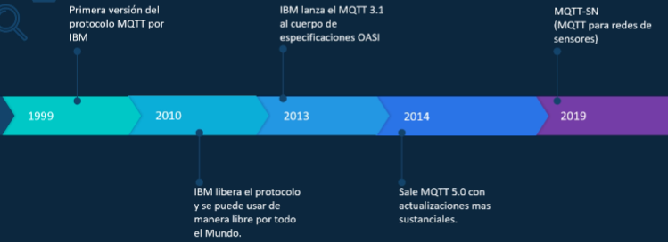
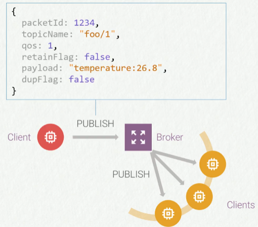

# Índice EMQX

- [Índice EMQX](#índice-emqx)
  - [S1 - INTRODUCCIÓN AL SERVICIO IOT CON MQTT Y EL BROKER EMQX](#s1---introducción-al-servicio-iot-con-mqtt-y-el-broker-emqx)
    - [Recursos de Aprendizaje](#recursos-de-aprendizaje)
    - [Introducción al EMQX](#introducción-al-emqx)
    - [IoT Internet de las Cosas](#iot-internet-de-las-cosas)
      - [Concepto de planeta más inteligente](#concepto-de-planeta-más-inteligente)
    - [Telemetría e Internet](#telemetría-e-internet)
  - [S2 - CARACTERÍSTICAS DEL PROTOCOLO MQTT](#s2---características-del-protocolo-mqtt)
    - [MQTT Protocol - Inicios](#mqtt-protocol---inicios)
    - [MQTT Publicación-Suscripción](#mqtt-publicación-suscripción)
    - [MQTT Publicar - Suscribirse - Desuscribirse](#mqtt-publicar---suscribirse---desuscribirse)
      - [Conexión MQTT](#conexión-mqtt)
      - [Publicación MQTT](#publicación-mqtt)
      - [Suscribirse MQTT](#suscribirse-mqtt)
      - [Desuscribirse MQTT](#desuscribirse-mqtt)
    - [MQTT Estructura de los Tópicos](#mqtt-estructura-de-los-tópicos)
      - [Tópicos](#tópicos)
      - [Comodines](#comodines)
      - [Cómo Planificar un Tópico](#cómo-planificar-un-tópico)
  - [S3 - TODO SOBRE EL BROKER EMQX V4.4.X](#s3---todo-sobre-el-broker-emqx-v44x)
  - [S4 - TODO SOBRE EL BROKER EMQX V5.X.X](#s4---todo-sobre-el-broker-emqx-v5xx)
  - [S5 - ANÁLISIS DEL TRÁFICO MQTT CON WIRESHARK](#s5---análisis-del-tráfico-mqtt-con-wireshark)
  - [S6 - EMQX MODO DE PRODUCCIÓN EN NUBE](#s6---emqx-modo-de-producción-en-nube)
  - [S7 - CLIENTE ESP32](#s7---cliente-esp32)
  - [S8 - CLIENTE ARDUINO UNO](#s8---cliente-arduino-uno)
  - [S9 - CLIENTE PHP](#s9---cliente-php)
  - [S10 - CLIENTE MQTT CON VUE.JS V3 POR WS Y WSS](#s10---cliente-mqtt-con-vuejs-v3-por-ws-y-wss)
  - [S11 - CLIENTE MQTT CON NODE.JS](#s11---cliente-mqtt-con-nodejs)
  - [S12 - INSTALACIÓN EMQX CON DOCKER](#s12---instalación-emqx-con-docker)
  - [S13 - INSTALACIÓN EMQX V5.8.0 USANDO DOCKER COMPOSE](#s13---instalación-emqx-v580-usando-docker-compose)
  - [S14 - PLATAFORMA IOT CLOUD V1 CONTROL CON ESP32 Y MQTT](#s14---plataforma-iot-cloud-v1-control-con-esp32-y-mqtt)
  - [S15 - PLATAFORMA IOT CLOUD V1 PROGRAMACIÓN ESP32](#s15---plataforma-iot-cloud-v1-programación-esp32)
  - [S16 - PLATAFORMA IOT CLOUD V1 PROYECTO PLATAFORMA IOT CON PHP](#s16---plataforma-iot-cloud-v1-proyecto-plataforma-iot-con-php)
  - [S17 - PRODUCCIÓN PLATAFORMA IOT CON NUBE ORACLE CLOUD](#s17---producción-plataforma-iot-con-nube-oracle-cloud)

- - -

## S1 - INTRODUCCIÓN AL SERVICIO IOT CON MQTT Y EL BROKER EMQX

### Recursos de Aprendizaje

[IotHot GitHub](https://github.com/yamir84?tab=repositories)
[IotHost YouTube](https://www.youtube.com/@iothost/videos)
[YamirTV YouTube](https://www.youtube.com/@YamirTV/videos)

Esquema del circuito con el ESP32 usado en el proyecto.

Plataforma IoT Cloud V1 en GitHub.

[IoTCloud](https://github.com/yamir84/esp32_generico_cloud)

### Introducción al EMQX

EMQX Broker MQTT, implementa tu servicio IoT Online. Puedes usarlo como broker MQTT para tu servicio IoT, tambien puedes usarlo como broker MQTT para tu servicio IoT en la nube.

Contenidos:

- MQTT historio, influencia en el IoT y comparación con otros protocolos.
- Publicación/Subscripción MQTT.
- Broker mas conocidos.
- Conexión.
- Publicar.
- Subscribe/Unsubscribe.
- Tópicos/Comodines.
- Calidad de Servicio.
- Keep Alive.
- Definición de EMQX.
- Instalación en W10 y Ubuntu. En local y nube.
- Instalación con Docker entorno local.
- Configuración de Archivos en la última versión del broker.
- Seguridad con Auth & ACL.
- Pruebas de conexión con distintos clientes.
- Cliente Oficial MQTT de EMQ X v3.1 y v5 Broker.
- Modo puente entre Broker Local/Nube.
- Uso de la API REST del Broker.

Seguridad en el MQTT:

- Uso de Wireshark.
- Análisis de las capas OSI del protocolo MQTT.
- Conexión insegura puerto 1883, análisis de los Data.
- Conexión segura TLSv1.2 puerto 8883, análisis de la data transmitida.
- Programar el ESP32 con conexión segura (8883) e insegura (1883) usando certificados generados en el Broker.

Modo Producción:

- Servidor VPS Linux (VPS Oracle Cloud).
- Dominios (Freenom/Otros)
- Panel Administrativo en Linux (Hestia Panel)

Creando Clientes Varios:

- Crear la conexión con MQTT desde Javascript.
- Cliente desde Node.js
- Cliente desde VUE.js
- Conexión desde Arduino.
- Conexión desde ESP32.

### IoT Internet de las Cosas

El internet de las cosas (IoT Internet of Things) es una red de dispositivos conectados a Internet y que se comunican entre si.

- Internet: red interconectada de dispositivos para compartir información.
- Cosa: dispositivo capaz de realizar alguna cosa.

Con el surgimiento de varios dispositivos inteligentes, Internet evoluciona para convertirse en el IoT, en el que miles de millones de dispositivos inteligentes interconectados miden, mueven y actúan de forma independiente todos los bits de datos que conforman la vida diaria.

Una compañía de energía puede monitorear molinos de viento en medio del océano y diagnosticar y desconectar de forma remota las unidades problemáticas.

El IoT irá más allá de conectar a las personas con la informacion y con otras personas. Los dispositivos interactúan con los dispositivos, creando lo que eventualmente podría convertirse en un sistema nervioso central global.

#### Concepto de planeta más inteligente

El concepto de IBM Smarter Planet, se basa en un conjunto de pilares llamados las Tres I:

- **Instrumental**: La información se captura dondequiera que exista, mediante el uso de sensores remotos.
- **Interconectado**: La información se mueve desde el punto de recopilación a cualquier lugar donde se pueda consumir de manera útil.
- **Inteligente**: La información se procesa, analiza y actúa para obtener el máximo valor y conocimiento.
  

### Telemetría e Internet

Permite medir o monitorizar cosas a distancia. Además, las mejoras en la tecnología de telemetría permiten interconectar dispositivos y sistemas de manera eficiente en diferentes ubicaciones, permitiendo la creación de un entorno de telemetría inteligente y de alta calidad.

MQTT proporciona la tecnología de telemetría para enfrentar los desafíos de información de los usuarios en el mundo real.

## S2 - CARACTERÍSTICAS DEL PROTOCOLO MQTT

### MQTT Protocol - Inicios

**MQTT** es el estándar para mensajería **IoT**. Es un protocolo de OASIS para Internet de las Cosas. Está diseñado como un transporte de mensajería de publicación/suscripción extremadamente ligero que es ideal para conectar dispositivos remotos con un espacio de código pequeño y un ancho de banda de red mínimo.

[MQTT](https://mqtt.org/)

Evolución del protocolo MQTT:

¿Por qué utilizar MQTT?

- Liviano y eficiente.
- Comunicaciones bidireccionales.
- Escala a millones de cosas.
- Entrega de mensajes confiables. MQTT tiene tres niveles de calidad de servicio definidos: 0 como máximo una vez, 1 al menos una vez y 2 exactamente una vez.
- Soporte para redes no confiables. El soporte de MQTT para sesiones persistentes reduce e tiempo para volver a conectar al cliente con el intermediario.
- Seguridad habilitada. Facilita el cifrado de mensajes mediante TLS y a autenticación de clientes mediante protocolos de autenticación modernos, como OAuth 2.0.

Los _Brokers_ MQTT más conocidos:

**EMQ** es un _Broker_ MQTT gratuito con versión de pago.

### MQTT Publicación-Suscripción

Protocolo de mensajería ligero basado en la arquitectura de Publicación/Suscripción.

Características básicas:

- Basado en TCP/IP
- Fácil de implementar, ligero y eficiente con encabezados de 2 bytes.

Patrón de Publicación/Suscripción:

- Modo Publicar/Suscribir.
- Distribución de uno a muchos.

Funciones Avanzadas:

- Proporcionado por QoS (Calidad de Servicio), Legacy (LWT)
- Retención de información, Keep-Alive y otros mecanismos.

### MQTT Publicar - Suscribirse - Desuscribirse

#### Conexión MQTT

Tanto el Broker como el cliente tienen que tener la pila TCP/IP.

- La conexión entre el Cliente y el Broker.
- Los Clientes no se pueden conectar directamente a los Clientes, se tiene que realizar mediante el Broker.

#### Publicación MQTT

El cliente envía el mensaje al _tópico + payload_.

Filtrado basado en Tópicos:

- Cada mensaje tiene un tópico asignado.
- El _Broker_ confía en el Tópico para asignar el mensaje a los Clientes.
- El _Payload_ (carga útil) es independiente de los datos.

#### Suscribirse MQTT

El cliente se suscribe a los tópicos del Broker para recibir información.

Suscribirse a un Tópico:

- Cada suscripción consta de pares _Topic-QoS_ (**QoS 0, 1 o 2** calidad de servicio).
- Se puede suscribir usando comodines (`#` o `+`).
- En caso de tópico duplicados, los QoS altos son los principales.

SUBACK:

- El _Broker_ envía un mensaje SUBACK al Cliente para reportar la confirmación de suscripción.

#### Desuscribirse MQTT

Darse de baja de un Tópico, proporcionando la información del Tópico al _Broker_.

Cancelar suscripción:

- Eliminar el registro en el Broker.
- Puede brindar una lista de Tópicos para darse de baja de todos.
- No es necesario especificar el QoS, solo Tópicos.

### MQTT Estructura de los Tópicos

#### Tópicos

Un Tópico es solo una cadena de texto.

- Los clientes se suscriben y publican información usando los Tópicos.

Características:

- Son una cadena UTF-8.
- El tópico se puede planificar en varios niveles.
- Un tópico requiere al menos un carácter.
- Las mayúsculas y minúsculas no son lo mismo (key sensitive).
- La `/` es tópico permitido. También es un separador de niveles.

#### Comodines

El uso de caracteres universales le permite usar patrones para leer tópicos.

Usar la cadena exacta para suscribirse a un Tópico:

- Solo se puede suscribir a un Tópico a la vez.

Uso de patrones para suscribirse a los temas:

- Con los comodines se puede suscribir a muchos Tópicos a la vez.
- Sólo se puede usar en SUB no en PUB.

Un solo Nivel:

- Nivel único: `+`.

Multinivel:

- Nivel 1: `#` (solo se puede colocar al final del tópico).

#### Cómo Planificar un Tópico

Reglas recomendadas:

- No comenzar con `/`. Por defecto sale `/mytopic`. Al comenzar por `/` quedaría de la siguiente manera `//mytopic`
- No utilizar espacios en blanco, UTF8 ya se utiliza.
- Utilizar sólo caracteres ASCII.
- Martener el tópico corto y lo más significativo posible.
- Usar tópicos ejemplo (`iddispositivo/idcliente`) para identificar aun más el origen del mensaje y limitar el control.
- No suscribirse a `#` ya que el cliente tendrá problemas con el rendimiento.
- Aunque los tópicos puedan contener cadenas arbitrarias, solo debe tenerse en cuenta para futuros crecimientos al formular una estructura.
- Usar temas específicos, como temperatura, humedad, luminosidad, en lugar de solo `home/room/valores` que sería equivalente a transmitir un paquete con varios valores, algo más específico sería `home/room/temperatura`, `home/room/humedad` y `home/room/luminosidad`.

## S3 - TODO SOBRE EL BROKER EMQX V4.4.X

## S4 - TODO SOBRE EL BROKER EMQX V5.X.X

## S5 - ANÁLISIS DEL TRÁFICO MQTT CON WIRESHARK

## S6 - EMQX MODO DE PRODUCCIÓN EN NUBE

## S7 - CLIENTE ESP32

## S8 - CLIENTE ARDUINO UNO

## S9 - CLIENTE PHP

## S10 - CLIENTE MQTT CON VUE.JS V3 POR WS Y WSS

## S11 - CLIENTE MQTT CON NODE.JS

## S12 - INSTALACIÓN EMQX CON DOCKER

## S13 - INSTALACIÓN EMQX V5.8.0 USANDO DOCKER COMPOSE

## S14 - PLATAFORMA IOT CLOUD V1 CONTROL CON ESP32 Y MQTT

## S15 - PLATAFORMA IOT CLOUD V1 PROGRAMACIÓN ESP32

## S16 - PLATAFORMA IOT CLOUD V1 PROYECTO PLATAFORMA IOT CON PHP

## S17 - PRODUCCIÓN PLATAFORMA IOT CON NUBE ORACLE CLOUD