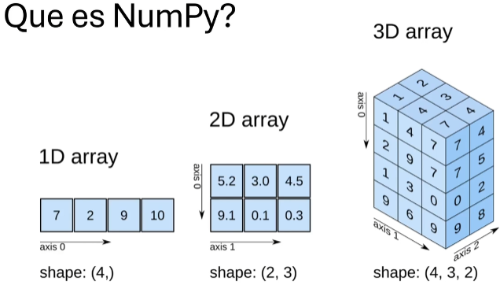

# IA Y PROGRAMACIÓN AVANZADA CON PYTHON Y RBPI - PROF24

- [IA Y PROGRAMACIÓN AVANZADA CON PYTHON Y RBPI - PROF24](#ia-y-programación-avanzada-con-python-y-rbpi---prof24)
  - [Módulo 1 - Programación en Python](#módulo-1---programación-en-python)
  - [Módulo 2 - Librerías Fundamentales de Python](#módulo-2---librerías-fundamentales-de-python)
    - [Numpy](#numpy)
    - [Pandas](#pandas)
    - [Matplotlib](#matplotlib)
    - [Seaborn](#seaborn)

- - -

## Módulo 1 - Programación en Python

Python es un lenguaje de programación interpretado, lo que significa que no es necesario compilar el código para ejecutarlo. Una vez que se ha escrito el código, se puede ejecutar directamente desde la consola de Python.

Las características principales de Python son:

- Sintaxis sencilla y legible.
- Amplia biblioteca estandard. Usado en desarrollo web, análisis de datos, IA, automatización, etc.
- Gran comunidad de desarrolladores.

- - -

## Módulo 2 - Librerías Fundamentales de Python

### Numpy

Las _listas_ son más lentas que el uso de _NumPy_. Los arrays en _NumPy_ tiene el mismo tipo de dato. Las _listas_ en cambio, pueden tener diferentes tipos de dato.

| Listas | NumPy |
| :----: | :----: |
| Inserta, elimina, añade, concatena, etc | Inserta, elimina, añade, concatena, etc |
| z = [1,4,6] | z = np.array([1,4,6]) |
| y = [2,1,2] | y = np.array([2,1,2]) |
| y*z = Error | z*y = np.array([2,4,12]) |

Código de ejemplo del uso de la librearía _Numpy_:

- [Hola Mundo Numpy](codigo/numpy_uno.py)
- [Ejemplo con Numpy](codigo/ejemploNumpy.py)

### Pandas

Librería es de código abierto, y sirve para la manipulación de datos. Permite el manejo de datos estructurados, de manera eficiente. Simplifica la transformación de datos, limpieza y modificación. Permite trabajar con bases de datos y tratar archivos del tipo: CSV, Excel, etc.

Ejemplos de uso de la librería _Pandas_:

- [Ejemplo con Pandas](codigo/ejemploPandas.py)

### Matplotlib

Librería para la representación de datos. Permite la representación de gráficos de datos, con el uso de _matplotlib_ y _seaborn_.

Ejemplos de uso de la librería _Matplotlib_:

- [Ejemplo con Matplotlib](codigo/ejemploMatplotlib.py)

### Seaborn

Librería para la representación de datos. Permite la representación de gráficos de datos, con el uso de _matplotlib_ y _seaborn_.

Ejemplos de uso de la librería _Seaborn_:

- [Ejemplo con Seaborn](codigo/ejemploSeaborn.py)