# Proyecto Node-RED Monitorización de Parámetros

- [Proyecto Node-RED Monitorización de Parámetros](#proyecto-node-red-monitorización-de-parámetros)
  - [Sección 1 - Introducción y Presentación del Proyecto](#sección-1---introducción-y-presentación-del-proyecto)
  - [Sección 2 - Desarrollo del Proyecto](#sección-2---desarrollo-del-proyecto)
    - [Creando el apartado de Información](#creando-el-apartado-de-información)
    - [Creando el apartado de Alamacenamiento](#creando-el-apartado-de-alamacenamiento)
    - [Creando el apartado Históricos](#creando-el-apartado-históricos)
    - [Creando el apartado Conexión a Internet](#creando-el-apartado-conexión-a-internet)
    - [Creando el apartado de Acciones](#creando-el-apartado-de-acciones)
    - [Retoques Estéticos Finales](#retoques-estéticos-finales)
    - [Organización del Código yResultados Finales](#organización-del-código-yresultados-finales)

- - -

## Sección 1 - Introducción y Presentación del Proyecto

Creación de un _Dashboard_ para monitorear parámetros del sistema operativo en la Raspberry Pi, tales como:

- Uso de CPU
- Temperatura
- Almacenamiento:
  - Total
  - Disponible
  - Usado
- Memoria RAM
- Velocidad del procesador
- Hostname
- IP Address
- Fecha y hora

## Sección 2 - Desarrollo del Proyecto

### Creando el apartado de Información

Accedemos a Node-RED en la URL: `http://192.168.0.41:1880/`.

- Añadir nombre, hacer doble clic en la pestaña _Flow 1_.
- 

Para cumplimentar el siguiente paso, se debe hacer clic en el icono y localizar la opción _Dashboard_. Tal y como se indica en la imagen:

Siguiente paso, es crear una pestaña (_TAB_) con tres grupos dentro.

- 
- 
- 
- 

En los componentes _dashboard_ que están disponibles lado izquierdo, buscar el _text_ y añadirlo al _Flow_:

- 
- 

Siguiente paso es añadir tres nodes _text_: Hostname, IP Address y Fecha y Hora.

- Comando para saber el hostname de la RBPi: `hostnamectl | grep hostname` o simplemente escribiendo `hostname`. El módulo que utilizaremos es _exec_ que sirve para ejecutar comandos de sistema.
- El módulo _exec_ lo ejecutaremos con un nodo _inject_ que es el que indica cuándo ejecutar el comando.
- 
- 
- La salida del _exec_ lo conectaremos al nodo _text_.
- 
- Para saber la IP de la RBPi, usaremos el módulo _exec_ con el comando `hostname -I`. El módulo _exec_ lo ejecutaremos con un nodo _inject_ que es el que indica cuándo ejecutar el comando.
- 
- Para saber la fecha y hora, usaremos el módulo _exec_ con el comando `date`. El módulo _exec_ lo ejecutaremos con un nodo _inject_ que es el que indica cuándo ejecutar el comando.
- En este caso el node _inject_ lo configuramos para que se ejecute cada segundo.
- 
- 

Para realizar una distribución de los componentes en el _Dashboard_, podemos hacer clic en el icono y localizar la opció _Layout_. Tal y como se indica en la imagen:

- 
- 

### Creando el apartado de Alamacenamiento

Añadimos textos con el nodo _text_ con la etiqueta ALAMACENAMIENTO para mostrar la información de Almacenamiento de la RBPi. Se utilizará el comando `df -h --total` en una nodo _exec_ que será activado por un nodo _inject_.

Al ejecutar el comando `df -h --total` se obtiene una tabla de salida; para seleccionar una fila de la tabla e imprimir una columna, usaremos el comando `grep` de la forma siguiente: `df -h --total | grep /dev/root | awk '{print $2}'`.

- 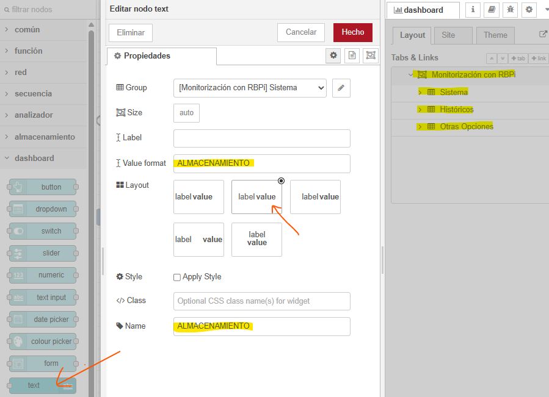
- 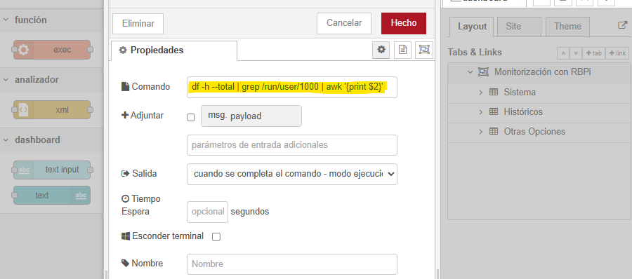
- 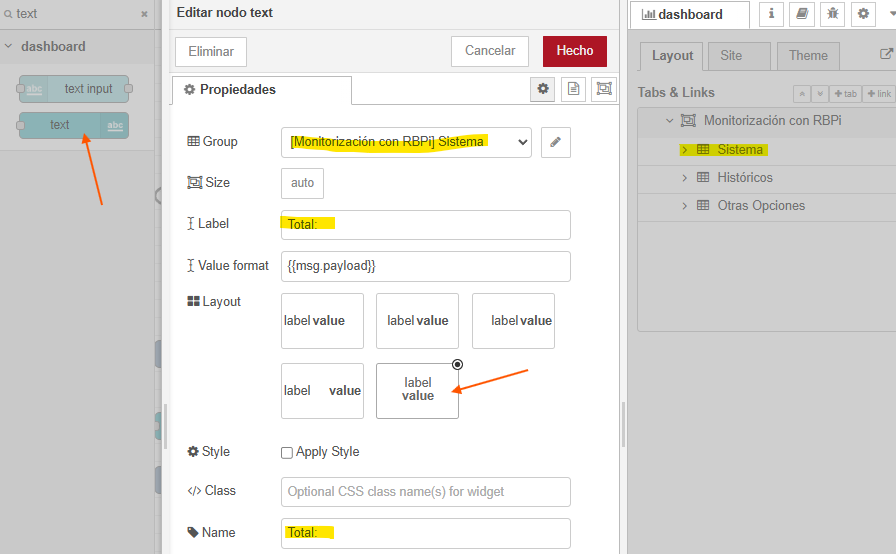

Realizamos el mismo proceso anterior, pero para la información de Memoria que está en uso y la memoria disponible. Para ello en el comando de ejecución se debe cambiar el parámetro `df -h --total | grep /dev/root | awk '{print $2}'` por `df -h --total | grep /dev/root | awk '{print $3}'` y `df -h --total | grep /dev/root | awk '{print $4}'` respectivamente.

Para la memoria que está en uso (en porcentaje), le añadiremos un nodo _gauge_ para mostrar este porcentaje de uso de la memoria en gráfico circular.

Entre el nodo _exec_ y el nodo _gauge_ conectaremos el nodo _change_ para cambiar el valor de tipo String a Number.

- 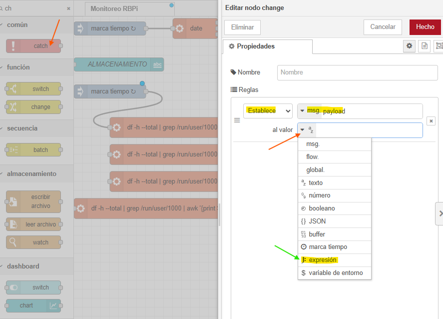
- El el campo _velor_ el _change_ añdir la expresión de cálculo: `$substring(payload,0,($length(payload)-1))`.
- 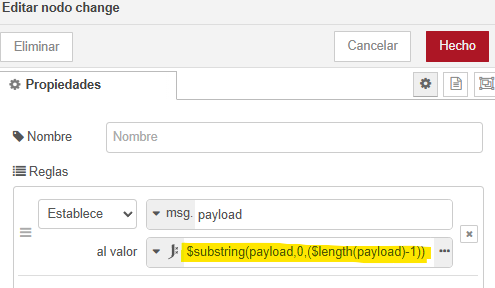

### Creando el apartado Históricos

En la pestaña de Histórico se mostrará un gráfico del uso de CPU y un gráfico dela Temperatura.

Para saber el uso de Memoria utilizaremos el comando `free` y para seleccionar la fila que queremos: `free | grep Mem:`. Para seleccionar un valor de la fila usaremos el comando `awk '{print $2}'` con el valor `$2` se indican las columnas. Para que represente la memoria de uso en porcentaje se puede realizar con la operación matemática `($2/$3)*100` donde `$2` es el uso de memoria y `$3` es el total de memoria.

- `free | grep Mem | awk '{print $2/$3*100}'`.
- 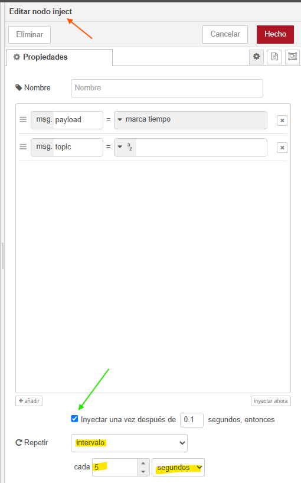
- 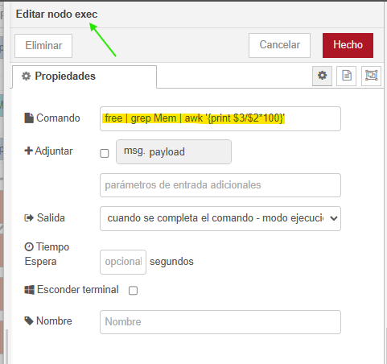

Para la representación se unirá a un nodo _chart_.

- 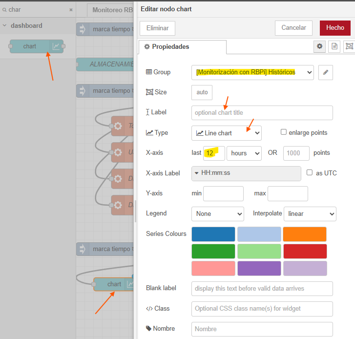

Creamos a continuación, el panel de la temperatura. Para ello, se utiliza el comando `vcgencmd measure_temp` y el nodo _exec_ lo conectaremos con el nodo _change_ para cambiar el tipo de dato String a Number. La forma en como se recibe el dato tras ejecutar el comando es `temp=XX.X°C`. Si nos queremos quedar con el valor numérico unicamente, usaremos el comando `$substring(payload,5,4)`. El nodo _change_ lo conectaremos con el nodo _gauge_.

- 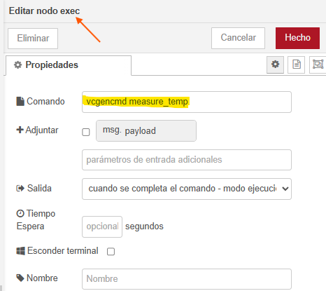
- 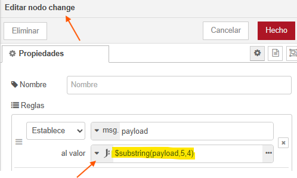

### Creando el apartado Conexión a Internet

Añadimos nodo _text_ para mostrar la información de la conexión a Internet.

- 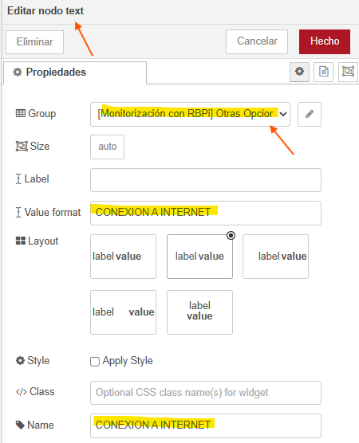

Para medir la conexión a internet se debe instalar el paquete `sudo apt install speedtest-cli`. Se debe ejecutar el comando `speedtest-cli --simple` en un nodo _exec_. 

- 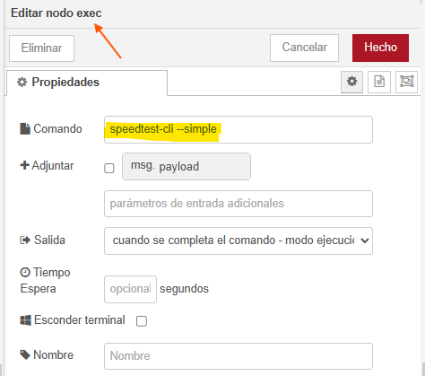

Para ver la ayuda del comando se debe escribir `speedtest-cli --help`.

La ejecución del comando `speedtest-cli --simple` muestra la información siguiente:

- Ping: xx.xx ms
- Download: xx.xx Mbps
- Upload: xx.xx Mbps

Añadiremos un botón (_button_)para ejecutar el comando `speedtest-cli --simple` y un nodo _text_ para mostrar la salida del comando.

- 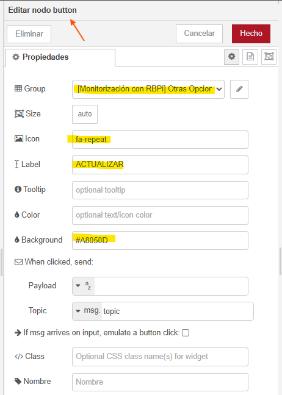

Para separar los datos proporcionados por el comando `speedtest-cli --simple` en tres nodos _text_: Ping, Download y Upload, usaremos el nodo _split_. Separa los datos utilizando el salto de línea al detectar '\n'.

- 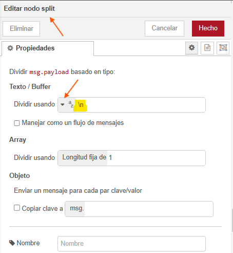

Utilizaresmos un nodo _switch_ para enviar los datos (index) del _split_ a las distintas salidas de los nodos _text_: Ping, Download y Upload.

- 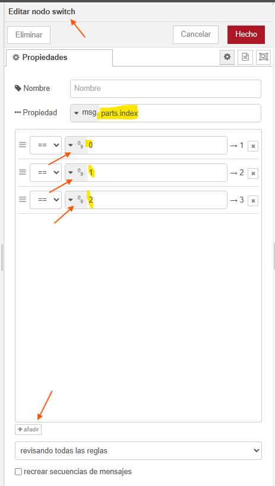

Añadirmos un _change_ para seleccionar la información a mostrar en los nodos _text_: Ping, Download y Upload.

- 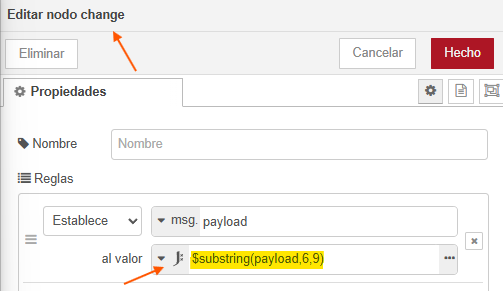
- 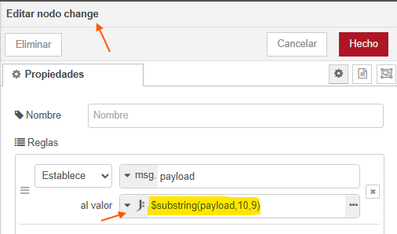
- 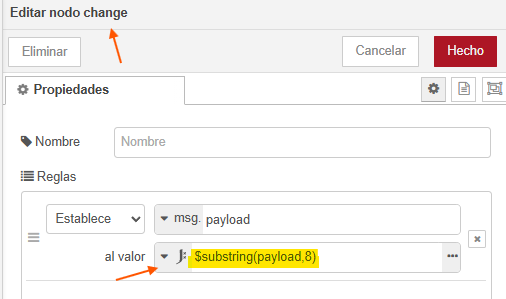

Añadimos los nodos _text_: Ping, Download y Upload.

- 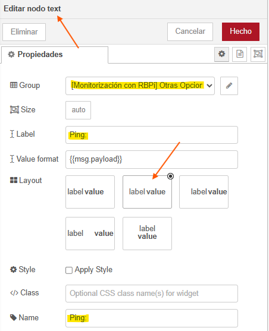
- 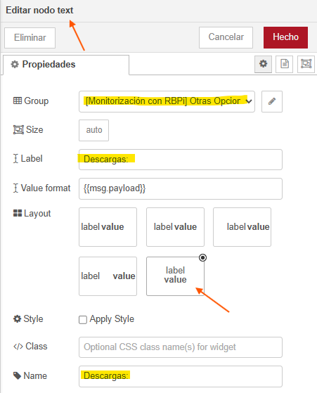
- 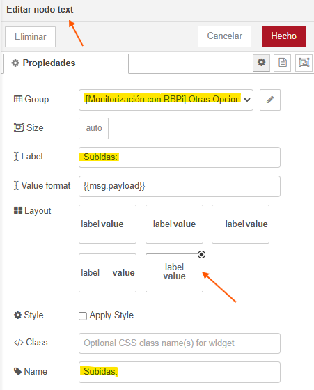

Le añadiremos un nodo para que actualice después de pulsar el botón. Para ello usaremos el nodo de función _template_, conectado en paralelo con el nodo _exec_. La configuración del nodo _template_ es la siguiente:

- 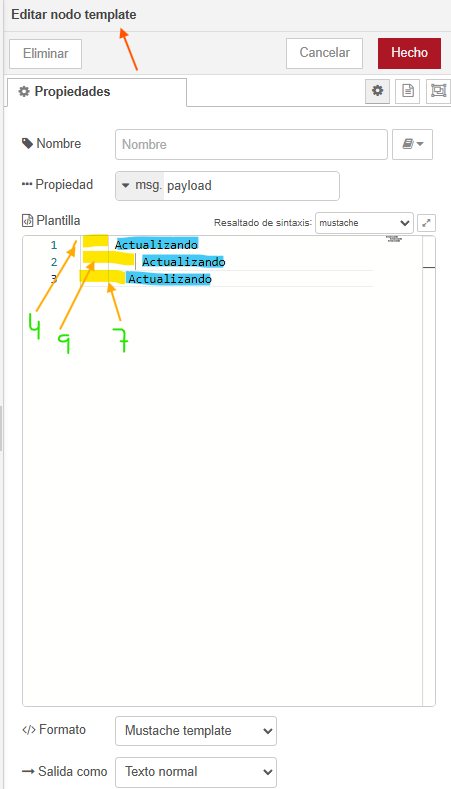

### Creando el apartado de Acciones

El grupo de acciones se divide en dos partes: en un texto y varios botones.

- 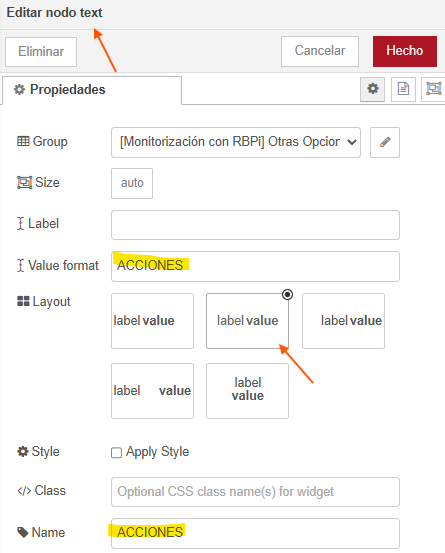

Añadimos varios botones con el nodo _button_.

- 
- 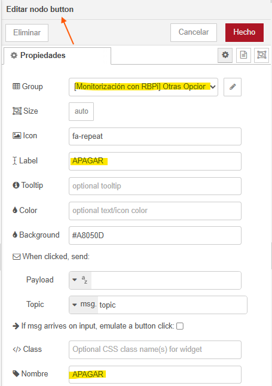

Las acciones de apagar y reiniciar se realizan con el nodo _exec_ ejecutando el correspondiente comando.

- 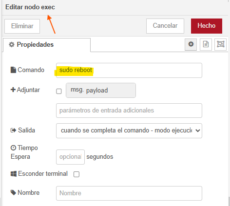
- 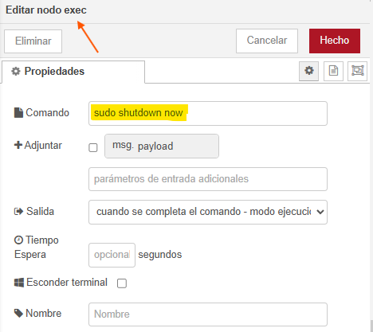

### Retoques Estéticos Finales

Los encabezados se modificarán para tener un fondo de un color diferente y el texto en blanco.

A todos los encabezados les pondremos un nombre de clase _encabezado_.

- 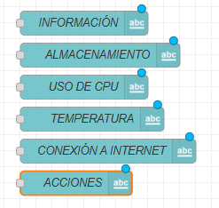
- 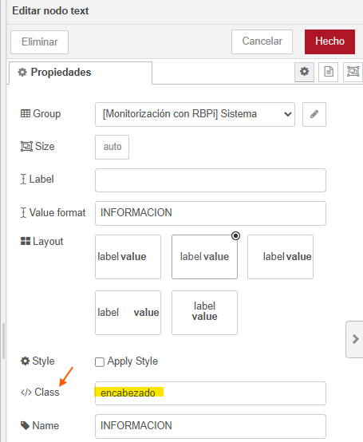

Para los textos del grupo de encabezados, les pondremos un nombre de clase _otros_.

- 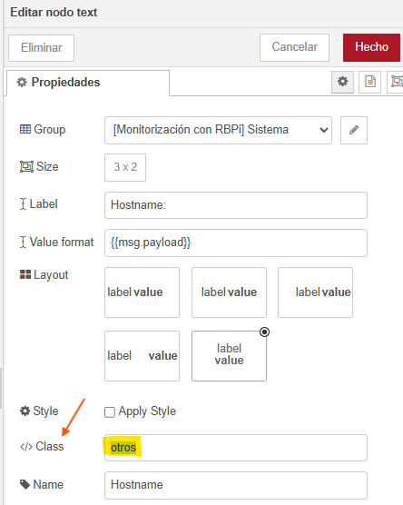

Añadiremos un nodo _template_ para que actualice el _Dashboard_, definiendo el estilo.

- 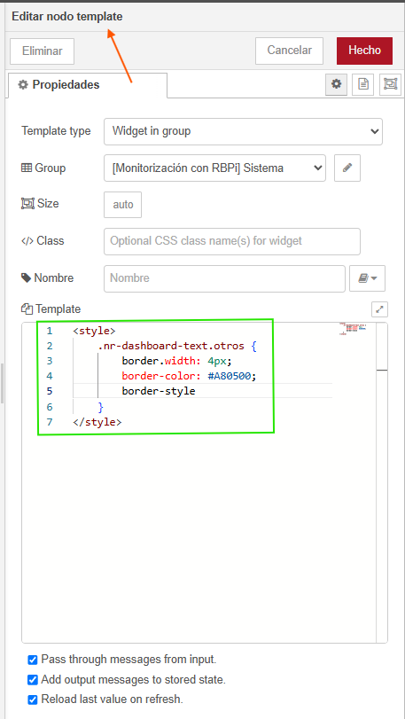
- 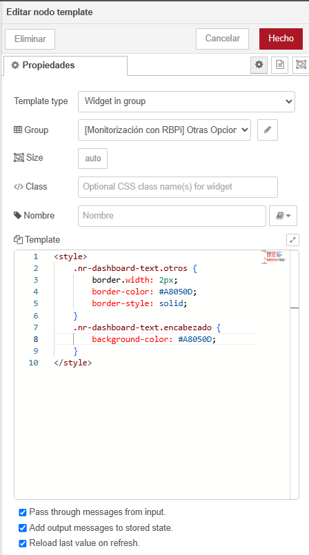
- 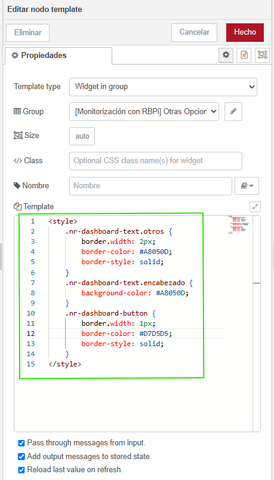

### Organización del Código yResultados Finales

- 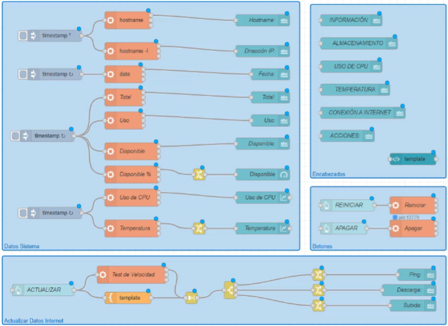
- 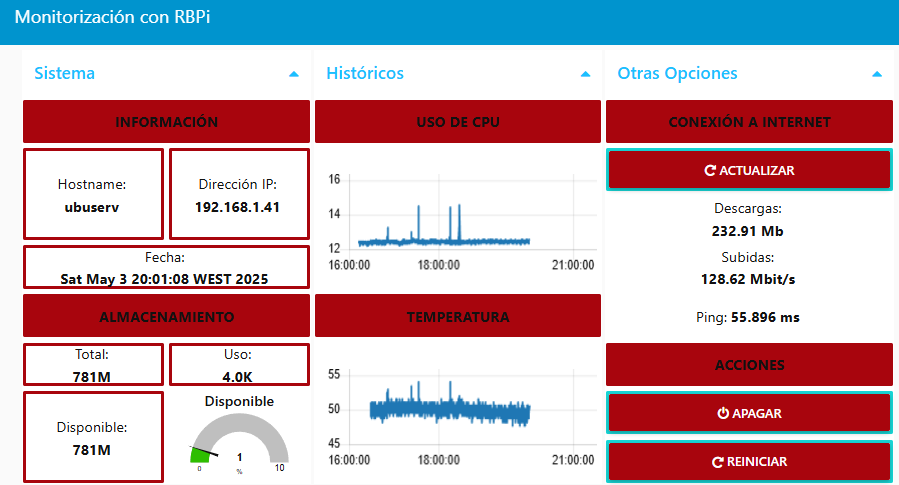
