# Proyecto Node-RED Monitorización de Parámetros

- [Proyecto Node-RED Monitorización de Parámetros](#proyecto-node-red-monitorización-de-parámetros)
  - [Sección 1 - Introducción y Presentación del Proyecto](#sección-1---introducción-y-presentación-del-proyecto)
  - [Sección 2 - Desarrollo del Proyecto](#sección-2---desarrollo-del-proyecto)
    - [Creando el apartado de Información](#creando-el-apartado-de-información)
    - [Creando el apartado de Alamacenamiento](#creando-el-apartado-de-alamacenamiento)

- - -

## Sección 1 - Introducción y Presentación del Proyecto

Creación de un _Dashboard_ para monitorear parámetros del sistema operativo en la Raspberry Pi, tales como:

- Uso de CPU
- Temperatura
- Almacenamiento:
  - Total
  - Disponible
  - Usado
- Memoria RAM
- Velocidad del procesador
- Hostname
- IP Address
- Fecha y hora

## Sección 2 - Desarrollo del Proyecto

### Creando el apartado de Información

Accedemos a Node-RED en la URL: `http://192.168.0.41:1880/`.

- Añadir nombre, hacer doble clic en la pestaña _Flow 1_.
- 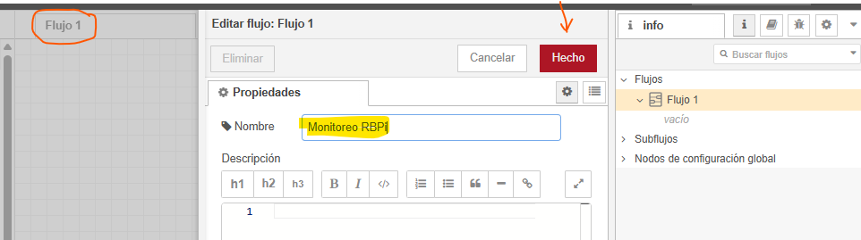

Para cumplimentar el siguiente paso, se debe hacer clic en el icono y localizar la opción _Dashboard_. Tal y como se indica en la imagen:

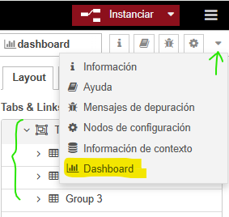

Siguiente paso, es crear una pestaña (_TAB_) con tres grupos dentro.

- 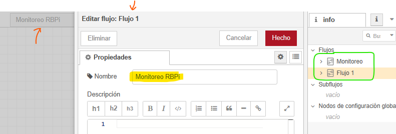
- 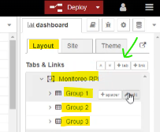
- 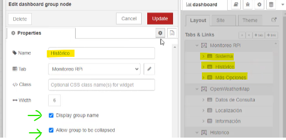
- 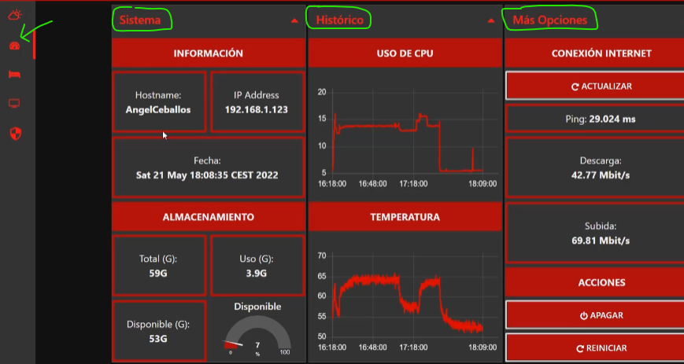

En los componentes _dashboard_ que están disponibles lado izquierdo, buscar el _text_ y añadirlo al _Flow_:

- 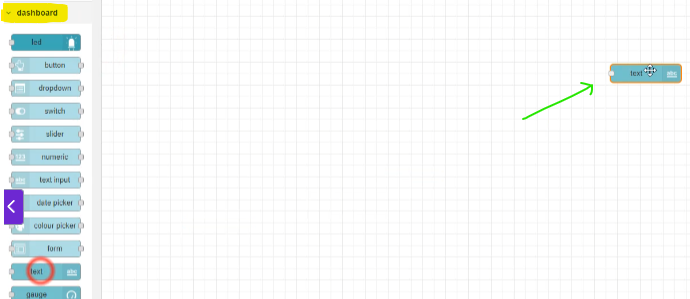
- 

Siguiente paso es añadir tres nodes _text_: Hostname, IP Address y Fecha y Hora.

- Comando para saber el hostname de la RBPi: `hostnamectl | grep hostname` o simplemente escribiendo `hostname`. El módulo que utilizaremos es _exec_ que sirve para ejecutar comandos de sistema.
- El módulo _exec_ lo ejecutaremos con un nodo _inject_ que es el que indica cuándo ejecutar el comando.
- 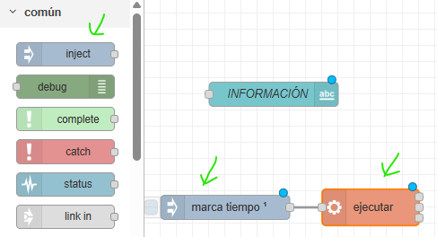
- 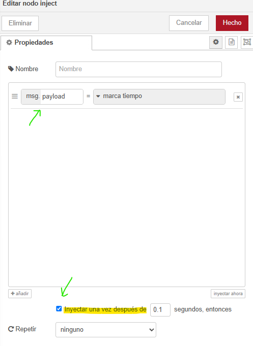
- La salida del _exec_ lo conectaremos al nodo _text_.
- 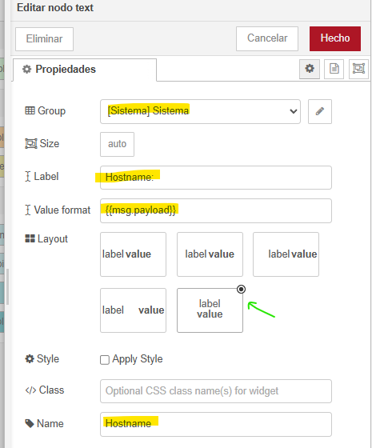
- Para saber la IP de la RBPi, usaremos el módulo _exec_ con el comando `hostname -I`. El módulo _exec_ lo ejecutaremos con un nodo _inject_ que es el que indica cuándo ejecutar el comando.
- 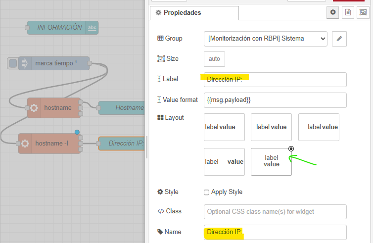
- Para saber la fecha y hora, usaremos el módulo _exec_ con el comando `date`. El módulo _exec_ lo ejecutaremos con un nodo _inject_ que es el que indica cuándo ejecutar el comando.
- En este caso el node _inject_ lo configuramos para que se ejecute cada segundo.
- 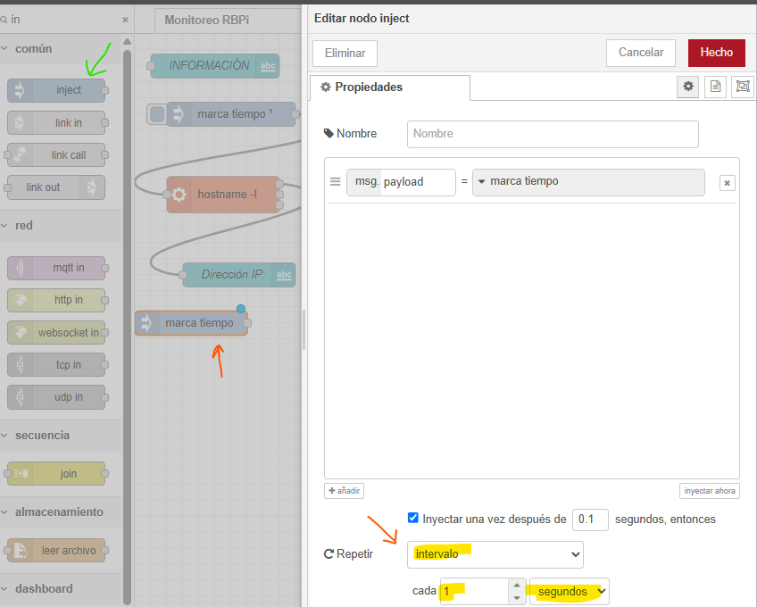
- 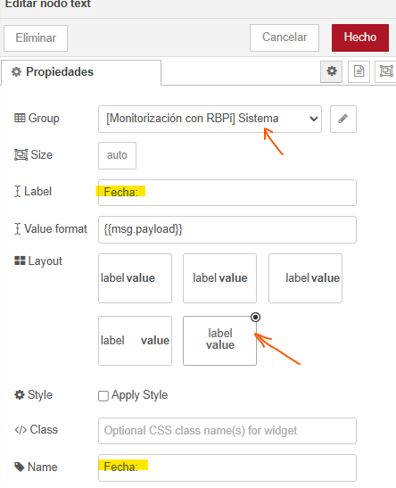

Para realizar una distribución de los componentes en el _Dashboard_, podemos hacer clic en el icono y localizar la opció _Layout_. Tal y como se indica en la imagen:

- 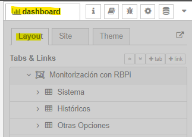
- 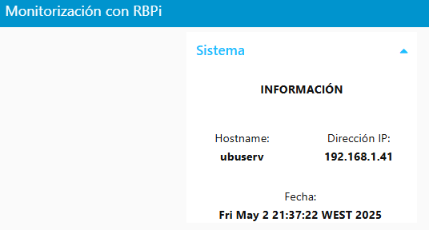

### Creando el apartado de Alamacenamiento