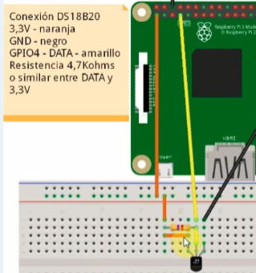
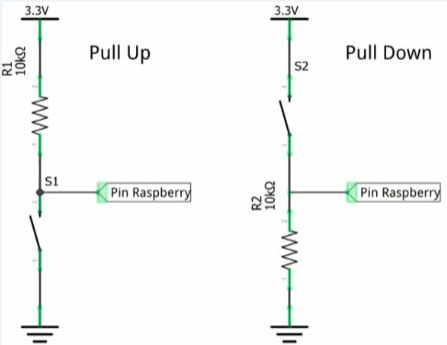
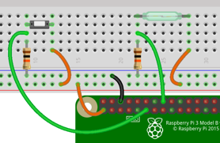
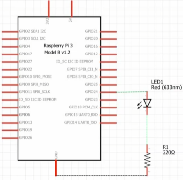
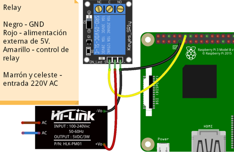

# IoT con RBPi. Curso Avanzado

- [IoT con RBPi. Curso Avanzado](#iot-con-rbpi-curso-avanzado)
  - [Hardware en RBPi](#hardware-en-rbpi)
  - [Software en RBPi](#software-en-rbpi)
  - [Conexión a RBPi-3](#conexión-a-rbpi-3)
  - [Habilitar 1-Wire e I2C en RBPi](#habilitar-1-wire-e-i2c-en-rbpi)
  - [Conexión del sensor DS18B20](#conexión-del-sensor-ds18b20)
  - [Conexión de Pulsaor y Sensor ON/OFF](#conexión-de-pulsaor-y-sensor-onoff)
    - [Acceder a los pines de la RBPi](#acceder-a-los-pines-de-la-rbpi)
  - [Control de un LED](#control-de-un-led)
    - [Control del pin desde línea de comandos](#control-del-pin-desde-línea-de-comandos)
  - [Control de un Relay](#control-de-un-relay)
  - [PWM en RBPi](#pwm-en-rbpi)
    - [Tipos de PWM](#tipos-de-pwm)
  - [Python en RBPi](#python-en-rbpi)
    - [Librería RPi.GPIO](#librería-rpigpio)
    - [Script Python - Leer un pin](#script-python---leer-un-pin)
    - [Leer ON/OFF usando RPi.GPIO](#leer-onoff-usando-rpigpio)
      - [Resistores Pull up / Pull down](#resistores-pull-up--pull-down)
    - [Método de las Interrupciones (detection edge)](#método-de-las-interrupciones-detection-edge)
      - [Función wait\_for\_edge()](#función-wait_for_edge)
    - [Control de una salida RBPi con Python](#control-de-una-salida-rbpi-con-python)
    - [Leer sensor D18B20 con Python](#leer-sensor-d18b20-con-python)
    - [PWM con Pytohn en RBPi](#pwm-con-pytohn-en-rbpi)
  - [Programar la ejecución de scripts Pytohn](#programar-la-ejecución-de-scripts-pytohn)
    - [Usando CRON](#usando-cron)

---

## Hardware en RBPi

- RBPi-3 modelo B o modelo B+.
- uSD, clase 10, 8 Gb
- Sensor temperatura DS1820.
- Sensor temperatura y presión BMP280.
- Sensor de movimiento por infrarrojo (PIR)
- Sensor magnético (para apertura de puertas)
- LEDs
- Módulo de Relay optoacoplado.
- Controlador PWM.

## Software en RBPi

- BalenaEtchar
- Win32 Disk Imager
- NMAP
- ZARC (es un ZIP)
- Notepad++
- PuTTY
- VNC Viewer
- TightVNC
- WinSCP (cliente FTP)
- FileZilla (cliente FTP)
- Raspbian Buster with Desktop

## Conexión a RBPi-3

La conexión se realizará desde la aplicación _PuTTY_ añadiendo la IP de la RBPi seleccionando SSH. La primera vez que nos conectamos, introducimos usuario y contraseña por defecto:

- login as: pi
- password: raspberry

Si queremos cambiar la contraseña usaremos el comando `passwd` seguido de la contraseña actual y luego la nueva.

Para configurar la RBPi `sudo raspi-config`. Tenemos varias opciones. Una opción que se debe activar es _VNC_.

La aplicación _VNC Viewer_ se instala en un PC con W10/11 nos permite conectarnos a la RBPi añadiendo la IP con el puerto por defecto 5900.

## Habilitar 1-Wire e I2C en RBPi

Conexión a través de PuTTY escribir el comando `sudo raspi-config` para configurar la RBPi. En el menú, seleccionar _Interfacing Options_ y posteriormente habilitar _I2C_ e _1-Wire_.

## Conexión del sensor DS18B20

Es un sensor de temperatura. Se puede alimentar con +5 Vcc o con 3,3 Vcc.



Para saber si RBPi reconoce el sensor, nos dirigiremos al directorio: `cd /sys/bus/w1/devices/`. Para listar el contenido `ls`. Aparecerá un directorio con un nombre numérico en hexadecimal. Ingresaremos a ese directorio: `cd 28-021312ddd5aa`. Veremos una serie de archivos, pero el que nos interesa es _w1_slace_. Para el contenido: `cat w1_slace`. El contenido nos da dos valores: _crc=24_ para verificar la lectura y _t=24062_ que corresponde a la temperatura. Prueba de que el sensor está funcionando.

## Conexión de Pulsaor y Sensor ON/OFF

Las conexiones _Pull Up_ y _Pull Down_ usadas para la conexión de los sensores a las entradas/salidas de la RBPi.



- **PULL-UP**: conexión a través de resistor de 10 k$\Omega$. Si pulsador está abierto, tendremos Vcc en la conexión de salida. En caso contrario, el voltaje será de 0 Vcc.
- **PULL-DOWN**: conexión a través del pulsador. Si está abierto el voltaje de salida es de 0 Vcc y si está cerrado el voltaje será de Vcc. El resistor de 10 k$\Omega$ estará entre GND y la salida.



### Acceder a los pines de la RBPi

- Listar el contenido: `ls /sys/class/gpio/`.
- Añadir el pin 17: `echo "17" > /sys/class/gpio/export`.
- Añadir el pin 23: `echo "23" > /sys/class/gpio/export`.

Si realizamos un listador del directorio `ls` aparecerán los pines que hemos añadido.

- Pin 17 como entrada: `echo "in" > /sys/class/gpio/gpio17/direction`.
- Pin 23 como entrada: `echo "out" > /sys/class/gpio/gpio23/directio`.

Para ver los valores que tienen estos pines:

- Contenido del pin: `cat /sys/class/gpio/gpio17/value`.
- Contenido del pin: `cat /sys/class/gpio/gpio23/value`.

## Control de un LED

En este ejemplo se conecta un diodo LED a un pin de la RBPi. Y se realizará la escritura de un bit para encendido/apagado del LED.

Esquema de conexión del LED a la RBPi utiliza un resistor de 200 $\Omega$ para limitar la corriente:



### Control del pin desde línea de comandos

- Pin 24 a 0 V: `echo "0" > /sys/class/gpio/gpio24/value`.
- Pin 24 a 3.3 V: `echo "1" > /sys/class/gpio/gpio24/value`.

## Control de un Relay

Conexión de un Relay al pin GPIO25 de la RBPi. Es recomendable añadir una fuente de alimentación externa.



Pasos a seguir en el código para el control del Relay:

  1. Exportar el pin _GPIO 25_: `echo "25" > /sys/class/gpio/export`.
  2. Definir si el pin _GPIO 25_ es entrada o salida: `echo "out" > /sys/class/gpio/gpio25/direction`.
  3. Escribir un valor en el pin _GPIO 25_: `echo "out" > /sys/class/gpio/gpio25/value`.

## PWM en RBPi

El **PWM** (Pulse Width Modulation) es una variación del ancho de pulso.


Las señales de la imagen anterior, todas tienen la misma frecuencia, lo que cambia es el tamaño del pulso (_Duty Cycle_)

### Tipos de PWM

En RBPi existen tre maneras de controlar el PWM:

- Por software. Con Python se puede escribir un código que genere señal PWM.
- Por DMA. Es usando el acceso directo a memoria del controlador sin intervención del microprocesador.
- Por hardware. Acceso director al hardware de la RBPi.

## Python en RBPi

El lenguaje _Python_ es un lenguaje de programación interpretado. Donde cada instrucción se va ejecutando de forma secuencial en el orden en que está escrita, sin que sea necesario un proceso de compilación previo. Es el _interprete_ el encargado de leer y ejecutar las instrucciones.

Una librería que se utiliza en RBPi es: _raspberry-gpio-python_ que permite el control de los pines GPIO desde Python.

Para instalar la librería python en RBPi:

  1. sudo apt-get update
  2. sudo apt-get install python-rpi.gpio python3-rpi.gpio

Otra manera de instalar, es usando el administrador de paquetes _pip_. Ejecutamos el comando `pip install RPi.GPIO` en el entorno de Python con permisos de administrador.

### Librería RPi.GPIO

Página web oficial para la librería [RPi.GPIO](https://pypi.org/project/RPi.GPIO/). Explicación _WiKi_ de la librería [RPi.GPIO](https://sourceforge.net/p/raspberry-gpio-python/wiki/Home/)

Identificación de los pines de la RBPi:

- Por la placa: **GPIO.BOARD**. Instrucción => `GPIO.setmode(GPIO.BOARD)`.
- Por el uP: **GPIO.BCM**. Instrucción => `GPIO.setmode(GPIO.BCM)`.


Podemos activar las advertencias (warning), para ello usamos el comando: `GPIO.setwarnings(False)`.

Para activar si un canal (pin) será de entrada o de salida: `GPIO.setup(channel, GPIO.OUT)`, `GPIO.setup(channel, GPIO.IN)`. Para indicar el estado inicial: `GPIO.setup(channel, GPIO.OUT, initial=GPIO.HIGH)`.

Se pueden utilizar listas de canales (pines) y luego configurar como entrada o salida:

- `chan_list = [11,12]`. Lista de canales (pines)
- `GPIO.setup(chan_list, GPIO.OUT)`. También puede ser `...GPIO.IN)`.

Para borrar todos los estados de los canales (pines):

- `GPIO.cleanup(channel)`
- `GPIO.cleanup( [channel1, channel2] )`.

### Script Python - Leer un pin

```python
# ejecución directamente desde intérprete Pytohn
>>> import os
>>> os.system("echo 23 > /sys/class/gpio/export")
>>> os.system("echo in > /sys/class/gpio23/direction")  #config. pin de entrada
>>> os.system("cat /sys/class/gpio/gpio23/value") #leer valor pin 
```

Script Python comprobar si un pin pasado como argumento es de entrada:

```python
# Para ejecutar el archivo, indicar el número de pin, como muestra el ejemplo
# python checkLeerPin.py 23
import os
import sys

pin = sys.argv[1]
def leer_pin(pin):
  if not os.path.isfile("/sys/class/gpio/gpio"+str(pin)+"/value"):
    os.system("echo "+str(pin)+" > /sys/class/gpio/export")
    os.system("echo in > /sys/class/gpio/gpio"+str(pin)+"/direction")
  
  file_name = os.path.join("/","sys","class","gpio","gpio"+str(pin),"value")
  f = open(file_name,"r")
  valor = f.read()
  f.close()
  return valor

print(leer_pin(pin))
```

### Leer ON/OFF usando RPi.GPIO

Métodos de lectura de los pines en RBPi:

  1. **Polling**. Escanea la entrada cada cierto tiempo, para determinar su estado. No es muy eficaz.
  2. **Interrupción bloqueante**. Un evento de la antreda activa una parte del código.
  3. **Interrupción no bloqueante**. Un evento activa una parte del código, pero no deja de hacer otras cosas.
  
Ejemplo de código usando la técnica de _polling_:

```python
# Para ejecutar el script: python pollPin.py

import RPi.GPIO as GPIO
import time
import signal
import sys

GPIO.setmode(GPIO.BCM)  # establece los números de los pines BCM
GPIO.setup(17, GPIO.IN)

def signal_handler(sig, frame):
  GPIO.cleanup()
  sys.exit(0)

while True:
  if GPIO.input(17):
    print('Entrada ALTA')
  else:
    print('Entrada BAJA')
  time.sleep(1)
  signal.signal(signal.SIGINT, signal_handler)
```

#### Resistores Pull up / Pull down

A través de la librería _RPi.GPIO_ se pueden usar los resistores internos que dispone la RBPi.

- `GPIO.setup(channel, GPIO.IN, pull_up_down=GPIO.PUD_UP)`.
- `GPIO.setup(channel, GPIO.IN, pull_up_down=GPIO.PUD_DOWN)`.

### Método de las Interrupciones (detection edge)

Se puede usar detectando el _flanco ascendente_ o el _flanco descendente_ de una señal de entrada o ambos estados.

#### Función wait_for_edge()

- `GPIO.wait_for_edge(channel, GPIO.RISING)`.
- Las opciones para detectar el flanco:
  - `GPIO.RISING`.
  - `GPIO.FALLING`.
  - `GPIO.BOTH`.

Script de ejemplo del uso de la función detección de flanco:

```python
# Ejecutar el script: python wait_for_edge.py

import RPi.GPIO as GPIO
import signal
import time
import sys

pin = 17
GPIO.setmode(GPIO.BCM)
GPIO.setup(pin, GPIO.IN)

def signal_handler(sig, frame):
  GPIO.cleanup()
  print("finalizando")
  sys.exit(0)

while True:
  print("Esperando")
  entrada = GPIO.wait_for_edge(pin, GPIO.FALLING, timeout=2000) # 2" espera flanco ascendente
  if entrada is None:
    print("Tiempo excedido")
  else:
    print("Pulsador presionado")
  signal.signal(signal.SIGINT, signal_handler)
```

<p style="color:blue">
Script que permite la ejecución de las interrupciones sin para el códigp principal del programa.</p>

```python
import RPi.GPIO as GPIO
import signal
import time
import sys
PULSADOR = 17

def signal_handler(sig, frame):
  GPIO.cleanup()
  sys.exit(0)

def button_pressed_callback(channel):
  print("Pulsador presionado")

GPIO.setmode(GPIO.BCM)
GPIO.setup(PULSADOR, GPIO.IN)
GPIO.add_event_detect(PULSADOR, GPIO.FALLING, callback=button_pressed_callback, bouncetime=100)
# rebote, tiempo mínimo que debe esperar
while True:
  print("Ejecutamos resto del código")
  time.sleep(2)
  signal.signal(signal.SIGINT, signal_handler)
```

### Control de una salida RBPi con Python

<font color="blue">Para probar el código, conectaremos un LED al pin GPIO-24 con resistor de 220 $\Omega$ en serie.</font>

```python
# Script control LED en GPIO-24

import RPi.GPIO as GPIO
import sys

pin = int(sys.argv[1])  # 1er es nº de pin (string) cast a int
on_off = int (sys.argv[2])  # 2a es on off (string) cast a int

GPIO.setwarnings(False)
GPIO.setmode(GPIO.BCM)

GPIO.setup(pin, GPIO.OUT)
GPIO.output(pin, on_off)
```

>[!NOTE]
>
>Para ejecutar el script requiere número de pin + on-off: _python fichero.py 24 1_.

### Leer sensor D18B20 con Python

<font color="blue">La librería necesaria para usar en Python es [W1ThermSensor](https://pypi.org/project/w1thermsensor/). Soportando varios modelos de sensores.</font>

<font color="blue">La librería se puede instalar desde: `pip install w1thermsensor` o usando `sudo apt-get install python3-w1thermsensor`.</font>

Script de ejemplo:

```python
from w1thermsensor import W1ThermSensor

# sirve para varios sensores conectados en serie
for sensor in W1ThermSensor.get_available_sensors():
  print("El sensor "+sensor.id+" marca la temperatura: "+sensor.get_temperature())
```

### PWM con Pytohn en RBPi

>[!IMPORTANT]
>
>Se utilizará el LED conectado al pin GPIO-24 a través de resistencia de 220 $\Omega$.</br>
>Usa la librería _raspberry-gpio-python_.

<font color="blue">Ejemplo para hacer parpadear un LED una vez cada dos segundos:</font>

```python
import RPi.GPIO as GPIO
GPIO.setmode(GPIO.BOARD)
GPIO.setup(12, GPIO.OUT)

p = GPIO.PWM(12, 0.5)
p.start(1)
input('Press return to stop:')   # use raw_input for Python 2
p.stop()
GPIO.cleanup()
```

<font color="blue">Ejemplo para aumentar o disminuir el brillo de un LED:</font>

```python
import time
import RPi.GPIO as GPIO
GPIO.setmode(GPIO.BOARD)
GPIO.setup(12, GPIO.OUT)

p = GPIO.PWM(12, 50)  # channel=12 frequency=50Hz
p.start(0)
try:
    while 1:
        for dc in range(0, 101, 5):
            p.ChangeDutyCycle(dc)
            time.sleep(0.1)
        for dc in range(100, -1, -5):
            p.ChangeDutyCycle(dc)
            time.sleep(0.1)
except KeyboardInterrupt:
    pass
p.stop()
GPIO.cleanup()
```

<font color="blue">Ejemplo tres. Para ejecutar el script se precisa pasar como argumentos: número de pin, frecuencia y ciclo en porcentaje.</font>

```python
# para ejecutar el script: python pwm.py 24 1 50
import RPi.GPIO as GPIO
import sys
import signal

pin = int(sys.argv[1])
frec = int(sys.argv[2])
ciclo = int(sys.argv[3])

GPIO.setmode(GPIO.BOARD)
GPIO.setup(pin, GPIO.OUT)

p = GPIO.PWM(pin, frec)
p.start(ciclo)

def signal_handler(sig, frame):
  p.stop()
  GPIO.cleanup()
  sys.exit()

while True:
  signal.signal(signal.SIGINT, signal_handler)
```

## Programar la ejecución de scripts Pytohn

### Usando CRON

_CRON_ es un demonio (servicio que funciona en segundo plano) que funciona en Linux. Permite programar la ejecución de un código, estableciendo fecha y hora.

Una página web [Crontab Guru](https://crontab.guru/) permite configurar de forma fácil las fechas y horas de inicio de ejecución.

En Terminal de RBPi ejecutar: _`sudo crontab -l`_. Para listar los usuarios que tienen la posibilidad de programar eventos.

- <font color="green">_`sudo crontab -l`_</font>. Para listar los usuarios con privilegios programar eventos.
- <font color="green">_`crontab -e`_</font>. Abre un editor de texto (nano, vi). Al final del fichero se escribe lo determinado en la página web [Crontab Guru](https://crontab.guru/). Ejemplo:<font color="orange"> _*/5 * * * * python leersensor.py_ >> valorSensor.dat</font>

El ejemplo anterior ejecuta cada 5 minutos creando un archivo (valorSensor.dat) y escribiendo en el mismo en línea nueva cada cinco minutos.
