# IoT con RBPi. Curso Avanzado

- [IoT con RBPi. Curso Avanzado](#iot-con-rbpi-curso-avanzado)
  - [Hardware en RBPi](#hardware-en-rbpi)
  - [Software en RBPi](#software-en-rbpi)
  - [Conexión a RBPi-3](#conexión-a-rbpi-3)
  - [Habilitar 1-Wire e I2C en RBPi](#habilitar-1-wire-e-i2c-en-rbpi)
  - [Conexión del sensor DS18B20](#conexión-del-sensor-ds18b20)
  - [Conexión de Pulsaor y Sensor ON/OFF](#conexión-de-pulsaor-y-sensor-onoff)
    - [Acceder a los pines de la RBPi](#acceder-a-los-pines-de-la-rbpi)
  - [Control de un LED](#control-de-un-led)
    - [Control del pin desde línea de comandos](#control-del-pin-desde-línea-de-comandos)
  - [Control de un Relay](#control-de-un-relay)
  - [PWM en RBPi](#pwm-en-rbpi)
    - [Tipos de PWM](#tipos-de-pwm)
  - [Python en RBPi](#python-en-rbpi)
    - [Librería RPi.GPIO](#librería-rpigpio)
    - [Script Python - Leer un pin](#script-python---leer-un-pin)
    - [Leer ON/OFF usando RPi.GPIO](#leer-onoff-usando-rpigpio)
      - [Resistores Pull up / Pull down](#resistores-pull-up--pull-down)
    - [Método de las Interrupciones (detection edge)](#método-de-las-interrupciones-detection-edge)
      - [Función wait\_for\_edge()](#función-wait_for_edge)
    - [Control de una salida RBPi con Python](#control-de-una-salida-rbpi-con-python)
    - [Leer sensor D18B20 con Python](#leer-sensor-d18b20-con-python)
    - [PWM con Pytohn en RBPi](#pwm-con-pytohn-en-rbpi)
  - [Programar la ejecución de scripts Pytohn](#programar-la-ejecución-de-scripts-pytohn)
    - [Usando CRON](#usando-cron)
  - [Node-RED](#node-red)
    - [Introducción a Node-RED](#introducción-a-node-red)
    - [Instalar Node-RED](#instalar-node-red)
    - [Seguridad en Node-RED](#seguridad-en-node-red)
    - [Sensor ON-OFF en Node-RED](#sensor-on-off-en-node-red)
    - [Sensor DS18B20 en Node-RED](#sensor-ds18b20-en-node-red)
    - [Relay en Node-RED](#relay-en-node-red)
    - [Panel IoT con Node-RED](#panel-iot-con-node-red)
  - [Dispositivos Remotos - Mosquitto](#dispositivos-remotos---mosquitto)
    - [Configuración de Mosquitto](#configuración-de-mosquitto)
      - [Añadir un Usuario a Mosquitto](#añadir-un-usuario-a-mosquitto)
    - [Conexión remota a Mosquitto](#conexión-remota-a-mosquitto)
      - [Ejemplo con MQTT Explorer](#ejemplo-con-mqtt-explorer)
    - [Integrando Node-RED con Mosquitto](#integrando-node-red-con-mosquitto)
      - [Añadir el Dashboard a la integración entre Node-RED y Mosquitto](#añadir-el-dashboard-a-la-integración-entre-node-red-y-mosquitto)
  - [Bases de Datos](#bases-de-datos)
    - [Configurar autenticación de InfluxDB](#configurar-autenticación-de-influxdb)
    - [Escribir en InfluxDB desde Node-RED](#escribir-en-influxdb-desde-node-red)
    - [Leer de InfluxDB desde Node-RED](#leer-de-influxdb-desde-node-red)
  - [Grafana en RBPi](#grafana-en-rbpi)
    - [Conexión InfluxDB con Grafana](#conexión-influxdb-con-grafana)
    - [Crear un Dashboard (tablero) en Grafana](#crear-un-dashboard-tablero-en-grafana)
  - [CURSO RBPi Node-RED CEP 2024-25](#curso-rbpi-node-red-cep-2024-25)

---

## Hardware en RBPi

- RBPi-3 modelo B o modelo B+.
- uSD, clase 10, 8 Gb
- Sensor temperatura DS1820.
- Sensor temperatura y presión BMP280.
- Sensor de movimiento por infrarrojo (PIR)
- Sensor magnético (para apertura de puertas)
- LEDs
- Módulo de Relay optoacoplado.
- Controlador PWM.

## Software en RBPi

- BalenaEtchar
- Win32 Disk Imager
- NMAP
- ZARC (es un ZIP)
- Notepad++
- PuTTY
- VNC Viewer
- TightVNC
- WinSCP (cliente FTP)
- FileZilla (cliente FTP)
- Raspbian Buster with Desktop

## Conexión a RBPi-3

La conexión se realizará desde la aplicación _PuTTY_ añadiendo la IP de la RBPi seleccionando SSH. La primera vez que nos conectamos, introducimos usuario y contraseña por defecto:

- login as: pi
- password: raspberry

Si queremos cambiar la contraseña usaremos el comando `passwd` seguido de la contraseña actual y luego la nueva.

Para configurar la RBPi `sudo raspi-config`. Tenemos varias opciones. Una opción que se debe activar es _VNC_.

La aplicación _VNC Viewer_ se instala en un PC con W10/11 nos permite conectarnos a la RBPi añadiendo la IP con el puerto por defecto 5900.

## Habilitar 1-Wire e I2C en RBPi

Conexión a través de PuTTY escribir el comando `sudo raspi-config` para configurar la RBPi. En el menú, seleccionar _Interfacing Options_ y posteriormente habilitar _I2C_ e _1-Wire_.

## Conexión del sensor DS18B20

Es un sensor de temperatura. Se puede alimentar con +5 Vcc o con 3,3 Vcc.


Para saber si RBPi reconoce el sensor, nos dirigiremos al directorio: `cd /sys/bus/w1/devices/`. Para listar el contenido `ls`. Aparecerá un directorio con un nombre numérico en hexadecimal. Ingresaremos a ese directorio: `cd 28-021312ddd5aa`. Veremos una serie de archivos, pero el que nos interesa es _w1_slace_. Para el contenido: `cat w1_slace`. El contenido nos da dos valores: _crc=24_ para verificar la lectura y _t=24062_ que corresponde a la temperatura. Prueba de que el sensor está funcionando.

## Conexión de Pulsaor y Sensor ON/OFF

Las conexiones _Pull Up_ y _Pull Down_ usadas para la conexión de los sensores a las entradas/salidas de la RBPi.


- **PULL-UP**: conexión a través de resistor de 10 k$\Omega$. Si pulsador está abierto, tendremos Vcc en la conexión de salida. En caso contrario, el voltaje será de 0 Vcc.
- **PULL-DOWN**: conexión a través del pulsador. Si está abierto el voltaje de salida es de 0 Vcc y si está cerrado el voltaje será de Vcc. El resistor de 10 k$\Omega$ estará entre GND y la salida.


### Acceder a los pines de la RBPi

- Listar el contenido: `ls /sys/class/gpio/`.
- Añadir el pin 17: `echo "17" > /sys/class/gpio/export`.
- Añadir el pin 23: `echo "23" > /sys/class/gpio/export`.

Si realizamos un listador del directorio `ls` aparecerán los pines que hemos añadido.

- Pin 17 como entrada: `echo "in" > /sys/class/gpio/gpio17/direction`.
- Pin 23 como entrada: `echo "out" > /sys/class/gpio/gpio23/directio`.

Para ver los valores que tienen estos pines:

- Contenido del pin: `cat /sys/class/gpio/gpio17/value`.
- Contenido del pin: `cat /sys/class/gpio/gpio23/value`.

## Control de un LED

En este ejemplo se conecta un diodo LED a un pin de la RBPi. Y se realizará la escritura de un bit para encendido/apagado del LED.

Esquema de conexión del LED a la RBPi utiliza un resistor de 200 $\Omega$ para limitar la corriente:


### Control del pin desde línea de comandos

- Pin 24 a 0 V: `echo "0" > /sys/class/gpio/gpio24/value`.
- Pin 24 a 3.3 V: `echo "1" > /sys/class/gpio/gpio24/value`.

## Control de un Relay

Conexión de un Relay al pin GPIO25 de la RBPi. Es recomendable añadir una fuente de alimentación externa.


Pasos a seguir en el código para el control del Relay:

  1. Exportar el pin _GPIO 25_: `echo "25" > /sys/class/gpio/export`.
  2. Definir si el pin _GPIO 25_ es entrada o salida: `echo "out" > /sys/class/gpio/gpio25/direction`.
  3. Escribir un valor en el pin _GPIO 25_: `echo "out" > /sys/class/gpio/gpio25/value`.

## PWM en RBPi

El **PWM** (Pulse Width Modulation) es una variación del ancho de pulso.


Las señales de la imagen anterior, todas tienen la misma frecuencia, lo que cambia es el tamaño del pulso (_Duty Cycle_)

### Tipos de PWM

En RBPi existen tre maneras de controlar el PWM:

- Por software. Con Python se puede escribir un código que genere señal PWM.
- Por DMA. Es usando el acceso directo a memoria del controlador sin intervención del microprocesador.
- Por hardware. Acceso director al hardware de la RBPi.

## Python en RBPi

El lenguaje _Python_ es un lenguaje de programación interpretado. Donde cada instrucción se va ejecutando de forma secuencial en el orden en que está escrita, sin que sea necesario un proceso de compilación previo. Es el _interprete_ el encargado de leer y ejecutar las instrucciones.

Una librería que se utiliza en RBPi es: _raspberry-gpio-python_ que permite el control de los pines GPIO desde Python.

Para instalar la librería python en RBPi:

  1. sudo apt-get update
  2. sudo apt-get install python-rpi.gpio python3-rpi.gpio

Otra manera de instalar, es usando el administrador de paquetes _pip_. Ejecutamos el comando `pip install RPi.GPIO` en el entorno de Python con permisos de administrador.

### Librería RPi.GPIO

Página web oficial para la librería [RPi.GPIO](https://pypi.org/project/RPi.GPIO/). Explicación _WiKi_ de la librería [RPi.GPIO](https://sourceforge.net/p/raspberry-gpio-python/wiki/Home/)

Identificación de los pines de la RBPi:

- Por la placa: **GPIO.BOARD**. Instrucción => `GPIO.setmode(GPIO.BOARD)`.
- Por el uP: **GPIO.BCM**. Instrucción => `GPIO.setmode(GPIO.BCM)`.


Podemos activar las advertencias (warning), para ello usamos el comando: `GPIO.setwarnings(False)`.

Para activar si un canal (pin) será de entrada o de salida: `GPIO.setup(channel, GPIO.OUT)`, `GPIO.setup(channel, GPIO.IN)`. Para indicar el estado inicial: `GPIO.setup(channel, GPIO.OUT, initial=GPIO.HIGH)`.

Se pueden utilizar listas de canales (pines) y luego configurar como entrada o salida:

- `chan_list = [11,12]`. Lista de canales (pines)
- `GPIO.setup(chan_list, GPIO.OUT)`. También puede ser `...GPIO.IN)`.

Para borrar todos los estados de los canales (pines):

- `GPIO.cleanup(channel)`
- `GPIO.cleanup( [channel1, channel2] )`.

### Script Python - Leer un pin

```python
# ejecución directamente desde intérprete Pytohn
>>> import os
>>> os.system("echo 23 > /sys/class/gpio/export")
>>> os.system("echo in > /sys/class/gpio23/direction")  #config. pin de entrada
>>> os.system("cat /sys/class/gpio/gpio23/value") #leer valor pin 
```

Script Python comprobar si un pin pasado como argumento es de entrada:

```python
# Para ejecutar el archivo, indicar el número de pin, como muestra el ejemplo
# python checkLeerPin.py 23
import os
import sys

pin = sys.argv[1]
def leer_pin(pin):
  if not os.path.isfile("/sys/class/gpio/gpio"+str(pin)+"/value"):
    os.system("echo "+str(pin)+" > /sys/class/gpio/export")
    os.system("echo in > /sys/class/gpio/gpio"+str(pin)+"/direction")
  
  file_name = os.path.join("/","sys","class","gpio","gpio"+str(pin),"value")
  f = open(file_name,"r")
  valor = f.read()
  f.close()
  return valor

print(leer_pin(pin))
```

### Leer ON/OFF usando RPi.GPIO

Métodos de lectura de los pines en RBPi:

  1. **Polling**. Escanea la entrada cada cierto tiempo, para determinar su estado. No es muy eficaz.
  2. **Interrupción bloqueante**. Un evento de la antreda activa una parte del código.
  3. **Interrupción no bloqueante**. Un evento activa una parte del código, pero no deja de hacer otras cosas.
  
Ejemplo de código usando la técnica de _polling_:

```python
# Para ejecutar el script: python pollPin.py

import RPi.GPIO as GPIO
import time
import signal
import sys

GPIO.setmode(GPIO.BCM)  # establece los números de los pines BCM
GPIO.setup(17, GPIO.IN)

def signal_handler(sig, frame):
  GPIO.cleanup()
  sys.exit(0)

while True:
  if GPIO.input(17):
    print('Entrada ALTA')
  else:
    print('Entrada BAJA')
  time.sleep(1)
  signal.signal(signal.SIGINT, signal_handler)
```

#### Resistores Pull up / Pull down

A través de la librería _RPi.GPIO_ se pueden usar los resistores internos que dispone la RBPi.

- `GPIO.setup(channel, GPIO.IN, pull_up_down=GPIO.PUD_UP)`.
- `GPIO.setup(channel, GPIO.IN, pull_up_down=GPIO.PUD_DOWN)`.

### Método de las Interrupciones (detection edge)

Se puede usar detectando el _flanco ascendente_ o el _flanco descendente_ de una señal de entrada o ambos estados.

#### Función wait_for_edge()

- `GPIO.wait_for_edge(channel, GPIO.RISING)`.
- Las opciones para detectar el flanco:
  - `GPIO.RISING`.
  - `GPIO.FALLING`.
  - `GPIO.BOTH`.

Script de ejemplo del uso de la función detección de flanco:

```python
# Ejecutar el script: python wait_for_edge.py

import RPi.GPIO as GPIO
import signal
import time
import sys

pin = 17
GPIO.setmode(GPIO.BCM)
GPIO.setup(pin, GPIO.IN)

def signal_handler(sig, frame):
  GPIO.cleanup()
  print("finalizando")
  sys.exit(0)

while True:
  print("Esperando")
  entrada = GPIO.wait_for_edge(pin, GPIO.FALLING, timeout=2000) # 2" espera flanco ascendente
  if entrada is None:
    print("Tiempo excedido")
  else:
    print("Pulsador presionado")
  signal.signal(signal.SIGINT, signal_handler)
```

Script que permite la ejecución de las interrupciones sin para el códigp principal del programa.<

```python
import RPi.GPIO as GPIO
import signal
import time
import sys
PULSADOR = 17

def signal_handler(sig, frame):
  GPIO.cleanup()
  sys.exit(0)

def button_pressed_callback(channel):
  print("Pulsador presionado")

GPIO.setmode(GPIO.BCM)
GPIO.setup(PULSADOR, GPIO.IN)
GPIO.add_event_detect(PULSADOR, GPIO.FALLING, callback=button_pressed_callback, bouncetime=100)
# rebote, tiempo mínimo que debe esperar
while True:
  print("Ejecutamos resto del código")
  time.sleep(2)
  signal.signal(signal.SIGINT, signal_handler)
```

### Control de una salida RBPi con Python

Para probar el código, conectaremos un LED al pin GPIO-24 con resistor de 220 $\Omega$ en serie.

```python
# Script control LED en GPIO-24

import RPi.GPIO as GPIO
import sys

pin = int(sys.argv[1])  # 1er es nº de pin (string) cast a int
on_off = int (sys.argv[2])  # 2a es on off (string) cast a int

GPIO.setwarnings(False)
GPIO.setmode(GPIO.BCM)

GPIO.setup(pin, GPIO.OUT)
GPIO.output(pin, on_off)
```

>[!NOTE]
>
>Para ejecutar el script requiere número de pin + on-off: _python fichero.py 24 1_.

### Leer sensor D18B20 con Python

La librería necesaria para usar en Python es [W1ThermSensor](https://pypi.org/project/w1thermsensor/). Soportando varios modelos de sensores.

La librería se puede instalar desde: `pip install w1thermsensor` o usando `sudo apt-get install python3-w1thermsensor`.

Script de ejemplo:

```python
from w1thermsensor import W1ThermSensor

# sirve para varios sensores conectados en serie
for sensor in W1ThermSensor.get_available_sensors():
  print("El sensor "+sensor.id+" marca la temperatura: "+sensor.get_temperature())
```

### PWM con Pytohn en RBPi

>[!IMPORTANT]
>
>Se utilizará el LED conectado al pin GPIO-24 a través de resistencia de 220 $\Omega$.</br>
>Usa la librería _raspberry-gpio-python_.

Ejemplo para hacer parpadear un LED una vez cada dos segundos:

```python
import RPi.GPIO as GPIO
GPIO.setmode(GPIO.BOARD)
GPIO.setup(12, GPIO.OUT)

p = GPIO.PWM(12, 0.5)
p.start(1)
input('Press return to stop:')   # use raw_input for Python 2
p.stop()
GPIO.cleanup()
```

Ejemplo para aumentar o disminuir el brillo de un LED:

```python
import time
import RPi.GPIO as GPIO
GPIO.setmode(GPIO.BOARD)
GPIO.setup(12, GPIO.OUT)

p = GPIO.PWM(12, 50)  # channel=12 frequency=50Hz
p.start(0)
try:
    while 1:
        for dc in range(0, 101, 5):
            p.ChangeDutyCycle(dc)
            time.sleep(0.1)
        for dc in range(100, -1, -5):
            p.ChangeDutyCycle(dc)
            time.sleep(0.1)
except KeyboardInterrupt:
    pass
p.stop()
GPIO.cleanup()
```

Ejemplo tres. Para ejecutar el script se precisa pasar como argumentos: número de pin, frecuencia y ciclo en porcentaje.

```python
# para ejecutar el script: python pwm.py 24 1 50
import RPi.GPIO as GPIO
import sys
import signal

pin = int(sys.argv[1])
frec = int(sys.argv[2])
ciclo = int(sys.argv[3])

GPIO.setmode(GPIO.BOARD)
GPIO.setup(pin, GPIO.OUT)

p = GPIO.PWM(pin, frec)
p.start(ciclo)

def signal_handler(sig, frame):
  p.stop()
  GPIO.cleanup()
  sys.exit()

while True:
  signal.signal(signal.SIGINT, signal_handler)
```

## Programar la ejecución de scripts Pytohn

### Usando CRON

_CRON_ es un demonio (servicio que funciona en segundo plano) que funciona en Linux. Permite programar la ejecución de un código, estableciendo fecha y hora.

Una página web [Crontab Guru](https://crontab.guru/) permite configurar de forma fácil las fechas y horas de inicio de ejecución.

En Terminal de RBPi ejecutar: _`sudo crontab -l`_. Para listar los usuarios que tienen la posibilidad de programar eventos.

- _`sudo crontab -l`_. Para listar los usuarios con privilegios programar eventos.
- _`crontab -e`_. Abre un editor de texto (nano, vi). Al final del fichero se escribe lo determinado en la página web [Crontab Guru](https://crontab.guru/).
- Ejemplo: _`*/5 * * * * python leersensor.py_ >> valorSensor.dat`_.

El ejemplo anterior ejecuta cada 5 minutos creando un archivo (valorSensor.dat) y escribiendo en el mismo en línea nueva cada cinco minutos.

---

## Node-RED

>[!TIP]
>
>Programación de bajo código para aplicaciones basadas en eventos.</br>
>Última versión: v4.0.5 (npm)

### Introducción a Node-RED

**Node-RED** entorno de desarrollo en plataforma. En la página web oficial de [Node-RED](https://nodered.org/) está la documentación necesaria.

### Instalar Node-RED

La instalación puede realizarse desde varias plataforma y de distintas maneras; para la instalación desde RBPi consultar la siguiente web [Instalar en RBPi](https://nodered.org/docs/getting-started/raspberrypi). Ejemplo a realizar desde la consola:

- _`sudo apt-get update`_
- _`sudo apt-get install nodered`_

Una vez instalado, para iniciar el programa: lo podemos hacer desde la línea de comandos o programar un servicio que lo inicie en una fecha y hora determinados.

- _`node-red-pi --max-old-space-size=256`_

Una vez iniciado desde el terminal, en el navegador escribir en el url la IP asignada seguido del puerto 1880 que asigna por defecto: `http://192.168.0.110:1880`. Accedemos así al _Dashboard_ panel principal.

Para hacer funcionar al Node-RED como servicio:

- _`node-red-start`_. Para iniciar el servicio.
- _`node-red-stop`_ Para parar el servicio.
- _`node-red-restart`_. Para reiniciar el servicio.
- _`node-red-log`_. Para mostrar el registro del servicio.

Si queremos que el servicio Node-RED se ejecute en el inicio de la RBPi:

- _`sudo systemctl enable nodered.service`_. Se ejecuta automáticamente.
- _`sudo systemctl disable nodered.service`_. Deshabilita el servicio.

### Seguridad en Node-RED

Se permite habilitar el acceso al servicio Node-RED a través de _HTTPS_. Utilizando _HTTP_ se puede añadir algo de seguridad, a pesar de que la información no está encriptada, para ello:

  1. Generar un HASH de la contraseña. Mirar en la documentación [Seguridad Node-RED](https://nodered.org/docs/user-guide/runtime/securing-node-red).
     1. _`node-red-admin hash-pw`_. Para generer la contraseña devolviéndonos el HASH creado.
  2. Incluir el fichero HASH en la configuración de Node-RED. Para poder loguearnos con este usuario y contraseña.
     1. El HASH generado se debe copiar en al fichero _settings.js_ que está en la carpeta de iinstalación del programa _`vim .node-red/settings.js`_. Descomentar la parte del código de _adminAuth_ y pegar el HASH en la línea de código correcto _password_.

### Sensor ON-OFF en Node-RED

En Node-RED, seleccionar _rpi gpio in_ que está en el grupo _Raspberry Pi_:

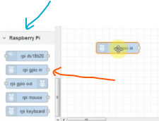

Haciendo doble clic sobre el elemento, se nos despliega el grupo de pines disponibles en RBPi:

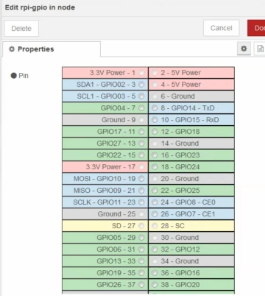

Seleccionamos el pin al que está conectado el pulsado, por ejemplo: Pin-17. Se puede añadir tiempo de retardo _Debounce_ en milisegundos. Dejar 5 ms.

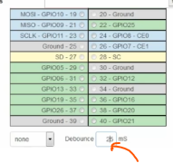

Agregar otro elemento _rpi gpio in_ donde conectaresmo el sensor magnético y seleccionar el pin:


Añadirmos dos bloques _Debug_ que están dentro del grupo _common_, que sirven para ver las salidas:

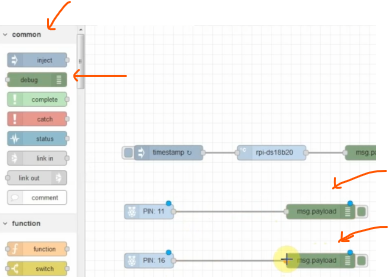

Pulsamos en _Deplay_ botón ubicado en la esquina superior izquierda del _Dashbard_, nos muestra la información según como estén los sensores.

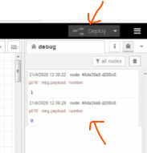

### Sensor DS18B20 en Node-RED

Para leer el sensor desde Node-RED utilizaremos una librería, para ello accedemos _Manage Palette_ haciendo clic en icono esquina superior derecha:

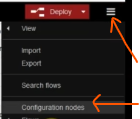

En la pestaña _Install_ buscamos _ds18_ y elegimos una de las librerías disponibles para la instalación.

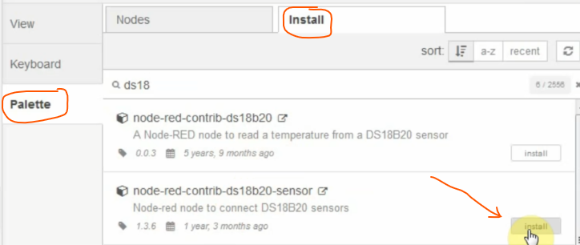

Añadimos un elemento _Inject_ que está en el bloque _common_, y lo vamos a configurar para que se repita en un intervalo definido, cada 30 segundos:

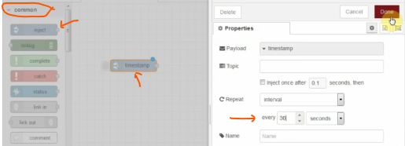

El siguiente elemento será _rpi ds18b20_ que lee el sensor conectado:

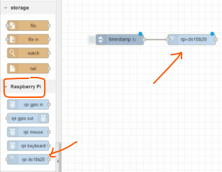

Añadimos un elemento de salida _debug_ para poder ver los resultados:

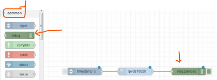

Hacemos clic en _Deplay_ y observamos los resultados:

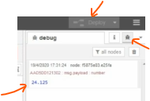

### Relay en Node-RED

Usar el nodo _rpi-gpio out_ dentro del bloque _Raspberry Pi_. Seleccionamos el pin 22 que corresponde con GPIO25, además de seleccionar el tipo de salida (digital o PWM):

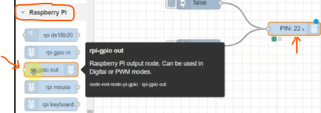

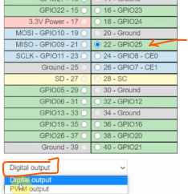

Es útil inicializar el estado del pin, marcar la opción _Initiallise pin state?_:

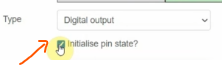

Añadir dos nodos de entrada _Inject_ que están en el bloque _common_ que son para indicar opciones de _false_ o _true_ (boolean):

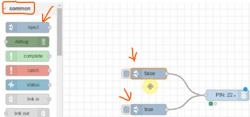

Probamos hacienod clic en _Deplay_ y al hacer clic sobre las entradas, observamos como el nodo _PIN 22_ cambia de estado:

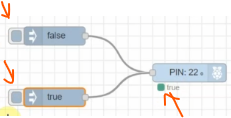

### Panel IoT con Node-RED

Instalar librerías desde _Manage Palette_ y buscamos _dash_ y de las opciones seleccionar _node-red-dashboard_:

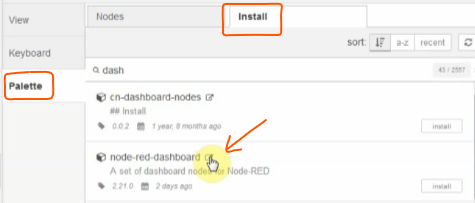

Una vez instalado aparecerá un icono para activar el Dashboard:

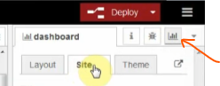

El nodo _gauge_ sirve para mostrar la información de un sensor:

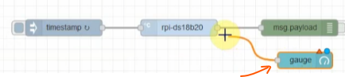

Hacer clic sobre el nodo _gauge_ para configurarlo:

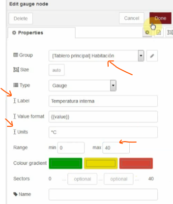

En el Dashboard (Tablero principal) se vería: el grupo Habitación, la variable Temperatura interna, el rango 0 a 40 ºC:

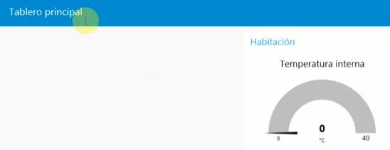

Podemos agrgar una gráfica de la temperatura, usando el nodo _Chart_ conectado a la salida del nodo _rpi-ds-18b20_:

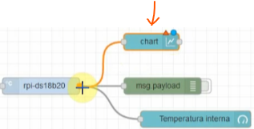

Configuración del nodo _Chart_:

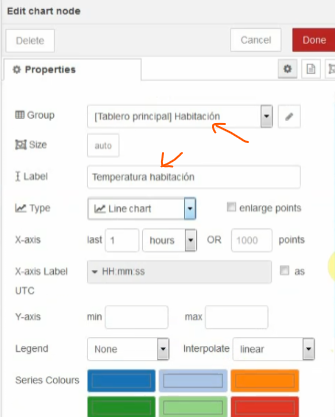

Hacer clic en _Deplay_ y en Dashboard tendremos los resultados:

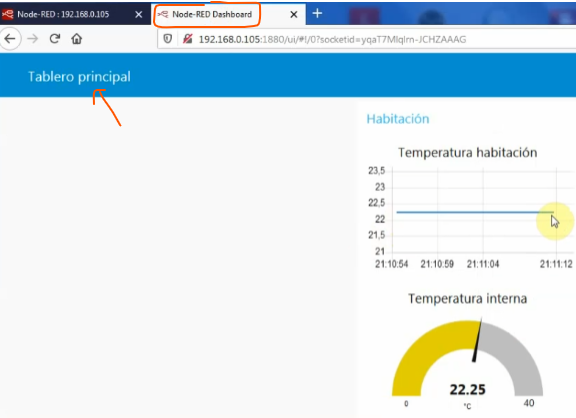

Podemos añadir el nodo _function_ que permite incorporar código en Javascript. Para el ejemplo lo conectaremos al nodo _PIN 16_ que es una entrada de la RBPi conectada a un sensor ON-OFF:

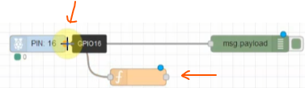

Clic sobre el nodo _function_ para añadir el siguiente código:

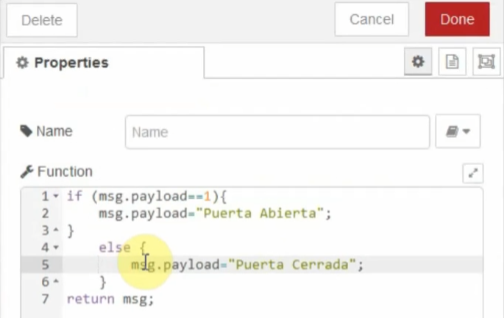

Añadimos un nodo _text_ conectado a la salida del anterior. Sirve para visualizar la salida:

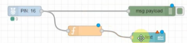

Configuramos el nodo _text_:

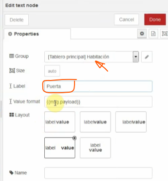

Resultados obtenidos (puerta abierta o puerta cerrada) dependiendo de como esté el sensor ON-OFF:

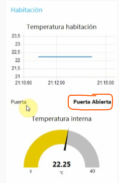

Para el control del Relay añadiremos un nodo _switch_ configurándolo de la siguiente forma:

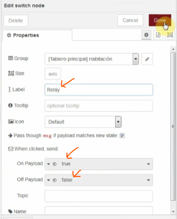

Conectamos la salida del nodo _switch_ a la entrada del nodo _PIN 13_:

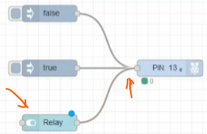

El resultado en el Dashboard:

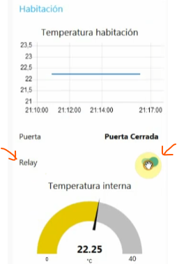

---

## Dispositivos Remotos - Mosquitto

>[!IMPORTANT]
>
>Instalar _Mosquitto_ en RBPi</br>
>_`sudo apt-get update`_</br>
>_`sudo apt-get upgrade`_</br>
>_`sudo apt-get install mosquitto mosquitto-clients`_

### Configuración de Mosquitto

Acceder al archivo de configuración de mosquitto _`vim /etc/mosquitto/mosquitto.conf`_. Existe un archivo de configuración de ejemplo en la ruta _`/usr/share/doc/mosquitto/examples/mosquitto.conf.gz`_. El archivo está comprimido, para descomprimirlo: _`sudo gunzip mosquitto.conf.gz`_.

Visualizando el archivo de configuración de ejemplo _mosquitto.conf_ veremos las configuraciones por defecto:

- El puerto por defecto que utiliza Mosquitto es el 1883 TCP/IP.
- Escucha en todas las interfaces, tanto WiFi con Ethernet.

Copiamos el archivo a la carpeta de Mosquitto: _`sudo cp mosquitto.conf /etc/mosquitto/conf.d/mosquitto.conf`_. Nos desplazamos al directorio _`cd /etc/mosquitto/conf.d/`_ para realizar las modificacioines que nos interesan.

#### Añadir un Usuario a Mosquitto

Creamos el usuario y la contraseña con el siguiente comando:

- _`sudo mosquitto_passwd -c /etc/mosquitto/passwd mosquitto`_, donde el usuario elegido es _mosquitto_. Pide la constraseña tras el clic.
- El archivo _passwd_ contendrá el usuario y el HASH de la contraseña introducida.
- Ejecutamos _`sudo vim mosquitto.conf`_, para modificar la configuración.
  - Descomentar (quitar #) de la opción: *allow_anonymous true* y cambiar el _true_ por el _false_; *allow_anonymous false*.
  - En la línea *password_file* (quitar #) y añador la ruta donde se encuentra el fichero: *password_file /etc/mosquitto/passwd*.

Guardar los cambios y reiniciar _`sudo systemctl restart mosquitto.servive`_.

### Conexión remota a Mosquitto

Clientes MQTT gratis:

- [MQTT Explorer](https://mqtt-explorer.com/)
- [MQTTLens](https://chromewebstore.google.com/detail/mqttlens/hemojaaeigabkbcookmlgmdigohjobjm?hl=es)

Esta última, es una extensión para Chrome.

#### Ejemplo con MQTT Explorer

Tras la instalación, realizar una conexión con Mosquitto.

Pantalla de conexión: añadir conexión, nombre, protocolo (mqtt://), IP Host, el puerto 1883 el usuario y la contraseña.

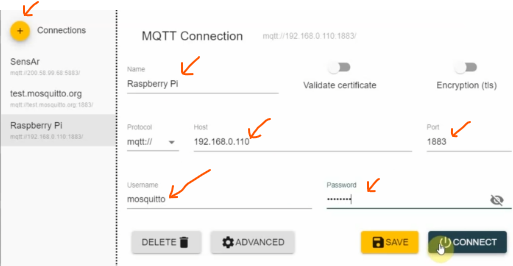

Una vez conectados, para publicar se aceptan tres formatos:

- _raw_
- _xml_
- _json_

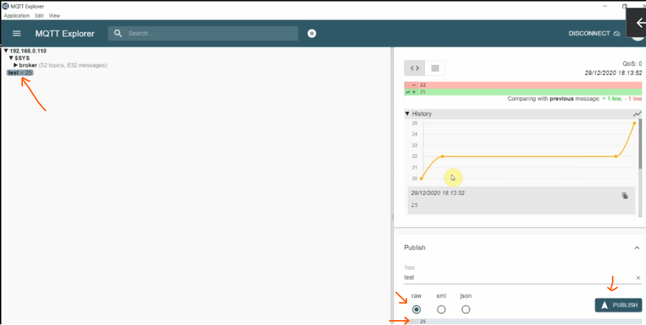

Desde la RBPi ejecutar: _`mosquitto_sub -h localhost -u mosquitto -P miClave -t test -q 2`_. Donde localhost es la IP de la RBPi, _test_ es el tópico al que queremos suscribirnos, está creado en MQTT Explorer y _-q 2_ es un parámetro de calidad. Este cliente mostrará en pantalla cada vez que publicamos un valor en el tópico _test_.

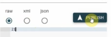


### Integrando Node-RED con Mosquitto

En Node-RED exite un nodo _mqtt in_ que sirve para la conexión. Está en el bloque _network_:

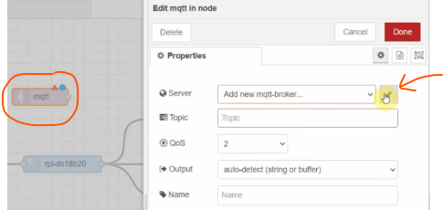

Agregamos el _mqtt-broker_:

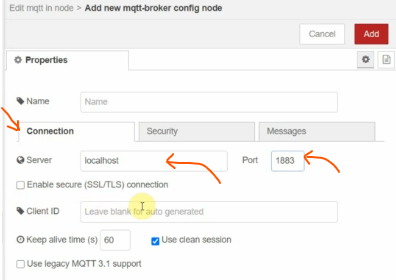

Añadimos en la pestaña de _Security_ nuestro usuario y la contraseña:

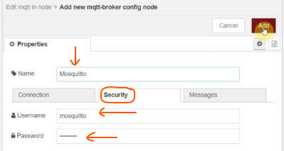

Debemos especificar el _tópico_ a usar:

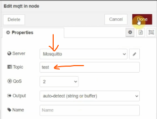

Ahora el servidor estaría configurado. Ya podrá conectarse y suscribirse al _test_ y ver los mensajes que llegan. Para ver los mensajes añadimos un nodo _debug_.

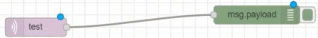

Publicamos mensajes, para ello escribimos el siguiente comando desde terminal de la RBPi:

- `mosquitto_pub -h 192.168.0.110 -u mosquitto - P miClave -t test -m 25`

Una vez ejecutado en el comando anterior, en el _debug_ de Node-RED aparecerá el valor de 25:

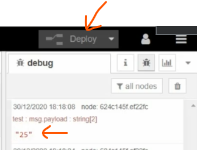

También podemos publicar desde MQTT Explorer, por ejemplo el valor de 20:

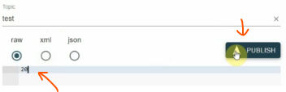

En Node-RED aparecerá el valor de 20:

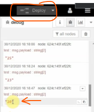

#### Añadir el Dashboard a la integración entre Node-RED y Mosquitto

Añadir un nodo _chart_ que sirve para representar una gráfica de línea, la cual conectaremos al nodo _test_ (mqtt in):


Configuramos el nodo, añadiendo la etiqueta:

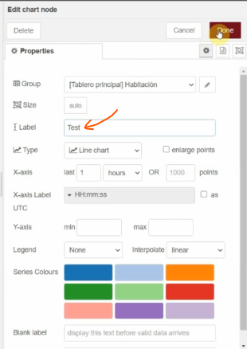

Accedemos al Dashboard:

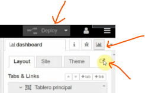

Se muestra el resultado del Dashboard, cada vez que se publique en el tópico _test_:

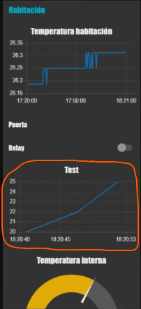

Si en nuestro _dashboard_ de Node-RED ponemos un botón y queremos activar/desactivar algo remotamente usamos el nodo _mqtt out_. En la configuración le pondremos un nombre nuevo en el tópico.


Añadimos dos botones usando el nodo _button_. Este botón lo conectamos a la entrada del nodo _mqtt out_.

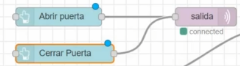

Confgiramos el nombre del nodo _button_ (apertura puerta, cerrar puerta):

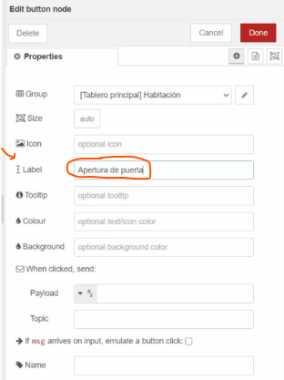

Configuramos el _payload_ es el mensaje que se envía al remoto:

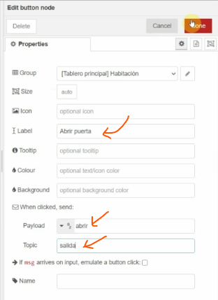

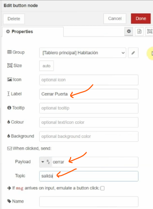

En el Dashboard tendremos dos botones: uno para abrir puerta y otro para cerrar puerta.


Al pulsar en el botón de abrir puerta del Dashboard, en MQTT Explorer aparece el mensaje recibido (payload):


Si pulsamos en el botón cerrar puerta, el mensaje recibido es:


---

## Bases de Datos

>[!TIP]
>
>Instalando InfluxDB en RBPi.</br>
>`sudo apt update`</br>
>`sudo apt upgrade`</br>
>Descarga y agregamos la llave del repositorio:</br>
>`wget -qO- https://repos.influxdata.com/influxdb.key | sudo apt-key add -`</br>
>Si nuestra _raspbian_ es _strech_:</br>
>`echo "deb https://repos.influxdata.com/debian stretch stable" | sudo tee /etc/apt/sources.list.d/influxdb.list`</br>
>Si nuestra _raspbian_ es _buster_:</br>
>`echo "deb https://repos.influxdata.com/debian buster stable" | sudo tee /etc/apt/sources.list.d/influxdb.list`</br>
>`sudo apt update`</br>
>`sudo apt install influxdb`</br>
>Para iniciar el porceso InfluxDB</br>
>`sudo systemctl unmask influxdb`</br>
>`sudo systemctl enable influxdb`</br>
>`sudo systemctl start influxdb`</br>

Para saber qué versión de raspbian tenemos:

>[!NOTE]
>
>`cat /etc/os-release`

### Configurar autenticación de InfluxDB

Accedemos a la base de datos, con el comando: `influx`. Y configuramos un usuario:

```influx
InfluxDB shell version: 1.8.4
> CREATE USER admin WITH PASSWORD '1234miPWD' WITH ALL PRIVILEGES
> exit
```

Configurar InfluxDB para usar la autenticación: `sudo vi /etc/influxdb.conf`.

La sección que nos interesa es _http_:

```influxdb.conf
[http]
  auth-enable = true
  pprof-enabled = true
  pprof-auth-enable = true
  ping-auth-enabled= true
```

Una vez guardados los cambios, reiniciamos el servicio: `sudo systemctl restart influxdb`.

Para iniciar usando el usuario creado: `influx -username admin -password`. Si todo ha ido bien, estaremos conectados a la base de datos.

>[!IMPORTANT]
>
>Nos conectamos a InfluxBD con el comando siguiente:</br>
>`influx -username admin -password`</br>
>Usamos la _password_ elegida.</br>
>Para crear una base de datos, estando dentro Influx:</br>
>`CREATE DATABASE iot`

### Escribir en InfluxDB desde Node-RED

Lo primero en Node-RED es instalar los paquetes de software para poder conectarnos a la base de datos. En _Manager Palette_ en la pestaña _Install_ buscar 'influx'. Instalar el de la primera opción _node-red-contrib-influxdb_.


En la sección _storage_ aparecerán los nuevos nodos. Seleccionar el que permite escribir en la base de datos _influxdb out_:


Configuramos la base de datos:


De las opciones diponibles seleccionar: nombre, versión, URL, nombre de usuario y contraseña.


Una vez agregada la base de datos. Accedemos a la base de datos:


El siguiente paso es obtener los valores del sensor y darlo un formato para escribirlos en la base de datos. Para ello, añadimos un nodo _function_ conectado entre la salida del sensor y la entrada del _influxdb out_:


La configuración del nodo _function_ añadimos el código JS:


Para probar podemos añadir un nodo _debug_ para visualizar el dato a enviar a la base de datos:


### Leer de InfluxDB desde Node-RED

En la página web:

- [InfluxDB](https://docs.influxdata.com/influxdb/v2/)
- [Consultas InfluxDB](https://docs.influxdata.com/influxdb/v2/query-data/get-started/query-influxdb/)

Tenemos las explicaciones del uso, tanto para leer como para escribir en la base de datos.

Añadimos un nodo _influxdb in_ y lo configuramos:


Seleccionar la base de datos previamente configurada, e ingresar la consulta (query):


Añadirmos un nodo _function_ para leer un dato del array de objetos:


---

## Grafana en RBPi

>[!NOTE]
>
>Instalación de Grafana en RBPi.
>
> - `sudo apt-get update`
> - `sudo apt-get upgrade`
> - `wget https://dl.grafana.com/oss/release/grafana-rpi_8.0.6_armhf.deb`
> - `sudo dpkg -i grafana-rpi_8.0.6_armhf.deb`</br>

Para cambiar la versión al último paquete, para ello [Grafana](https://grafana.com/grafana/download?pg=get&plcmt=selfmanaged-box1-cta1)</br>

Para iniciar al arrancar en RBPi: `sudo systemctl enable grafana-server`

>[!TIP]
>
>Para acceder a _Grafana_ a través del navegador web: </br>
>
> - `http://dirección-ip-de-tu-raspberry:3000`
> - Ingresar: usuario y contraseña para entrar a la plataforma
> - Credenciales por defecto: _admin_ y _admin_

### Conexión InfluxDB con Grafana


### Crear un Dashboard (tablero) en Grafana


---

## CURSO RBPi Node-RED CEP 2024-25

[Curso RBPi Node-RED CEP 2024-25](cursoCEP/cursoRBPiNodeRedCEP.md)