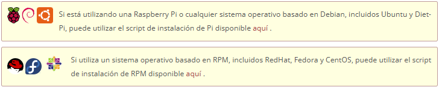

# CURSO AUTOMATIZACIÓN E INTELIGENCIA ARTIFICIAL CON RBPi SCADA Y NODE-RED PROF24

- [CURSO AUTOMATIZACIÓN E INTELIGENCIA ARTIFICIAL CON RBPi SCADA Y NODE-RED PROF24](#curso-automatización-e-inteligencia-artificial-con-rbpi-scada-y-node-red-prof24)
  - [Módulo 1: Primeros pasos con RBPi](#módulo-1-primeros-pasos-con-rbpi)
    - [Características de la RBPi-4](#características-de-la-rbpi-4)
    - [Router configuración inicial](#router-configuración-inicial)
    - [Introducción IP's](#introducción-ips)
    - [Instalar Raspbian](#instalar-raspbian)
    - [Arrancando Raspbian en RBPi - Control remoto SSH](#arrancando-raspbian-en-rbpi---control-remoto-ssh)
      - [Comandos APT](#comandos-apt)
    - [Raspi-config y control VNC](#raspi-config-y-control-vnc)
    - [DHCP en IP Estáticas](#dhcp-en-ip-estáticas)
      - [Configurar IP estática en RBPi](#configurar-ip-estática-en-rbpi)
    - [Cuestionario Módulo 1](#cuestionario-módulo-1)
  - [Módulo 2: Introducción a Linux y RBPi OS](#módulo-2-introducción-a-linux-y-rbpi-os)
    - [Introdución: Componentes clave de Linux](#introdución-componentes-clave-de-linux)
    - [Diferencias entre Interfaz Gráfica y Terminal](#diferencias-entre-interfaz-gráfica-y-terminal)
      - [Ventajas de usar la Terminal](#ventajas-de-usar-la-terminal)
    - [Comandos esenciales de Linux](#comandos-esenciales-de-linux)
    - [Directorios y Archivos](#directorios-y-archivos)
      - [Scripts](#scripts)
      - [Permisos de los archivos](#permisos-de-los-archivos)
    - [Comandos de Redes](#comandos-de-redes)
    - [Rutas y Directorios](#rutas-y-directorios)
      - [Comando LS](#comando-ls)
      - [Comando CD](#comando-cd)
      - [Comando PWD](#comando-pwd)
      - [Comando TREE](#comando-tree)
    - [Directorios Importantes](#directorios-importantes)
    - [Gestión de Archivos y Carpetas](#gestión-de-archivos-y-carpetas)
      - [Comando MKDIR](#comando-mkdir)
      - [Comando RMDIR](#comando-rmdir)
      - [Comando TOUCH y STAT](#comando-touch-y-stat)
      - [Comando CP y MV](#comando-cp-y-mv)
      - [Comando RM](#comando-rm)
    - [Ampliando Comandos para RBPi](#ampliando-comandos-para-rbpi)
    - [Cuestionario Módulo 2](#cuestionario-módulo-2)
  - [Node-RED en RBPi](#node-red-en-rbpi)
    - [Antes de instalar Node-RED actualizar el sistema](#antes-de-instalar-node-red-actualizar-el-sistema)
    - [Instalar Node-RED en RBPi](#instalar-node-red-en-rbpi)
    - [Instalar Node-RED en Windows](#instalar-node-red-en-windows)
    - [Instalar Node-RED en Linux](#instalar-node-red-en-linux)
    - [Entorno Node-RED](#entorno-node-red)
    - [Introducción a Node-RED](#introducción-a-node-red)
      - [Ejemplo Mi Primer Programa](#ejemplo-mi-primer-programa)
    - [Nodos Inject y Debug](#nodos-inject-y-debug)
    - [Mensajes](#mensajes)
      - [Práctica crear Objeto en Nodo INJECT](#práctica-crear-objeto-en-nodo-inject)
    - [Nodo CHANGE](#nodo-change)
    - [Contexto](#contexto)
      - [Ejemplo Contadores en Flow y el Global](#ejemplo-contadores-en-flow-y-el-global)

---

## Módulo 1: Primeros pasos con RBPi

### Características de la RBPi-4

- Procesador ARM Cortex-A53 Quad Core
- 4 ó 8 GB de RAM LPDDR4
- 8 GB de almacenamiento en tarjeta microSD, clase 10
- Raspberry Pi 4 Model B o Raspberry Pi 4 Model B+
- Conector Ethernet 1Gbit
- x2 USB 2.0
- x2 USB 3.0
- X2 uHDMI resoluciones 1080p y 4K
- USB tipo C para la alimentación externa 5V/3A
- Puerto GPIO 40 pines
- Puerto I2C
- WiFi y Bluetooth

### Router configuración inicial

- Acceso al router a traves del navegador web: `http://192.168.1.1`
- Configuración de la zona horaria.
- Configuración de la clave de acceso a la red WiFi.

### Introducción IP's

- Cada dispositivo se interconecta a la red usando un número de IP.
- Un router tiene una IP pública para la conexión con otras redes.
- El router tiene una IP privada para la conexión con los dispositivos de la red privada o LAN.
- IP públicas y máscara de red. Ejemplo: `37.84.2.178/8`.
- IP privadas y máscara de red. Ejemplo: `220.178.44.111/24`.
- La _máscara de red_ determina el número de redes y de dispositivos que se pueden direccionar. Los bits que están a 1 lógico fijan las redes, por el contrario los bits a 0 fijan los dispositivos.
- IP públicas dinámicas, se pueden fijar a IP públicas estáticas, usando servicios en la web.

### Instalar Raspbian

- Utilizar el instalador _Raspberry Pi Imager v1.8.5_.
- Seleccionar el sistema operativo _Raspbian_ de 64 bits.
- Antes de iniciar el proceso de instalación pulsando sobre _Write_ se debe hacer clic sobre la configuración (icono en forma de rueda dentada)para configurar ciertos pasos importantes:
  - Enable SSH
    - Use password authentication
    - Allow public-key authentication
  - Set hostname
  - Set username and password
    - Username
    - Password
  - Configure wireless LAN
    - SSID
    - Password
    - Wireless LAN country: ES
  - Set locale settings
    - Time zone
    - Keyboard layout

### Arrancando Raspbian en RBPi - Control remoto SSH

- Conocer la IP de la RBPi una vez que está conectada con la herramienta NMAP.
- Usar la herramienta _putty_ para conectarse a la RBPi.
- Usar la herramienta _WinSCP_ para conectarse a la RBPi.
- Desde un terminal se puede acceder a la RBPi, escribiendo: `ssh pi@IP`.

#### Comandos APT

- _`sudo apt-get update`_. Variante: _`sudo apt update`_.
- _`sudo apt-get upgrade`_. Variantes: _`sudo apt upgrade`_, _`sudo apt full-upgrade`_.
- _`apt-cache search`_. Ejemplo: _`apt-cache search node`_. Muestra las versiones disponibles de un paquete.
- `apt-cache show node`. Muestra las características de un paquete.
- _`sudo apt-get install nodered`_. Variantes: _`sudo apt install nodered`_, _`sudo apt-get install node-red`_. Instalar sin confirmación de dependencias (_`-y`_).
- Para desinstalar: _`sudo apt-get purge nodered`_. Variantes: _`sudo apt purge nodered`_, _`sudo apt-get purge node-red`_. Desinstalar sin confirmación de dependencias (_`-y`_). Variante para desinstalar todos los paquetes: _`sudo apt-get remove`_.
- Para arreglar dependencias rotas: _`sudo apt-get -f install`_. Variantes: _`sudo apt -f install`_.
- Para actualizar todos los paquetes: _`sudo apt-get dist-upgrade`_. Variantes: _`sudo apt dist-upgrade`_.

### Raspi-config y control VNC

- Configuración inicial de la RBPi con el comando `sudo raspi-config`. Se abre un menú de configuración con varias opciones.
- Las opciones son:
  - _System Options_:
    - Wireless LAN
    - Audio
    - Password
    - Hostname
    - Boot / Auto Login
    - Network at Boot
    - Splash Screen
    - Power LED
  - Display Options
    - Underscan
    - Screen Blanking
    - VNC Resolution
      - 640x480
      - 720x480
      - 800x480
      - 1024x768
      - 1280x1024
  - Interface Options
    - Legacy Camera
    - SSH
    - VNC &larr; habilitar
    - I2C
    - Serial Port
    - 1-Wire
    - Remote GPIO
  - Performance Options
  - Localisations Options
  - Advanced Options
  - Update
  - About raspi-config

Conexión desde VNC Viewer en Windows; permite la conexión al escritorio de la RBPi. Desde el VNC Viewer para acceder a la RBPi se debe introducir la IP de la RBPi y el puerto 5900, además de la contraseña y el nombre seleccionado en la configuración de la RBPi.

Se puede modificar el _Display Options_ para cambiar la resolución de la pantalla.

### DHCP en IP Estáticas

Una IP dinámica es asignada por un servicio DHCP de forma aleatoria dentro de un rango previamente prestablecido, mientras que una IP estática se asigna de forma fija dentro de un rango de direcciones predefinidas.

El router puede asignar las IP de forma fija o dinámicas, para congiurarlo:

- DHCP &larr; habilitar.
- Pool IP address: se estable IP mínima y máxima.
- En la RBPi se configura una IP estática fuera del rango de la IP asignada por el router.

#### Configurar IP estática en RBPi

- Abrir el archivo _`sudo vim/etc/dhcpcd.conf~`_.
  - `static ip_address=192.168.1.41/24`.
  - `static routers=192.168.1.1`.
  - `static domain_name_servers=8.8.8.8 8.8.4.4`.
- Reiniciar la RBPi `reboot`.

### Cuestionario Módulo 1

- ¿Qué componente es necesario para almacenar el sistema operativo en una Raspberry Pi?

  - [ ] Memoria RAM
  - [ ] Disco duro externo
  - [X] Tarjeta microSD
  - [ ] Tarjeta SD

- Para trabajar con raspberry pi, conectarle una pantalla un teclado y un rato

  - [ ] Verdadero
  - [X] Falso

- ¿Cuál de los siguientes sistemas operativos es comúnmente utilizado en Raspberry Pi?

  - [ ] Android
  - [X] Raspbian (Raspberry Pi OS)
  - [ ] Windows XP
  - [ ] macOS

- ¿Qué es el GPIO en una Raspberry Pi?
Pregunta 4Respuesta
  - [ ] Una conexión de red inalámbrica
  - [X] Un conjunto de pines para controlar dispositivos electrónicos
  - [ ] Una aplicación para programar en Python
  - [ ] Una conexión de red inalámbrica

- ¿Para qué se utiliza SSH en una Raspberry Pi?
Pregunta 5Respuesta
  - [ ] Una conexión de red inalámbrica
  - [ ] Un sistema operativo
  - [X] Para controlar la Raspberry Pi de forma remota por terminal
  - [ ] Para encender y apagar la pantalla

- ¿Qué permite hacer la herramienta VNC en Raspberry Pi?
Pregunta 6Respuesta
  - [ ] Programar robots en Python
  - [X] Acceder al escritorio de la Raspberry Pi desde otro dispositivo
  - [ ] Medir la temperatura del procesador
  - [ ] Controlar el volumen del sistema

- ¿Qué es una dirección IP?
Pregunta 7Respuesta
  - [X] Un número que identifica un dispositivo en una red
  - [ ] Un tipo de cable de video
  - [ ] Un programa para navegar por internet
  - [ ] El código de seguridad de la Raspberry Pi

- ¿Para qué sirve la herramienta raspi-config en Raspberry Pi?
Pregunta 8Respuesta
  - [X] Para configurar opciones básicas del sistema, como red o idioma
  - [ ] Para editar imágenes
  - [ ] Para descargar música
  - [ ] Para instalar videojuegos

- ¿Cuál es la principal diferencia entre una IP dinámica y una IP estática?
Pregunta 9Respuesta
  - [ ] La IP dinámica es más rápida que la estática
  - [ ] No hay ninguna diferencia, son exactamente lo mismo
  - [ ] La IP estática cambia automáticamente cada vez que se reinicia el dispositivo
  - [X] La IP dinámica cambia con el tiempo, mientras que la estática permanece fija

- ¿Qué tipo de alimentación eléctrica utiliza una Raspberry Pi (modelo moderno)?
Pregunta 10Respuesta
  - [ ] Cable HDMI
  - [ ] Cable de red Ethernet
  - [ ] Baterías AA
  - [X] Fuente de alimentación USB-C o micro-USB (según modelo)

---

## Módulo 2: Introducción a Linux y RBPi OS

Linux es un OS de código abierto. El código fuente está disponible y se puede modificar.

Linux es más compatible con una amplia variedad de hardware, debido a la amplia comunidad de desarrolladores que crean los controladores.

Linux dispone de gestores de paquetes como `apt` (Advanced Packaging Tool), `dpkg`, `dnf` y `yum` para instalar y actualizar software.

La curva de aprendizaje de Linux es mucho más lenta que la de Windows.

Distribuciones Linux: Ubuntu, Debian, Raspbian (basado en Debian).

Una ventaja de Raspbian es que permite el uso de los pines GPIO de la RBPi para controlar dispositivos electrónicos. Lo que hace que sea fácil trabajar con proyectos de hardware.

### Introdución: Componentes clave de Linux

| **KERNEL** |
| ---------- |
| Es el núcleo del OS Linux. Comunica el hardware con el software. Controla los recursos básicos: procesamiento, memoria, E/S |

| **SHELL** |
| --------- |
| Es una interfaz de línea de comandos que proporciona una forma de interactuar con el OS. Permite ejecutar comandos y programas, realizar tareas de administración del sistema, automatizar tareas mediante scripts |

### Diferencias entre Interfaz Gráfica y Terminal

| **Interfaz Gráfica** |
| ------------------ |
| Es una interfaz de usuario (GUI) que permite interactuar con el sistema mediante un navegador web, un editor de texto o cualquier otra herramienta que requiera una interfaz gráfica |

| **Terminal** |
| ----------- |
| Es una interfaz de línea de comandos, permite interactuar con el sistema mediante una consola de comandos (CLI Command Line Interface) permitiendo mayor control y flexibilidad, realizando tareas con comandos y scripts |

#### Ventajas de usar la Terminal

- Mayor control sobre el sistema.
- Automatizar las tareas mediante scripts.
- Menor consumo de recursos.
- Acceso remoto mediante SSH.
- Posibilidad de gestionar múltiples máquinas de manera eficiente.

### Comandos esenciales de Linux

- `sudo apt update`
- `sudo apt upgrade`
- `ls /home` &rarr; listar el contenido de la carpeta home.
- `sudo visudo` &rarr; editar el archivo sudoers.
- `sudo apt install htop` &rarr; instalar el programa htop.
- `htop` &rarr; abrir el programa htop. Muestra estatísticas del sistema.
- `sudo adduser user_admin` &rarr; crear un nuevo usuario.
- `sudo usermod -aG sudo user_admin` &rarr; agregar el nuevo usuario al grupo sudo.
- `sudo usermod -G "" user_invitado` &rarr; quitar el grupo sudo al nuevo usuario.
- `su - user_admin` &rarr; entrar como el nuevo usuario.
- `sudo ls` &rarr; listar el contenido del sistema.
- `exit` &rarr; salir del modo root.

### Directorios y Archivos

#### Scripts

- Crear un script: `vim holamundo.sh`.
- Dar permisos de ejecución: `chmod +x holamundo.sh`.
- Ejecutar el script: `./holamundo.sh`.
- Ejecutar el script como root: `sudo ./holamundo.sh`.
- Eliminar el script: `rm holamundo.sh`.

Contenido del _scripts_ para el _hola mundo.sh_:

```bash
#!/bin/bash

echo "hola mundo"
```

#### Permisos de los archivos

Tras ejecutar el comando `ls -l` se obtiene una tabla de salida en la que se muestran los permisos de los archivos y los directorios.

Los archivos que empiezan por la letra `d` son directorios. Y los que empiezan por el símbolo `-` son archivos.

Los siguientes tres grupos de letras, separados por guiones, indican los permisos de: _lectura_, _escritura_ y _ejecución_. Para el: _propietario_, _grupo_ y _otros_.

Las letras de los grupos de permisos pueden ser: `r` (leer), `w` (escribir) y `x` (ejecutar).

Para cambiar los permisos de un archivo, se pueden usar los siguientes comandos:

- `chmod 777 holamundo.sh` &rarr; dar permisos de lectura, escritura y ejecución a todos los usuarios.
- `chmod 755 holamundo.sh` &rarr; dar permisos de lectura y ejecución a todos los usuarios, pero no de escritura.
- `chmod 644 holamundo.sh` &rarr; dar permisos de lectura a todos los usuarios, pero no de escritura ni de ejecución.
- `chmod 555 holamundo.sh` &rarr; dar permisos de lectura y ejecución a todos los usuarios, pero no de escritura.
- `chmod 444 holamundo.sh` &rarr; dar permisos de lectura a todos los usuarios, pero no de escritura ni de ejecución.
- `chmod 333 holamundo.sh` &rarr; dar permisos de lectura y ejecución a todos los usuarios, pero no de escritura.
- `chmod 222 holamundo.sh` &rarr; dar permisos de lectura y ejecución a todos los usuarios, pero no de escritura.
- `chmod 111 holamundo.sh` &rarr; dar permisos de lectura y ejecución a todos los usuarios, pero no de escritura.
- `chmod 000 holamundo.sh` &rarr; dar permisos de lectura y ejecución a todos los usuarios, pero no de escritura.
- `chmod +x holamundo.sh` &rarr; dar permisos de lectura y ejecución a todos los usuarios, pero no de escritura.
- `chmod -x holamundo.sh` &rarr; quitar permisos de lectura y ejecución a todos los usuarios, pero no de escritura.
- `chmod u +x holamundo.sh` &rarr; dar permisos de lectura, escritura y ejecución al propietario, el resto solo de lectura.
- `chmod g +x holamundo.sh` &rarr; dar permisos de lectura, escritura y ejecución al grupo, el resto solo de lectura.
- `chmod o +x holamundo.sh` &rarr; dar permisos de lectura, escritura y ejecución a otros, el resto solo de lectura.
- `chmod a +x holamundo.sh` &rarr; dar permisos de lectura, escritura y ejecución a todos los usuarios, el resto solo de lectura.
- `chmod a -x holamundo.sh` &rarr; quitar permisos de lectura, escritura y ejecución a todos los usuarios, el resto solo de lectura.

### Comandos de Redes

El comando `ifconfig` muestra la configuración de las interfaces de red. Los parámetros útiles que devuelve son: _IP_, _MAC_, Loopback_, Broadcast_ entre otros.

El comando `ping` realiza un ping a un host o a una IP. Sirve para probar la conectividad en la red.

El comando `netstat` muestra el estado de las conexiones de red. Permite saber que puertos se están usando en el sistema. Con el modificador `-tuln` se muestran todas las conexiones activas.

- `ip a` &rarr; mostrar la configuración de las interfaces de red.
- `ifconfig` &rarr; mostrar la configuración de las interfaces de red.
- `ifconfig eth0` &rarr; mostrar la configuración de la interface de red eth0.
- `ifconfig eth0 up` &rarr; activar la interface de red eth0.
- `ifconfig eth0 down` &rarr; desactivar la interface de red eth0.
- `ifconfig eth0 89.207.132.170` &rarr; configurar la interface de red eth0 con la dirección IP 89.207.132.170.
- `ifconfig eth0 netmask 244.178.44.111` &rarr; configurar la interface de red eth0 con la m&aacute;scara de red 244.178.44.111.
- `ifconfig eth0 broadcast 237.84.2.178` &rarr; configurar la interface de red eth0 con la direcci&oacute;n de broadcast 237.84.2.178.
- `ping google.com` &rarr; realizar un ping a google.com.
- `traceroute google.com` &rarr; realizar un trazado de rutas a google.com.
- `netstat` &rarr; mostrar el estado de las interfaces de red.
- `netstat -i` &rarr; mostrar el estado de las interfaces de red.
- `netstat -a` &rarr; mostrar el estado de todas las interfaces de red.
- `netstat -l` &rarr; mostrar el estado de los sockets de red.
- `netstat -p` &rarr; mostrar el estado de los procesos de red.
- `netstat -s` &rarr; mostrar el estado de los servicios de red.
- `netstat -t` &rarr; mostrar el estado de los flujos de red.
- `netstat -u` &rarr; mostrar el estado de los usuarios de red.
- `sudo apt install nmap` &rarr; instalar el programa nmap.
- `sudo apt install net-tools` &rarr; instalar el programa net-tools.

### Rutas y Directorios

#### Comando LS

- `ls` &rarr; listar el contenido del directorio actual.
- `ls -a` &rarr; listar el contenido del directorio actual, incluyendo los archivos ocultos.
- `ls -l` &rarr; listar el contenido del directorio actual, incluyendo los permisos de los archivos y los directorios.
- `ls -la` &rarr; listar el contenido del directorio actual, incluyendo los permisos de los archivos y los directorios, incluyendo los archivos ocultos.
- `ls -R` &rarr; listar el contenido del directorio actual y sus subdirectorios.
- `ls -Rl` &rarr; listar el contenido del directorio actual y sus subdirectorios, incluyendo los permisos de los archivos y los directorios.
- `ls -Rla` &rarr; listar el contenido del directorio actual y sus subdirectorios, incluyendo los permisos de los archivos y los directorios, incluyendo los archivos ocultos.
- `ls -lh` &rarr; listar el contenido del directorio actual, incluyendo los tamaños en kilobytes, megabytes y gigabytes, y los permisos de;os de los archivos.

#### Comando CD

- `cd` &rarr; cambiar de directorio.
- `cd /` &rarr; cambiar de directorio a la raiz del sistema.
- `cd ~` &rarr; cambiar de directorio al directorio de usuario.
- `cd ..` &rarr; cambiar de directorio al directorio padre.
- `cd -` &rarr; cambiar de directorio al directorio anterior.
- `cd /var` &rarr; cambiar de directorio a la carpeta /var.
- `cd /var/log` &rarr; cambiar de directorio a la carpeta /var/log.
- `cd /var/log/` &rarr; cambiar de directorio a la carpeta /var/log/.
- `cd /var/log/` &rarr; cambiar de directorio a la carpeta /var/log/.

#### Comando PWD

- `pwd` &rarr; mostrar el directorio actual.

#### Comando TREE

- `sudo apt install tree` &rarr; instalar el programa tree.
- `sudo snap install tree` &rarr; instalar el programa tree con snap.
- `tree` &rarr; mostrar el directorio actual en forma de árbol.
- `tree -a` &rarr; mostrar el directorio actual en forma de árbol, incluyendo los archivos ocultos.
- `tree -l` &rarr; mostrar el directorio actual en forma de árbol, incluyendo los permisos de los archivos y los directorios.
- `tree -la` &rarr; mostrar el directorio actual en forma de árbol, incluyendo los permisos de los archivos y los directorios, incluyendo los archivos ocultos.
- `tree -R` &rarr; mostrar el directorio actual y sus subdirectorios en forma de árbol.
- `tree -Rl` &rarr; mostrar el directorio actual y sus subdirectorios en forma de árbol, incluyendo los permisos de los archivos y los directorios.
- `tree -Rla` &rarr; mostrar el directorio actual y sus subdirectorios en forma de árbol, incluyendo los permisos de los archivos y los directorios, incluyendo los archivos ocultos.
- `tree -lh` &rarr; mostrar el directorio actual en forma de árbol, incluyendo los tamaños en kilobytes, megabytes y gigabytes, y los permisos de;os de los archivos.
- `tree -L1` &rarr; mostrar el directorio actual en forma de árbol, sin mostrar los subdirectorios.
- `tree -L2` &rarr; mostrar el directorio actual en forma de árbol, sin mostrar los subdirectorios de los subdirectorios.
- `tree -L3` &rarr; mostrar el directorio actual en forma de árbol, sin mostrar los subdirectorios de los subdirectorios de los subdirectorios.

### Directorios Importantes

- `/` &rarr; la raiz del sistema.
- `home` &rarr; el directorio de los usuarios creados en el sistema.
- `/var` &rarr; la carpeta de configuraciones del sistema. Tiene: `/backups`, `cache`, `lib`, `local`, `opt`, `mail`, `run`, `swap`, `sys`, `tmp`.
- `/etc` &rarr; la carpeta de configuraciones del sistema.
  - `/etc/fstab` &rarr; la tabla de montaje del sistema.
  - `/etc/hosts` &rarr; la tabla de hosts del sistema. Asigna direcciones IP a nombres de dominio.
  - `/etc/hostname` &rarr; el nombre del sistema.
- `/tmp` &rarr; la carpeta temporal del sistema.
- `/bin` &rarr; la carpeta de programas del sistema. Comandos para los usuarios.
- `/sbin` &rarr; la carpeta de programas del sistema. Comandos para los administradores.
- `/dev` &rarr; la carpeta de dispositivos del sistema.
- `/media` &rarr; la carpeta de dispositivos externos.
- `/mnt` &rarr; la carpeta de dispositivos externos.

### Gestión de Archivos y Carpetas

#### Comando MKDIR

- `mkdir` &rarr; crear una carpeta.
- `mkdir mi_carpeta` &rarr; crear una carpeta llamada mi_carpeta.
- `mkdir mi_carpeta/` &rarr; crear una carpeta llamada mi_carpeta.
- `mkdir mi_carpeta/mi_subcarpeta` &rarr; crear una carpeta llamada mi_carpeta/mi_subcarpeta.
- `mkdir mi_carpeta/mi_subcarpeta/` &rarr; crear una carpeta llamada mi_carpeta/mi_subcarpeta/.
- `mkdir mi_carpeta/mi_subcarpeta/mi_subsubcarpeta` &rarr; crear una carpeta llamada mi_carpeta/mi_subcarpeta/mi_subsubcarpeta.
- `mkdir mi_carpeta/mi_subcarpeta/mi_subsubcarpeta/` &rarr; crear una carpeta llamada mi_carpeta/mi_subcarpeta/mi_subsubcarpeta/.
- `mkdir mi_carpeta/mi_subcarpeta/mi_subsubcarpeta/mi_subsubsubcarpeta` &rarr; crear una carpeta llamada mi_carpeta/mi_subcarpeta/mi_subsubcarpeta/mi_subsubsubcarpeta.
- `mkdir mi_carpeta/mi_subcarpeta/mi_subsubcarpeta/mi_subsubsubcarpeta/` &rarr; crear una carpeta llamada mi_carpeta/mi_subcarpeta/mi_subsubcarpeta/mi_subsubsubcarpeta/.
- `mkdir -p mi_carpeta/mi_subcarpeta/mi_subsubcarpeta/mi_subsubsubcarpeta` &rarr; crear una carpeta llamada mi_carpeta/mi_subcarpeta/mi_subsubcarpeta/mi_subsubsubcarpeta.
- `mkdir -p mi_carpeta/mi_subcarpeta/mi_subsubcarpeta/mi_subsubsubcarpeta/` &rarr; crear una carpeta llamada mi_carpeta/mi_subcarpeta/mi_subsubcarpeta/mi_subsubsubcarpeta/.
- `mkdir carpeta_uno carpeta_dos` &rarr; crear dos carpetas llamadas carpeta_uno y carpeta_dos.
- `mkdir -p carpeta_uno carpeta_dos` &rarr; crear dos carpetas llamadas carpeta_uno y carpeta_dos.

#### Comando RMDIR

- `rmdir` &rarr; eliminar una carpeta que esté vacía.
- `rmdir mi_carpeta` &rarr; eliminar una carpeta llamada mi_carpeta.
- `rmdir -p mi_carpeta/mi_subcarpeta/mi_subsubcarpeta/mi_subsubsubcarpeta` &rarr; eliminar una carpeta llamada mi_carpeta/mi_subcarpeta/mi_subsubcarpeta/mi_subsubsubcarpeta.

#### Comando TOUCH y STAT

- `touch` &rarr; crear un archivo o modificar marcas de tiempo.
- `touch mi_archivo.txt` &rarr; crear un archivo llamado mi_archivo.txt.
- `touch mi_archivo.txt mi_archivo2.txt` &rarr; crear dos archivos llamados mi_archivo.txt y mi_archivo2.txt.
- `stat mi_archivo.txt` &rarr; mostrar información del archivo mi_archivo.txt.
- `ls -lu` &rarr; mostrar información del archivo mi_archivo.txt.
- `ls -lc` &rarr; mostrar información del archivo mi_archivo.txt.
- `touch -t 202501011535 mi_archivo.txt` &rarr; crear un archivo llamado mi_archivo.txt con la fecha y hora especificada.
- `touch -c archivo.txt` &rarr; crear un archivo llamado mi_archivo.txt con la fecha y hora actual.

#### Comando CP y MV

- `cp` &rarr; copiar un archivo o carpeta.
- `cp mi_archivo.txt mi_carpeta` &rarr; copiar un archivo llamado mi_archivo.txt a la carpeta mi_carpeta.
- `cp -r mi_carpeta mi_carpeta_copia` &rarr; copiar una carpeta llamada mi_carpeta a la carpeta mi_carpeta_copia.
- `cp -i` &rarr; preguntar antes de copiar un archivo o carpeta.
- `cp -n` &rarr; mostrar los archivos que se van a copiar.
- `cp -u` &rarr; sobreescribir los archivos copiados.
- `cp -v` &rarr; mostrar los archivos que se van a copiar.
- `cp -p` &rarr; copiar los permisos de los archivos.
- `mv` &rarr; mover un archivo o carpeta.
- `mv mi_archivo.txt mi_carpeta` &rarr; mover un archivo llamado mi_archivo.txt a la carpeta mi_carpeta.
- `mv -r mi_carpeta mi_carpeta_copia` &rarr; mover una carpeta llamada mi_carpeta a la carpeta mi_carpeta_copia.

#### Comando RM

- `rm` &rarr; eliminar un archivo o carpeta.
- `rm mi_archivo.txt` &rarr; eliminar un archivo llamado mi_archivo.txt.
- `rm -r mi_carpeta` &rarr; eliminar una carpeta llamada mi_carpeta.
- `rm -rf mi_carpeta` &rarr; eliminar una carpeta llamada mi_carpeta y su contenido.
- `rm -i` &rarr; preguntar antes de eliminar un archivo o carpeta.
- `rm -v` &rarr; mostrar los archivos que se van a eliminar.

### Ampliando Comandos para RBPi

- `uname -a` &rarr; mostrar información del sistema operativo.
- `cat /proc/cpuinfo` &rarr; mostrar información de la CPU.
- `free -h` &rarr; mostrar información de la memoria RAM.
- `uptime` &rarr; mostrar información del tiempo de uso del sistema.
- `df -h` &rarr; mostrar información del espacio en disco.
- `vcgencmd measure_temp` &rarr; mostrar temperatura del procesador.
- `vcgencmd measure_volts` &rarr; mostrar voltaje del procesador.
- `vcgencmd measure_clock arm` &rarr; mostrar frecuencia del procesador.
- `vcgencmd measure_clock core` &rarr; mostrar frecuencia del procesador.
- `vcgencmd measure_clock gpu` &rarr; mostrar frecuencia del procesador.
- `cat /etc/os-release` &rarr; mostrar información del sistema operativo.
- `lsusb` &rarr; mostrar información de los dispositivos USB.
- `lspci` &rarr; mostrar información de los dispositivos PCI.
- `lshw` &rarr; mostrar información de los dispositivos hardware.
- `lscpu` &rarr; mostrar información de la CPU.
- `lsblk` &rarr; mostrar información de los dispositivos de bloque.
- `dmesg` &rarr; mostrar mensajes de error del kernel.
- `journalctl` &rarr; mostrar mensajes de error del kernel.

### Cuestionario Módulo 2

- ¿Qué hace el comando `cd` en Linux?
  - [ ] Elimina una carpeta
  - [ ] Crea un nuevo archivo
  - [ ] Muestra el contenido del directorio
  - [X] Cambia de directorio

- ¿Qué comando te lleva al directorio principal del usuario (home)?
  - [ ] cd root
  - [X] cd
  - [ ] cd home
  - [ ] cd /

- ¿Qué comando usarías para volver al directorio anterior en Linux?
  - [X] cd ~
  - [ ] cd ..
  - [ ] cd /home
  - [ ] cd

- ¿Qué significa cd ..?
  - [ ] Ir al directorio actual
  - [ ] Ir al directorio raíz
  - [X] Ir al directorio padre (un nivel arriba)
  - [ ] Ir a una carpeta oculta

- ¿Para qué sirve el comando sudo?
  - [X] Para ejecutar comandos con privilegios de administrador
  - [ ] Para cambiar de usuario
  - [ ] Para cerrar la terminal
  - [ ] Para crear carpetas

- ¿Qué hace el comando _sudo apt update_?
  - [ ] Instala actualizaciones del sistema
  - [ ] Descarga nuevas versiones de programas
  - [ ] Reinicia la Raspberry Pi
  - [X] Verifica y actualiza la lista de paquetes disponibles

- ¿Qué hace el comando _sudo apt upgrade_?
  - [ ] Actualiza el kernel de Linux
  - [X] Instala las versiones más recientes de los paquetes ya instalados
  - [ ] Muestra la versión actual del sistema
  - [ ] Elimina programas antiguos

- ¿Qué comando muestra la lista de archivos y carpetas en un directorio?**
Pregunta 8Respuesta
  - [X] ls
  - [ ] dir
  - [ ] pwd
  - [ ] show

- ¿Qué comando te dice en qué carpeta estás ubicado actualmente?
  - [X] pwd
  - [ ] locate
  - [ ] cd
  - [ ] whereami

- ¿Qué comando sirve para crear un nuevo directorio (carpeta)?
  - [X] mkdir
  - [ ] touch
  - [ ] cd
  - [ ] Muestra la versión actual del sistema
  
  ---

## Node-RED en RBPi

### Antes de instalar Node-RED actualizar el sistema

```bash
  update - Retrieve new lists of packages
  upgrade - Perform an upgrade
  install - Install new packages (pkg is libc6 not libc6.deb)
  reinstall - Reinstall packages (pkg is libc6 not libc6.deb)
  remove - Remove packages
  purge - Remove packages and config files
  autoremove - Remove automatically all unused packages
  dist-upgrade - Distribution upgrade, see apt-get(8)
  dselect-upgrade - Follow dselect selections
  build-dep - Configure build-dependencies for source packages
  satisfy - Satisfy dependency strings
  clean - Erase downloaded archive files
  autoclean - Erase old downloaded archive files
  check - Verify that there are no broken dependencies
  source - Download source archives
  download - Download the binary package into the current directory
  changelog - Download and display the changelog for the given package
  sudo apt-get install --fix-missing - fijar dependencias rotas
```

### Instalar Node-RED en RBPi

Una vez instalado, para iniciar el programa: lo podemos hacer desde la línea de comandos escribiendo: _`node-red`_. Luego en el navegador escribir en el url la IP asignada seguido del puerto 1880 que asigna por defecto: `http://192.168.0.110:1880`. Accedemos asi al _Dashboard_ panel principal.

- `node-red` &rarr; iniciar el programa.
- `node-red-start` &rarr; iniciar el servicio.
- `node-red-stop` &rarr; parar el servicio.
- `node-red-restart` &rarr; reiniciar el servicio.
- `node-red-status` &rarr; mostrar el estado del servicio.
- `node-red-reinstall` &rarr; reinstalar el servicio.
- `node-red-uninstall` &rarr; desinstalar el servicio.

Para comprobar si el servicio Node-RED se ejecuta en el inicio de la RBPi:

- `sudo systemctl status node-red.service` &rarr; mostrar el estado del servicio.
- `sudo systemctl start node-red.service` &rarr; iniciar el servicio.
- `sudo systemctl stop node-red.service` &rarr; parar el servicio.
- `sudo systemctl restart node-red.service` &rarr; reiniciar el servicio.
- `sudo systemctl enable node-red.service` &rarr; ejecutar el servicio en el inicio de la RBPi.
- `sudo systemctl disable node-red.service` &rarr; deshabilitar el servicio.
- `sudo systemctl status node-red.service` &rarr; mostrar el estado del servicio.

### Instalar Node-RED en Windows

[Node-RED en Windows](https://nodered.org/docs/getting-started/windows)

1. Instalar [Node.js](https://nodejs.org/en/)
2. Para instalar Node-RED ejecutar el comando `npm install -g --unsafe-perm node-red` en la consola de comandos.
3. Para ejecutar Node-RED ejecutar el comando `node-red` en la consola de comandos. En RBPi ejecutar el comando `node-red-start` en la consola de comandos para iniciar el proceso.

### Instalar Node-RED en Linux



- [RBPi-Ubuntu](https://nodered.org/docs/getting-started/raspberrypi)
- [Fedora](https://github.com/node-red/linux-installers)

### Entorno Node-RED

- _Menú Superior_.
- _Aparato de los Nodos_ (lateral izquierda).
- _Espacio de trabajo_ (zona central).
- Iconos de:
  - _Información_.
  - _Depuración_.
  - _Ayuda_.
  - _Configuración_.
  - _Información de contexto_.
  - _Dashboard_.


### Introducción a Node-RED

Los flujos (_Flow_) de Node-RED son un conjunto de nodos que se conectan entre ellos para formar un diagrama de flujo. Cada flujo es independiente de los demás.


Habilitar o deshabilitar un _Flow_ se realiza haciendo doble clic sobre el nombre del _Flow_. Y en la ventana emergente se puede activar o desactivar el _Flow_.:


Los flujos, se indican en derecha siempre que se selecciona el icono de información.


#### Ejemplo Mi Primer Programa

Se realiza la siguiente configuración: _Inject_ &rarr; _Debug_.

- _Inject_. Se configura para enviar un texto (_String_)
- _Debug_. Se configura para recibir el texto (_String_)


### Nodos Inject y Debug


La propiedad _payload_ del nodo _Inject_ se configura para enviar un texto (_String_) aunque admite muchas otros tipos de datos.


- _Timestamp_ &rarr; _msg.payload_. Marca de tiempo en ms. Desde 1970-01-01T00:00:00.000Z.
- _msg.topic_ &rarr; Topico del mensaje.
- _Inject_ &rarr; Se puede configurar para que se ejecute automáticamente.


Para repetir el mensaje se puede configurar la propiedad _Repeat_, la cual dispone de las siguientes opciones:

- _Never_ &rarr; No se repite el mensaje.
- _Interval_ &rarr; Se repite el mensaje en un intervalo de tiempo.
- _Interval Times_ &rarr; Se repite el mensaje entre un intervalo de tiempos.
- _In time specific_ &rarr; Se repite el mensaje en un intervalo de tiempo especifico.


En el nodo _Debug_ se configura para recibir el mensaje completo en formato JSON.:


### Mensajes

Un mensaje es un objeto JSON con las siguientes propiedades:

- _topic_ &rarr; Topico del mensaje.
- _payload_ &rarr; Contenido del mensaje.
- _time_ &rarr; Marca de tiempo en ms. Desde 1970-01-01T00:00:00.000Z.
- _msgid_ &rarr; Identificador del mensaje.
- _flow_ &rarr; Identificador del flujo.
- _type_ &rarr; Tipo del mensaje.

Los mensajes de Node-RED son objetos JSON, que se estructuran mediante el par _clave_:_valor_ dentro de llaves. Por ejemplo:

```json
{
  "topic": "valor_topic",
  "payload": "valor_payload",
  "msgid": "valor_msgid"
}
```

#### Práctica crear Objeto en Nodo INJECT

Para crear los objetos JSON de un nodo _Inject_ se realiza lo siguiente:

1. Clic en los tres puntos del nodo _Inject_.
2. Se abre el editor de JSON.
3. Se crea el objeto JSON en formato _clave_:_valor_ entre llaves.
4. Se guarda el objeto JSON.
5. Se cierra el editor de JSON.


Código JSON bien estructurado sin corchetes:

```json
{
    "Planta-1": {
        "Nombre": "Cocina",
        "Estadp": "Encendido",
        "Temperatura": "21"
    },
    "Planta-2": {
        "Nombre": "Dormitorio",
        "Estadp": "Encendido",
        "Temperatura": "24"
    },
    "VIVIENDA-0": {
        "Nombre": "Garaje",
        "Estadp": "Encendido",
        "Temperatura": "19",
        "Ocupado": "TRUE"
    }
}
```

Código JSON bien estructurado con corchetes:

```json
{
    "VIVIENDA": [
        {
            "Nombre": "Cocina",
            "Estadp": "Encendido",
            "Temperatura": "21"
        },
        {
            "Nombre": "Dormitorio",
            "Estadp": "Encendido",
            "Temperatura": "24"
        },
        {
            "Nombre": "Garaje",
            "Estadp": "Encendido",
            "Temperatura": "19",
            "Ocupado": "TRUE"
        }
    ]
}
```

### Nodo CHANGE

El nodo _CHANGE_ se utiliza para cambiar el tipo de dato de un mensaje. Para ello utiliza las reglas _rules_ y las opciones:

- _Set_. Establece el valor de la propiedad.
- _Change_. Cambia partes de la propiedad.
- _Delete_. Borra la propiedad.
- _Move_. Mueve el valor de una propiedad a otra propiedad.


### Contexto

Las variables pueden ser utilizadas en los flujos de Node-RED. Para ello se utiliza el nodo _Context_. O pueden ser utilizadas de forma global en toda la plataforma Node-RED.


Ejemplo de un nodo _Change_ con dos salidas para cambiar el valor de una propiedad:


#### Ejemplo Contadores en Flow y el Global

Para definir dos variables: contador1 (Local al Flow) y contador2 (Global).

El _Inject_ se inicializa de forma automática al iniciar el _Flow_.


Esquema de _Inject_ y _Change_ en Flow:


Los resultados tras la ejecución del ejemplo:


