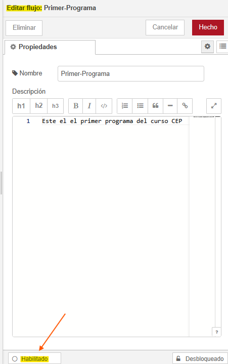
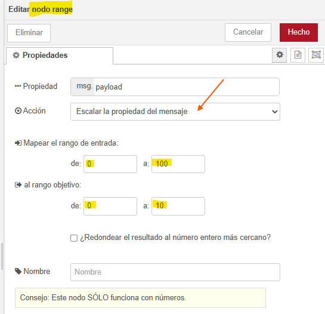
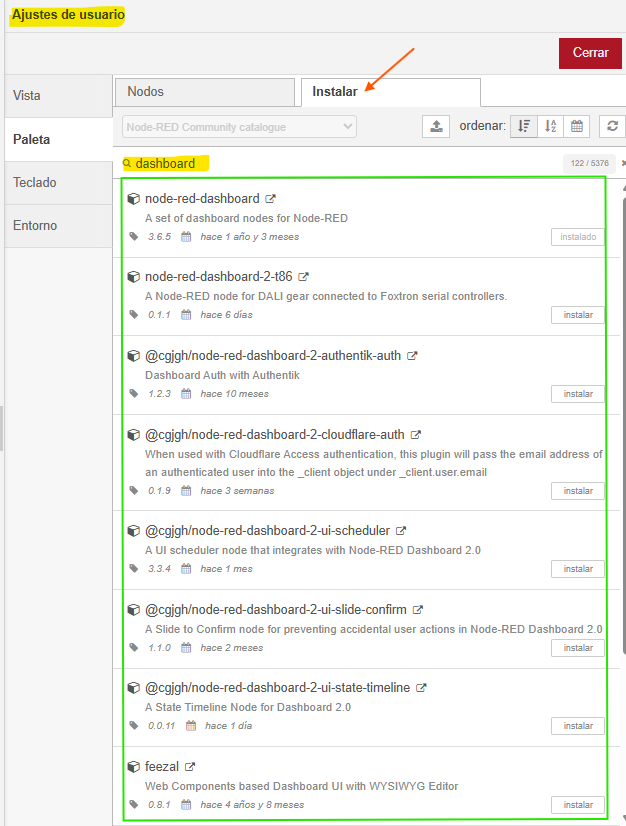
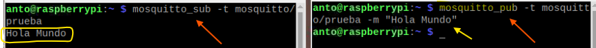
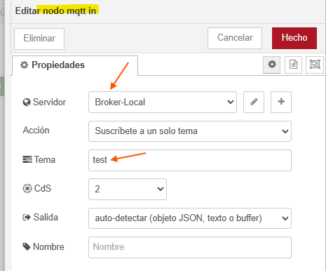

# CURSO AUTOMATIZACIÓN E INTELIGENCIA ARTIFICIAL CON RBPi SCADA Y NODE-RED PROF24

- [CURSO AUTOMATIZACIÓN E INTELIGENCIA ARTIFICIAL CON RBPi SCADA Y NODE-RED PROF24](#curso-automatización-e-inteligencia-artificial-con-rbpi-scada-y-node-red-prof24)
  - [Módulo 1: Primeros pasos con RBPi](#módulo-1-primeros-pasos-con-rbpi)
    - [Características de la RBPi-4](#características-de-la-rbpi-4)
    - [Router configuración inicial](#router-configuración-inicial)
    - [Introducción IP's](#introducción-ips)
    - [Instalar Raspbian](#instalar-raspbian)
    - [Arrancando Raspbian en RBPi - Control remoto SSH](#arrancando-raspbian-en-rbpi---control-remoto-ssh)
      - [Comandos APT](#comandos-apt)
    - [Raspi-config y control VNC](#raspi-config-y-control-vnc)
    - [DHCP en IP Estáticas](#dhcp-en-ip-estáticas)
      - [Configurar IP estática en RBPi](#configurar-ip-estática-en-rbpi)
    - [Cuestionario Módulo 1](#cuestionario-módulo-1)
  - [Módulo 2: Introducción a Linux y RBPi OS](#módulo-2-introducción-a-linux-y-rbpi-os)
    - [Introdución: Componentes clave de Linux](#introdución-componentes-clave-de-linux)
    - [Diferencias entre Interfaz Gráfica y Terminal](#diferencias-entre-interfaz-gráfica-y-terminal)
      - [Ventajas de usar la Terminal](#ventajas-de-usar-la-terminal)
    - [Comandos esenciales de Linux](#comandos-esenciales-de-linux)
    - [Directorios y Archivos](#directorios-y-archivos)
      - [Scripts](#scripts)
      - [Permisos de los archivos](#permisos-de-los-archivos)
    - [Comandos de Redes](#comandos-de-redes)
    - [Rutas y Directorios](#rutas-y-directorios)
      - [Comando LS](#comando-ls)
      - [Comando CD](#comando-cd)
      - [Comando PWD](#comando-pwd)
      - [Comando TREE](#comando-tree)
    - [Directorios Importantes](#directorios-importantes)
    - [Gestión de Archivos y Carpetas](#gestión-de-archivos-y-carpetas)
      - [Comando MKDIR](#comando-mkdir)
      - [Comando RMDIR](#comando-rmdir)
      - [Comando TOUCH y STAT](#comando-touch-y-stat)
      - [Comando CP y MV](#comando-cp-y-mv)
      - [Comando RM](#comando-rm)
    - [Ampliando Comandos para RBPi](#ampliando-comandos-para-rbpi)
    - [Cuestionario Módulo 2](#cuestionario-módulo-2)
  - [Módulo 3 - Node-RED en RBPi](#módulo-3---node-red-en-rbpi)
    - [Antes de instalar Node-RED actualizar el sistema](#antes-de-instalar-node-red-actualizar-el-sistema)
    - [Instalar Node-RED en RBPi](#instalar-node-red-en-rbpi)
    - [Instalar Node-RED en Windows](#instalar-node-red-en-windows)
    - [Instalar Node-RED en Linux](#instalar-node-red-en-linux)
    - [Entorno Node-RED](#entorno-node-red)
    - [Introducción a Node-RED](#introducción-a-node-red)
      - [Ejemplo Mi Primer Programa](#ejemplo-mi-primer-programa)
    - [Nodos Inject y Debug](#nodos-inject-y-debug)
    - [Mensajes](#mensajes)
      - [Práctica crear Objeto en Nodo INJECT](#práctica-crear-objeto-en-nodo-inject)
    - [Nodo CHANGE](#nodo-change)
    - [Contexto](#contexto)
      - [Ejemplo Contadores en Flow y el Global](#ejemplo-contadores-en-flow-y-el-global)
  - [Nodo FUNCTION](#nodo-function)
    - [Ejemplo Incrementar-Decrementar con nodo FUNCTION](#ejemplo-incrementar-decrementar-con-nodo-function)
  - [Nodo COMPLETE](#nodo-complete)
  - [Nodo CATCH](#nodo-catch)
  - [Nodo STATUS](#nodo-status)
  - [Nodo LINK](#nodo-link)
  - [Nodo COMMENT](#nodo-comment)
  - [Nodo Switch](#nodo-switch)
  - [Nodo RANGE](#nodo-range)
    - [Ejemplo de uso nodo RANGE](#ejemplo-de-uso-nodo-range)
  - [Nodo TEMPLATE](#nodo-template)
    - [Ejemplo de uso del nodo TEMPLATE](#ejemplo-de-uso-del-nodo-template)
  - [Nodo DELAY](#nodo-delay)
    - [Ejemplo de uso del nodo DELAY](#ejemplo-de-uso-del-nodo-delay)
    - [Ejemplo II de uso del nodo DELAY](#ejemplo-ii-de-uso-del-nodo-delay)
  - [Nodo TRIGGER](#nodo-trigger)
  - [Nodo EXEC](#nodo-exec)
  - [Nodo FILTER](#nodo-filter)
  - [Nodo RANDOM](#nodo-random)
  - [Nodo SMOOTH](#nodo-smooth)
    - [Ejemplo de uso del nodo SMOOTH](#ejemplo-de-uso-del-nodo-smooth)
  - [Nodo SPLIT](#nodo-split)
  - [Nodo JOIN](#nodo-join)
  - [Nodo SORT](#nodo-sort)
  - [Nodo BATCH](#nodo-batch)
  - [DASHBOARD](#dashboard)
  - [Importar y Exportar Flujos](#importar-y-exportar-flujos)
  - [Crear un DASHBOARD](#crear-un-dashboard)
  - [Archivo SETTING](#archivo-setting)
  - [Grupos](#grupos)
  - [SUBFLOWS](#subflows)
  - [Cuestionario Módulo 3](#cuestionario-módulo-3)
  - [Módulo 4 - IoT Teoría y Práctica](#módulo-4---iot-teoría-y-práctica)
    - [Introducción a IoT](#introducción-a-iot)
      - [Tipos de Redes](#tipos-de-redes)
        - [Comparativa entre LoRaWAN y NB-IoT](#comparativa-entre-lorawan-y-nb-iot)
      - [Infraestructura de Servidores propios](#infraestructura-de-servidores-propios)
      - [Sistemas de Monitorización con Node-RED](#sistemas-de-monitorización-con-node-red)
      - [Mosquito](#mosquito)
    - [Introducción a MQTT](#introducción-a-mqtt)
      - [Publicador - Suscriptor](#publicador---suscriptor)
    - [Broker MQTT](#broker-mqtt)
    - [Nodos MQTT](#nodos-mqtt)
    - [Nodos HTTP](#nodos-http)
      - [Ejemplo de uso del nodo HTTP IN](#ejemplo-de-uso-del-nodo-http-in)
    - [Cuestionario IoT Teoría y Práctica](#cuestionario-iot-teoría-y-práctica)
  - [Módulo 5 - Prácticas Avanzadas](#módulo-5---prácticas-avanzadas)

---

## Módulo 1: Primeros pasos con RBPi

### Características de la RBPi-4

- Procesador ARM Cortex-A53 Quad Core
- 4 ó 8 GB de RAM LPDDR4
- 8 GB de almacenamiento en tarjeta microSD, clase 10
- Raspberry Pi 4 Model B o Raspberry Pi 4 Model B+
- Conector Ethernet 1Gbit
- x2 USB 2.0
- x2 USB 3.0
- X2 uHDMI resoluciones 1080p y 4K
- USB tipo C para la alimentación externa 5V/3A
- Puerto GPIO 40 pines
- Puerto I2C
- WiFi y Bluetooth

### Router configuración inicial

- Acceso al router a traves del navegador web: `http://192.168.1.1`
- Configuración de la zona horaria.
- Configuración de la clave de acceso a la red WiFi.

### Introducción IP's

- Cada dispositivo se interconecta a la red usando un número de IP.
- Un router tiene una IP pública para la conexión con otras redes.
- El router tiene una IP privada para la conexión con los dispositivos de la red privada o LAN.
- IP públicas y máscara de red. Ejemplo: `37.84.2.178/8`.
- IP privadas y máscara de red. Ejemplo: `220.178.44.111/24`.
- La _máscara de red_ determina el número de redes y de dispositivos que se pueden direccionar. Los bits que están a 1 lógico fijan las redes, por el contrario los bits a 0 fijan los dispositivos.
- IP públicas dinámicas, se pueden fijar a IP públicas estáticas, usando servicios en la web.

### Instalar Raspbian

- Utilizar el instalador _Raspberry Pi Imager v1.8.5_.
- Seleccionar el sistema operativo _Raspbian_ de 64 bits.
- Antes de iniciar el proceso de instalación pulsando sobre _Write_ se debe hacer clic sobre la configuración (icono en forma de rueda dentada)para configurar ciertos pasos importantes:
  - Enable SSH
    - Use password authentication
    - Allow public-key authentication
  - Set hostname
  - Set username and password
    - Username
    - Password
  - Configure wireless LAN
    - SSID
    - Password
    - Wireless LAN country: ES
  - Set locale settings
    - Time zone
    - Keyboard layout

### Arrancando Raspbian en RBPi - Control remoto SSH

- Conocer la IP de la RBPi una vez que está conectada con la herramienta NMAP.
- Usar la herramienta _putty_ para conectarse a la RBPi.
- Usar la herramienta _WinSCP_ para conectarse a la RBPi.
- Desde un terminal se puede acceder a la RBPi, escribiendo: `ssh pi@IP`.

#### Comandos APT

- _`sudo apt-get update`_. Variante: _`sudo apt update`_.
- _`sudo apt-get upgrade`_. Variantes: _`sudo apt upgrade`_, _`sudo apt full-upgrade`_.
- _`apt-cache search`_. Ejemplo: _`apt-cache search node`_. Muestra las versiones disponibles de un paquete.
- `apt-cache show node`. Muestra las características de un paquete.
- _`sudo apt-get install nodered`_. Variantes: _`sudo apt install nodered`_, _`sudo apt-get install node-red`_. Instalar sin confirmación de dependencias (_`-y`_).
- Para desinstalar: _`sudo apt-get purge nodered`_. Variantes: _`sudo apt purge nodered`_, _`sudo apt-get purge node-red`_. Desinstalar sin confirmación de dependencias (_`-y`_). Variante para desinstalar todos los paquetes: _`sudo apt-get remove`_.
- Para arreglar dependencias rotas: _`sudo apt-get -f install`_. Variantes: _`sudo apt -f install`_.
- Para actualizar todos los paquetes: _`sudo apt-get dist-upgrade`_. Variantes: _`sudo apt dist-upgrade`_.

### Raspi-config y control VNC

- Configuración inicial de la RBPi con el comando `sudo raspi-config`. Se abre un menú de configuración con varias opciones.
- Las opciones son:
  - _System Options_:
    - Wireless LAN
    - Audio
    - Password
    - Hostname
    - Boot / Auto Login
    - Network at Boot
    - Splash Screen
    - Power LED
  - Display Options
    - Underscan
    - Screen Blanking
    - VNC Resolution
      - 640x480
      - 720x480
      - 800x480
      - 1024x768
      - 1280x1024
  - Interface Options
    - Legacy Camera
    - SSH
    - VNC &larr; habilitar
    - I2C
    - Serial Port
    - 1-Wire
    - Remote GPIO
  - Performance Options
  - Localisations Options
  - Advanced Options
  - Update
  - About raspi-config

Conexión desde VNC Viewer en Windows; permite la conexión al escritorio de la RBPi. Desde el VNC Viewer para acceder a la RBPi se debe introducir la IP de la RBPi y el puerto 5900, además de la contraseña y el nombre seleccionado en la configuración de la RBPi.

Se puede modificar el _Display Options_ para cambiar la resolución de la pantalla.

### DHCP en IP Estáticas

Una IP dinámica es asignada por un servicio DHCP de forma aleatoria dentro de un rango previamente prestablecido, mientras que una IP estática se asigna de forma fija dentro de un rango de direcciones predefinidas.

El router puede asignar las IP de forma fija o dinámicas, para congiurarlo:

- DHCP &larr; habilitar.
- Pool IP address: se estable IP mínima y máxima.
- En la RBPi se configura una IP estática fuera del rango de la IP asignada por el router.

#### Configurar IP estática en RBPi

- Abrir el archivo _`sudo vim/etc/dhcpcd.conf~`_.
  - `static ip_address=192.168.1.41/24`.
  - `static routers=192.168.1.1`.
  - `static domain_name_servers=8.8.8.8 8.8.4.4`.
- Reiniciar la RBPi `reboot`.

### Cuestionario Módulo 1

- ¿Qué componente es necesario para almacenar el sistema operativo en una Raspberry Pi?

  - [ ] Memoria RAM
  - [ ] Disco duro externo
  - [X] Tarjeta microSD
  - [ ] Tarjeta SD

- Para trabajar con raspberry pi, conectarle una pantalla un teclado y un rato

  - [ ] Verdadero
  - [X] Falso

- ¿Cuál de los siguientes sistemas operativos es comúnmente utilizado en Raspberry Pi?

  - [ ] Android
  - [X] Raspbian (Raspberry Pi OS)
  - [ ] Windows XP
  - [ ] macOS

- ¿Qué es el GPIO en una Raspberry Pi?
Pregunta 4Respuesta
  - [ ] Una conexión de red inalámbrica
  - [X] Un conjunto de pines para controlar dispositivos electrónicos
  - [ ] Una aplicación para programar en Python
  - [ ] Una conexión de red inalámbrica

- ¿Para qué se utiliza SSH en una Raspberry Pi?
Pregunta 5Respuesta
  - [ ] Una conexión de red inalámbrica
  - [ ] Un sistema operativo
  - [X] Para controlar la Raspberry Pi de forma remota por terminal
  - [ ] Para encender y apagar la pantalla

- ¿Qué permite hacer la herramienta VNC en Raspberry Pi?
Pregunta 6Respuesta
  - [ ] Programar robots en Python
  - [X] Acceder al escritorio de la Raspberry Pi desde otro dispositivo
  - [ ] Medir la temperatura del procesador
  - [ ] Controlar el volumen del sistema

- ¿Qué es una dirección IP?
Pregunta 7Respuesta
  - [X] Un número que identifica un dispositivo en una red
  - [ ] Un tipo de cable de video
  - [ ] Un programa para navegar por internet
  - [ ] El código de seguridad de la Raspberry Pi

- ¿Para qué sirve la herramienta raspi-config en Raspberry Pi?
Pregunta 8Respuesta
  - [X] Para configurar opciones básicas del sistema, como red o idioma
  - [ ] Para editar imágenes
  - [ ] Para descargar música
  - [ ] Para instalar videojuegos

- ¿Cuál es la principal diferencia entre una IP dinámica y una IP estática?
Pregunta 9Respuesta
  - [ ] La IP dinámica es más rápida que la estática
  - [ ] No hay ninguna diferencia, son exactamente lo mismo
  - [ ] La IP estática cambia automáticamente cada vez que se reinicia el dispositivo
  - [X] La IP dinámica cambia con el tiempo, mientras que la estática permanece fija

- ¿Qué tipo de alimentación eléctrica utiliza una Raspberry Pi (modelo moderno)?
Pregunta 10Respuesta
  - [ ] Cable HDMI
  - [ ] Cable de red Ethernet
  - [ ] Baterías AA
  - [X] Fuente de alimentación USB-C o micro-USB (según modelo)

---

## Módulo 2: Introducción a Linux y RBPi OS

Linux es un OS de código abierto. El código fuente está disponible y se puede modificar.

Linux es más compatible con una amplia variedad de hardware, debido a la amplia comunidad de desarrolladores que crean los controladores.

Linux dispone de gestores de paquetes como `apt` (Advanced Packaging Tool), `dpkg`, `dnf` y `yum` para instalar y actualizar software.

La curva de aprendizaje de Linux es mucho más lenta que la de Windows.

Distribuciones Linux: Ubuntu, Debian, Raspbian (basado en Debian).

Una ventaja de Raspbian es que permite el uso de los pines GPIO de la RBPi para controlar dispositivos electrónicos. Lo que hace que sea fácil trabajar con proyectos de hardware.

### Introdución: Componentes clave de Linux

| **KERNEL** |
| ---------- |
| Es el núcleo del OS Linux. Comunica el hardware con el software. Controla los recursos básicos: procesamiento, memoria, E/S |

| **SHELL** |
| --------- |
| Es una interfaz de línea de comandos que proporciona una forma de interactuar con el OS. Permite ejecutar comandos y programas, realizar tareas de administración del sistema, automatizar tareas mediante scripts |

### Diferencias entre Interfaz Gráfica y Terminal

| **Interfaz Gráfica** |
| ------------------ |
| Es una interfaz de usuario (GUI) que permite interactuar con el sistema mediante un navegador web, un editor de texto o cualquier otra herramienta que requiera una interfaz gráfica |

| **Terminal** |
| ----------- |
| Es una interfaz de línea de comandos, permite interactuar con el sistema mediante una consola de comandos (CLI Command Line Interface) permitiendo mayor control y flexibilidad, realizando tareas con comandos y scripts |

#### Ventajas de usar la Terminal

- Mayor control sobre el sistema.
- Automatizar las tareas mediante scripts.
- Menor consumo de recursos.
- Acceso remoto mediante SSH.
- Posibilidad de gestionar múltiples máquinas de manera eficiente.

### Comandos esenciales de Linux

- `sudo apt update`
- `sudo apt upgrade`
- `ls /home` &rarr; listar el contenido de la carpeta home.
- `sudo visudo` &rarr; editar el archivo sudoers.
- `sudo apt install htop` &rarr; instalar el programa htop.
- `htop` &rarr; abrir el programa htop. Muestra estatísticas del sistema.
- `sudo adduser user_admin` &rarr; crear un nuevo usuario.
- `sudo usermod -aG sudo user_admin` &rarr; agregar el nuevo usuario al grupo sudo.
- `sudo usermod -G "" user_invitado` &rarr; quitar el grupo sudo al nuevo usuario.
- `su - user_admin` &rarr; entrar como el nuevo usuario.
- `sudo ls` &rarr; listar el contenido del sistema.
- `exit` &rarr; salir del modo root.

### Directorios y Archivos

#### Scripts

- Crear un script: `vim holamundo.sh`.
- Dar permisos de ejecución: `chmod +x holamundo.sh`.
- Ejecutar el script: `./holamundo.sh`.
- Ejecutar el script como root: `sudo ./holamundo.sh`.
- Eliminar el script: `rm holamundo.sh`.

Contenido del _scripts_ para el _hola mundo.sh_:

```bash
#!/bin/bash

echo "hola mundo"
```

#### Permisos de los archivos

Tras ejecutar el comando `ls -l` se obtiene una tabla de salida en la que se muestran los permisos de los archivos y los directorios.

Los archivos que empiezan por la letra `d` son directorios. Y los que empiezan por el símbolo `-` son archivos.

Los siguientes tres grupos de letras, separados por guiones, indican los permisos de: _lectura_, _escritura_ y _ejecución_. Para el: _propietario_, _grupo_ y _otros_.

Las letras de los grupos de permisos pueden ser: `r` (leer), `w` (escribir) y `x` (ejecutar).

Para cambiar los permisos de un archivo, se pueden usar los siguientes comandos:

- `chmod 777 holamundo.sh` &rarr; dar permisos de lectura, escritura y ejecución a todos los usuarios.
- `chmod 755 holamundo.sh` &rarr; dar permisos de lectura y ejecución a todos los usuarios, pero no de escritura.
- `chmod 644 holamundo.sh` &rarr; dar permisos de lectura a todos los usuarios, pero no de escritura ni de ejecución.
- `chmod 555 holamundo.sh` &rarr; dar permisos de lectura y ejecución a todos los usuarios, pero no de escritura.
- `chmod 444 holamundo.sh` &rarr; dar permisos de lectura a todos los usuarios, pero no de escritura ni de ejecución.
- `chmod 333 holamundo.sh` &rarr; dar permisos de lectura y ejecución a todos los usuarios, pero no de escritura.
- `chmod 222 holamundo.sh` &rarr; dar permisos de lectura y ejecución a todos los usuarios, pero no de escritura.
- `chmod 111 holamundo.sh` &rarr; dar permisos de lectura y ejecución a todos los usuarios, pero no de escritura.
- `chmod 000 holamundo.sh` &rarr; dar permisos de lectura y ejecución a todos los usuarios, pero no de escritura.
- `chmod +x holamundo.sh` &rarr; dar permisos de lectura y ejecución a todos los usuarios, pero no de escritura.
- `chmod -x holamundo.sh` &rarr; quitar permisos de lectura y ejecución a todos los usuarios, pero no de escritura.
- `chmod u +x holamundo.sh` &rarr; dar permisos de lectura, escritura y ejecución al propietario, el resto solo de lectura.
- `chmod g +x holamundo.sh` &rarr; dar permisos de lectura, escritura y ejecución al grupo, el resto solo de lectura.
- `chmod o +x holamundo.sh` &rarr; dar permisos de lectura, escritura y ejecución a otros, el resto solo de lectura.
- `chmod a +x holamundo.sh` &rarr; dar permisos de lectura, escritura y ejecución a todos los usuarios, el resto solo de lectura.
- `chmod a -x holamundo.sh` &rarr; quitar permisos de lectura, escritura y ejecución a todos los usuarios, el resto solo de lectura.

### Comandos de Redes

El comando `ifconfig` muestra la configuración de las interfaces de red. Los parámetros útiles que devuelve son: _IP_, _MAC_, Loopback_, Broadcast_ entre otros.

El comando `ping` realiza un ping a un host o a una IP. Sirve para probar la conectividad en la red.

El comando `netstat` muestra el estado de las conexiones de red. Permite saber que puertos se están usando en el sistema. Con el modificador `-tuln` se muestran todas las conexiones activas.

- `ip a` &rarr; mostrar la configuración de las interfaces de red.
- `ifconfig` &rarr; mostrar la configuración de las interfaces de red.
- `ifconfig eth0` &rarr; mostrar la configuración de la interface de red eth0.
- `ifconfig eth0 up` &rarr; activar la interface de red eth0.
- `ifconfig eth0 down` &rarr; desactivar la interface de red eth0.
- `ifconfig eth0 89.207.132.170` &rarr; configurar la interface de red eth0 con la dirección IP 89.207.132.170.
- `ifconfig eth0 netmask 244.178.44.111` &rarr; configurar la interface de red eth0 con la m&aacute;scara de red 244.178.44.111.
- `ifconfig eth0 broadcast 237.84.2.178` &rarr; configurar la interface de red eth0 con la direcci&oacute;n de broadcast 237.84.2.178.
- `ping google.com` &rarr; realizar un ping a google.com.
- `traceroute google.com` &rarr; realizar un trazado de rutas a google.com.
- `netstat` &rarr; mostrar el estado de las interfaces de red.
- `netstat -i` &rarr; mostrar el estado de las interfaces de red.
- `netstat -a` &rarr; mostrar el estado de todas las interfaces de red.
- `netstat -l` &rarr; mostrar el estado de los sockets de red.
- `netstat -p` &rarr; mostrar el estado de los procesos de red.
- `netstat -s` &rarr; mostrar el estado de los servicios de red.
- `netstat -t` &rarr; mostrar el estado de los flujos de red.
- `netstat -u` &rarr; mostrar el estado de los usuarios de red.
- `sudo apt install nmap` &rarr; instalar el programa nmap.
- `sudo apt install net-tools` &rarr; instalar el programa net-tools.

### Rutas y Directorios

#### Comando LS

- `ls` &rarr; listar el contenido del directorio actual.
- `ls -a` &rarr; listar el contenido del directorio actual, incluyendo los archivos ocultos.
- `ls -l` &rarr; listar el contenido del directorio actual, incluyendo los permisos de los archivos y los directorios.
- `ls -la` &rarr; listar el contenido del directorio actual, incluyendo los permisos de los archivos y los directorios, incluyendo los archivos ocultos.
- `ls -R` &rarr; listar el contenido del directorio actual y sus subdirectorios.
- `ls -Rl` &rarr; listar el contenido del directorio actual y sus subdirectorios, incluyendo los permisos de los archivos y los directorios.
- `ls -Rla` &rarr; listar el contenido del directorio actual y sus subdirectorios, incluyendo los permisos de los archivos y los directorios, incluyendo los archivos ocultos.
- `ls -lh` &rarr; listar el contenido del directorio actual, incluyendo los tamaños en kilobytes, megabytes y gigabytes, y los permisos de;os de los archivos.

#### Comando CD

- `cd` &rarr; cambiar de directorio.
- `cd /` &rarr; cambiar de directorio a la raiz del sistema.
- `cd ~` &rarr; cambiar de directorio al directorio de usuario.
- `cd ..` &rarr; cambiar de directorio al directorio padre.
- `cd -` &rarr; cambiar de directorio al directorio anterior.
- `cd /var` &rarr; cambiar de directorio a la carpeta /var.
- `cd /var/log` &rarr; cambiar de directorio a la carpeta /var/log.
- `cd /var/log/` &rarr; cambiar de directorio a la carpeta /var/log/.
- `cd /var/log/` &rarr; cambiar de directorio a la carpeta /var/log/.

#### Comando PWD

- `pwd` &rarr; mostrar el directorio actual.

#### Comando TREE

- `sudo apt install tree` &rarr; instalar el programa tree.
- `sudo snap install tree` &rarr; instalar el programa tree con snap.
- `tree` &rarr; mostrar el directorio actual en forma de árbol.
- `tree -a` &rarr; mostrar el directorio actual en forma de árbol, incluyendo los archivos ocultos.
- `tree -l` &rarr; mostrar el directorio actual en forma de árbol, incluyendo los permisos de los archivos y los directorios.
- `tree -la` &rarr; mostrar el directorio actual en forma de árbol, incluyendo los permisos de los archivos y los directorios, incluyendo los archivos ocultos.
- `tree -R` &rarr; mostrar el directorio actual y sus subdirectorios en forma de árbol.
- `tree -Rl` &rarr; mostrar el directorio actual y sus subdirectorios en forma de árbol, incluyendo los permisos de los archivos y los directorios.
- `tree -Rla` &rarr; mostrar el directorio actual y sus subdirectorios en forma de árbol, incluyendo los permisos de los archivos y los directorios, incluyendo los archivos ocultos.
- `tree -lh` &rarr; mostrar el directorio actual en forma de árbol, incluyendo los tamaños en kilobytes, megabytes y gigabytes, y los permisos de;os de los archivos.
- `tree -L1` &rarr; mostrar el directorio actual en forma de árbol, sin mostrar los subdirectorios.
- `tree -L2` &rarr; mostrar el directorio actual en forma de árbol, sin mostrar los subdirectorios de los subdirectorios.
- `tree -L3` &rarr; mostrar el directorio actual en forma de árbol, sin mostrar los subdirectorios de los subdirectorios de los subdirectorios.

### Directorios Importantes

- `/` &rarr; la raiz del sistema.
- `home` &rarr; el directorio de los usuarios creados en el sistema.
- `/var` &rarr; la carpeta de configuraciones del sistema. Tiene: `/backups`, `cache`, `lib`, `local`, `opt`, `mail`, `run`, `swap`, `sys`, `tmp`.
- `/etc` &rarr; la carpeta de configuraciones del sistema.
  - `/etc/fstab` &rarr; la tabla de montaje del sistema.
  - `/etc/hosts` &rarr; la tabla de hosts del sistema. Asigna direcciones IP a nombres de dominio.
  - `/etc/hostname` &rarr; el nombre del sistema.
- `/tmp` &rarr; la carpeta temporal del sistema.
- `/bin` &rarr; la carpeta de programas del sistema. Comandos para los usuarios.
- `/sbin` &rarr; la carpeta de programas del sistema. Comandos para los administradores.
- `/dev` &rarr; la carpeta de dispositivos del sistema.
- `/media` &rarr; la carpeta de dispositivos externos.
- `/mnt` &rarr; la carpeta de dispositivos externos.

### Gestión de Archivos y Carpetas

#### Comando MKDIR

- `mkdir` &rarr; crear una carpeta.
- `mkdir mi_carpeta` &rarr; crear una carpeta llamada mi_carpeta.
- `mkdir mi_carpeta/` &rarr; crear una carpeta llamada mi_carpeta.
- `mkdir mi_carpeta/mi_subcarpeta` &rarr; crear una carpeta llamada mi_carpeta/mi_subcarpeta.
- `mkdir mi_carpeta/mi_subcarpeta/` &rarr; crear una carpeta llamada mi_carpeta/mi_subcarpeta/.
- `mkdir mi_carpeta/mi_subcarpeta/mi_subsubcarpeta` &rarr; crear una carpeta llamada mi_carpeta/mi_subcarpeta/mi_subsubcarpeta.
- `mkdir mi_carpeta/mi_subcarpeta/mi_subsubcarpeta/` &rarr; crear una carpeta llamada mi_carpeta/mi_subcarpeta/mi_subsubcarpeta/.
- `mkdir mi_carpeta/mi_subcarpeta/mi_subsubcarpeta/mi_subsubsubcarpeta` &rarr; crear una carpeta llamada mi_carpeta/mi_subcarpeta/mi_subsubcarpeta/mi_subsubsubcarpeta.
- `mkdir mi_carpeta/mi_subcarpeta/mi_subsubcarpeta/mi_subsubsubcarpeta/` &rarr; crear una carpeta llamada mi_carpeta/mi_subcarpeta/mi_subsubcarpeta/mi_subsubsubcarpeta/.
- `mkdir -p mi_carpeta/mi_subcarpeta/mi_subsubcarpeta/mi_subsubsubcarpeta` &rarr; crear una carpeta llamada mi_carpeta/mi_subcarpeta/mi_subsubcarpeta/mi_subsubsubcarpeta.
- `mkdir -p mi_carpeta/mi_subcarpeta/mi_subsubcarpeta/mi_subsubsubcarpeta/` &rarr; crear una carpeta llamada mi_carpeta/mi_subcarpeta/mi_subsubcarpeta/mi_subsubsubcarpeta/.
- `mkdir carpeta_uno carpeta_dos` &rarr; crear dos carpetas llamadas carpeta_uno y carpeta_dos.
- `mkdir -p carpeta_uno carpeta_dos` &rarr; crear dos carpetas llamadas carpeta_uno y carpeta_dos.

#### Comando RMDIR

- `rmdir` &rarr; eliminar una carpeta que esté vacía.
- `rmdir mi_carpeta` &rarr; eliminar una carpeta llamada mi_carpeta.
- `rmdir -p mi_carpeta/mi_subcarpeta/mi_subsubcarpeta/mi_subsubsubcarpeta` &rarr; eliminar una carpeta llamada mi_carpeta/mi_subcarpeta/mi_subsubcarpeta/mi_subsubsubcarpeta.

#### Comando TOUCH y STAT

- `touch` &rarr; crear un archivo o modificar marcas de tiempo.
- `touch mi_archivo.txt` &rarr; crear un archivo llamado mi_archivo.txt.
- `touch mi_archivo.txt mi_archivo2.txt` &rarr; crear dos archivos llamados mi_archivo.txt y mi_archivo2.txt.
- `stat mi_archivo.txt` &rarr; mostrar información del archivo mi_archivo.txt.
- `ls -lu` &rarr; mostrar información del archivo mi_archivo.txt.
- `ls -lc` &rarr; mostrar información del archivo mi_archivo.txt.
- `touch -t 202501011535 mi_archivo.txt` &rarr; crear un archivo llamado mi_archivo.txt con la fecha y hora especificada.
- `touch -c archivo.txt` &rarr; crear un archivo llamado mi_archivo.txt con la fecha y hora actual.

#### Comando CP y MV

- `cp` &rarr; copiar un archivo o carpeta.
- `cp mi_archivo.txt mi_carpeta` &rarr; copiar un archivo llamado mi_archivo.txt a la carpeta mi_carpeta.
- `cp -r mi_carpeta mi_carpeta_copia` &rarr; copiar una carpeta llamada mi_carpeta a la carpeta mi_carpeta_copia.
- `cp -i` &rarr; preguntar antes de copiar un archivo o carpeta.
- `cp -n` &rarr; mostrar los archivos que se van a copiar.
- `cp -u` &rarr; sobreescribir los archivos copiados.
- `cp -v` &rarr; mostrar los archivos que se van a copiar.
- `cp -p` &rarr; copiar los permisos de los archivos.
- `mv` &rarr; mover un archivo o carpeta.
- `mv mi_archivo.txt mi_carpeta` &rarr; mover un archivo llamado mi_archivo.txt a la carpeta mi_carpeta.
- `mv -r mi_carpeta mi_carpeta_copia` &rarr; mover una carpeta llamada mi_carpeta a la carpeta mi_carpeta_copia.

#### Comando RM

- `rm` &rarr; eliminar un archivo o carpeta.
- `rm mi_archivo.txt` &rarr; eliminar un archivo llamado mi_archivo.txt.
- `rm -r mi_carpeta` &rarr; eliminar una carpeta llamada mi_carpeta.
- `rm -rf mi_carpeta` &rarr; eliminar una carpeta llamada mi_carpeta y su contenido.
- `rm -i` &rarr; preguntar antes de eliminar un archivo o carpeta.
- `rm -v` &rarr; mostrar los archivos que se van a eliminar.

### Ampliando Comandos para RBPi

- `uname -a` &rarr; mostrar información del sistema operativo.
- `cat /proc/cpuinfo` &rarr; mostrar información de la CPU.
- `free -h` &rarr; mostrar información de la memoria RAM.
- `uptime` &rarr; mostrar información del tiempo de uso del sistema.
- `df -h` &rarr; mostrar información del espacio en disco.
- `vcgencmd measure_temp` &rarr; mostrar temperatura del procesador.
- `vcgencmd measure_volts` &rarr; mostrar voltaje del procesador.
- `vcgencmd measure_clock arm` &rarr; mostrar frecuencia del procesador.
- `vcgencmd measure_clock core` &rarr; mostrar frecuencia del procesador.
- `vcgencmd measure_clock gpu` &rarr; mostrar frecuencia del procesador.
- `cat /etc/os-release` &rarr; mostrar información del sistema operativo.
- `lsusb` &rarr; mostrar información de los dispositivos USB.
- `lspci` &rarr; mostrar información de los dispositivos PCI.
- `lshw` &rarr; mostrar información de los dispositivos hardware.
- `lscpu` &rarr; mostrar información de la CPU.
- `lsblk` &rarr; mostrar información de los dispositivos de bloque.
- `dmesg` &rarr; mostrar mensajes de error del kernel.
- `journalctl` &rarr; mostrar mensajes de error del kernel.

### Cuestionario Módulo 2

- ¿Qué hace el comando `cd` en Linux?
  - [ ] Elimina una carpeta
  - [ ] Crea un nuevo archivo
  - [ ] Muestra el contenido del directorio
  - [X] Cambia de directorio

- ¿Qué comando te lleva al directorio principal del usuario (home)?
  - [ ] cd root
  - [X] cd
  - [ ] cd home
  - [ ] cd /

- ¿Qué comando usarías para volver al directorio anterior en Linux?
  - [X] cd ~
  - [ ] cd ..
  - [ ] cd /home
  - [ ] cd

- ¿Qué significa cd ..?
  - [ ] Ir al directorio actual
  - [ ] Ir al directorio raíz
  - [X] Ir al directorio padre (un nivel arriba)
  - [ ] Ir a una carpeta oculta

- ¿Para qué sirve el comando sudo?
  - [X] Para ejecutar comandos con privilegios de administrador
  - [ ] Para cambiar de usuario
  - [ ] Para cerrar la terminal
  - [ ] Para crear carpetas

- ¿Qué hace el comando _sudo apt update_?
  - [ ] Instala actualizaciones del sistema
  - [ ] Descarga nuevas versiones de programas
  - [ ] Reinicia la Raspberry Pi
  - [X] Verifica y actualiza la lista de paquetes disponibles

- ¿Qué hace el comando _sudo apt upgrade_?
  - [ ] Actualiza el kernel de Linux
  - [X] Instala las versiones más recientes de los paquetes ya instalados
  - [ ] Muestra la versión actual del sistema
  - [ ] Elimina programas antiguos

- ¿Qué comando muestra la lista de archivos y carpetas en un directorio?**
Pregunta 8Respuesta
  - [X] ls
  - [ ] dir
  - [ ] pwd
  - [ ] show

- ¿Qué comando te dice en qué carpeta estás ubicado actualmente?
  - [X] pwd
  - [ ] locate
  - [ ] cd
  - [ ] whereami

- ¿Qué comando sirve para crear un nuevo directorio (carpeta)?
  - [X] mkdir
  - [ ] touch
  - [ ] cd
  - [ ] Muestra la versión actual del sistema
  
---

## Módulo 3 - Node-RED en RBPi

### Antes de instalar Node-RED actualizar el sistema

```bash
  update - Retrieve new lists of packages
  upgrade - Perform an upgrade
  install - Install new packages (pkg is libc6 not libc6.deb)
  reinstall - Reinstall packages (pkg is libc6 not libc6.deb)
  remove - Remove packages
  purge - Remove packages and config files
  autoremove - Remove automatically all unused packages
  dist-upgrade - Distribution upgrade, see apt-get(8)
  dselect-upgrade - Follow dselect selections
  build-dep - Configure build-dependencies for source packages
  satisfy - Satisfy dependency strings
  clean - Erase downloaded archive files
  autoclean - Erase old downloaded archive files
  check - Verify that there are no broken dependencies
  source - Download source archives
  download - Download the binary package into the current directory
  changelog - Download and display the changelog for the given package
  sudo apt-get install --fix-missing - fijar dependencias rotas
```

### Instalar Node-RED en RBPi

Una vez instalado, para iniciar el programa: lo podemos hacer desde la línea de comandos escribiendo: _`node-red`_. Luego en el navegador escribir en el url la IP asignada seguido del puerto 1880 que asigna por defecto: `http://192.168.0.110:1880`. Accedemos asi al _Dashboard_ panel principal.

- `node-red` &rarr; iniciar el programa.
- `node-red-start` &rarr; iniciar el servicio.
- `node-red-stop` &rarr; parar el servicio.
- `node-red-restart` &rarr; reiniciar el servicio.
- `node-red-status` &rarr; mostrar el estado del servicio.
- `node-red-reinstall` &rarr; reinstalar el servicio.
- `node-red-uninstall` &rarr; desinstalar el servicio.

Para comprobar si el servicio Node-RED se ejecuta en el inicio de la RBPi:

- `sudo systemctl status node-red.service` &rarr; mostrar el estado del servicio.
- `sudo systemctl start node-red.service` &rarr; iniciar el servicio.
- `sudo systemctl stop node-red.service` &rarr; parar el servicio.
- `sudo systemctl restart node-red.service` &rarr; reiniciar el servicio.
- `sudo systemctl enable node-red.service` &rarr; ejecutar el servicio en el inicio de la RBPi.
- `sudo systemctl disable node-red.service` &rarr; deshabilitar el servicio.
- `sudo systemctl status node-red.service` &rarr; mostrar el estado del servicio.

### Instalar Node-RED en Windows

[Node-RED en Windows](https://nodered.org/docs/getting-started/windows)

1. Instalar [Node.js](https://nodejs.org/en/)
2. Para instalar Node-RED ejecutar el comando `npm install -g --unsafe-perm node-red` en la consola de comandos.
3. Para ejecutar Node-RED ejecutar el comando `node-red` en la consola de comandos. En RBPi ejecutar el comando `node-red-start` en la consola de comandos para iniciar el proceso.

### Instalar Node-RED en Linux


- [RBPi-Ubuntu](https://nodered.org/docs/getting-started/raspberrypi)
- [Fedora](https://github.com/node-red/linux-installers)

### Entorno Node-RED

- _Menú Superior_.
- _Aparato de los Nodos_ (lateral izquierda).
- _Espacio de trabajo_ (zona central).
- Iconos de:
  - _Información_.
  - _Depuración_.
  - _Ayuda_.
  - _Configuración_.
  - _Información de contexto_.
  - _Dashboard_.


### Introducción a Node-RED

Los flujos (_Flow_) de Node-RED son un conjunto de nodos que se conectan entre ellos para formar un diagrama de flujo. Cada flujo es independiente de los demás.


Habilitar o deshabilitar un _Flow_ se realiza haciendo doble clic sobre el nombre del _Flow_. Y en la ventana emergente se puede activar o desactivar el _Flow_.:



Los flujos, se indican en derecha siempre que se selecciona el icono de información.


#### Ejemplo Mi Primer Programa

Se realiza la siguiente configuración: _Inject_ &rarr; _Debug_.

- _Inject_. Se configura para enviar un texto (_String_)
- _Debug_. Se configura para recibir el texto (_String_)


### Nodos Inject y Debug


La propiedad _payload_ del nodo _Inject_ se configura para enviar un texto (_String_) aunque admite muchas otros tipos de datos.


- _Timestamp_ &rarr; _msg.payload_. Marca de tiempo en ms. Desde 1970-01-01T00:00:00.000Z.
- _msg.topic_ &rarr; Topico del mensaje.
- _Inject_ &rarr; Se puede configurar para que se ejecute automáticamente.


Para repetir el mensaje se puede configurar la propiedad _Repeat_, la cual dispone de las siguientes opciones:

- _Never_ &rarr; No se repite el mensaje.
- _Interval_ &rarr; Se repite el mensaje en un intervalo de tiempo.
- _Interval Times_ &rarr; Se repite el mensaje entre un intervalo de tiempos.
- _In time specific_ &rarr; Se repite el mensaje en un intervalo de tiempo especifico.


En el nodo _Debug_ se configura para recibir el mensaje completo en formato JSON.:


### Mensajes

Un mensaje es un objeto JSON con las siguientes propiedades:

- _topic_ &rarr; Topico del mensaje.
- _payload_ &rarr; Contenido del mensaje.
- _time_ &rarr; Marca de tiempo en ms. Desde 1970-01-01T00:00:00.000Z.
- _msgid_ &rarr; Identificador del mensaje.
- _flow_ &rarr; Identificador del flujo.
- _type_ &rarr; Tipo del mensaje.

Los mensajes de Node-RED son objetos JSON, que se estructuran mediante el par _clave_:_valor_ dentro de llaves. Por ejemplo:

```json
{
  "topic": "valor_topic",
  "payload": "valor_payload",
  "msgid": "valor_msgid"
}
```

#### Práctica crear Objeto en Nodo INJECT

Para crear los objetos JSON de un nodo _Inject_ se realiza lo siguiente:

1. Clic en los tres puntos del nodo _Inject_.
2. Se abre el editor de JSON.
3. Se crea el objeto JSON en formato _clave_:_valor_ entre llaves.
4. Se guarda el objeto JSON.
5. Se cierra el editor de JSON.


Código JSON bien estructurado sin corchetes:

```json
{
    "Planta-1": {
        "Nombre": "Cocina",
        "Estadp": "Encendido",
        "Temperatura": "21"
    },
    "Planta-2": {
        "Nombre": "Dormitorio",
        "Estadp": "Encendido",
        "Temperatura": "24"
    },
    "VIVIENDA-0": {
        "Nombre": "Garaje",
        "Estadp": "Encendido",
        "Temperatura": "19",
        "Ocupado": "TRUE"
    }
}
```

Código JSON bien estructurado con corchetes:

```json
{
    "VIVIENDA": [
        {
            "Nombre": "Cocina",
            "Estadp": "Encendido",
            "Temperatura": "21"
        },
        {
            "Nombre": "Dormitorio",
            "Estadp": "Encendido",
            "Temperatura": "24"
        },
        {
            "Nombre": "Garaje",
            "Estadp": "Encendido",
            "Temperatura": "19",
            "Ocupado": "TRUE"
        }
    ]
}
```

### Nodo CHANGE

El nodo _CHANGE_ se utiliza para cambiar el tipo de dato de un mensaje. Para ello utiliza las reglas _rules_ y las opciones:

- _Set_. Establece el valor de la propiedad.
- _Change_. Cambia partes de la propiedad.
- _Delete_. Borra la propiedad.
- _Move_. Mueve el valor de una propiedad a otra propiedad.


### Contexto

Las variables pueden ser utilizadas en los flujos de Node-RED. Para ello se utiliza el nodo _Context_. O pueden ser utilizadas de forma global en toda la plataforma Node-RED.


Ejemplo de un nodo _Change_ con dos salidas para cambiar el valor de una propiedad:


#### Ejemplo Contadores en Flow y el Global

Para definir dos variables: contador1 (Local al Flow) y contador2 (Global).

El _Inject_ se inicializa de forma automática al iniciar el _Flow_.


Esquema de _Inject_ y _Change_ en Flow:


Los resultados tras la ejecución del ejemplo:


## Nodo FUNCTION


Ejemplo de código JS en nodo _Function_ en la etiqueta _En mensaje_:

```javascript
var mensaje_funcion = {
  payload: msg.payload,
  topic: msg.topic
};
mensaje_funcion.payload = mensaje_funcion.payload.toUpperCase();
return mensaje_funcion;
```

En el nodo _Function_ podemos configurar que envíe dos salidas.


Ejemplo de código JS en nodo _Function_ para dos salidas:

```javascript
var mensaje_funcion1 = {
  payload: msg.payload
};
var mensaje_funcion2 = {
  payload: msg.topic
}
return [mensaje_funcion1, mensaje_funcion2];
```

### Ejemplo Incrementar-Decrementar con nodo FUNCTION

Para configurar el nodo _Function_ se hará uso de las opciones _On Start_, _On Message_ y _On Stop_.

Código del _On Start_:

```javascript
flow.set('contador1', 0); //declaración de variable local al flujo
global.set('contador2', 0); //declaración de variable global
```

Código del _On Message_:

```javascript
return msg;
```


La configuración del nodo _Inject_:


Activar la opción `Inyectar una vez después de 0.1 segundos`.

Añadimos cuatro nodos _Inject_, y configuramos sus _topic_ de la siguiente manera:

- `contador1+`.
- `contador1-`.
- `contador2+`.
- `contador2-`.

Las salidas de los nodos _Inject_ se conectan al nodo _Function_.

El código JS del nodo _Function_ para la opción de _On Message_ será lo siguiente:

```javascript
if (msg.topic == 'contador1+') {
  flow.set('contador1', flow.get('contador1') + 1);
  msg.payload = flow.get('contador1');
  msg.topic = 'contador1';
} else if (msg.topic == 'contador1-') {
  flow.set('contador1', flow.get('contador1') - 1);
  msg.payload = flow.get('contador1');
  msg.topic = 'contador1';
} else if (msg.topic == 'contador2+') {
  global.set('contador2', global.get('contador2') + 1);
  msg.payload = global.get('contador2');
  msg.topic = 'contador2';
} else if (msg.topic == 'contador2-') {
  global.set('contador2', global.get('contador2') - 1);
  msg.payload = global.get('contador2');
  msg.topic = 'contador2';
} else {
  msg.topic = 'Error';
  msg.payload = 'Error';
}
return msg;
```

La opción _On Start_ se deja en blanco sin codificación.

## Nodo COMPLETE

El nodo _Complete_ permite: activar un flujo cuando otro nodo completa su manejo de un mensaje.

Si un nodo informa cuando ha terminado de manejar un mensaje, este nodo se puede utilizar para desencadenar un segundo flujo.

Se puede utilizar junto con un nodo sin puerto de salida, como el nodo de envío de correo electrónico, para continuar el flujo.

Este nodo debe configurarse para manejar el evento para los nodos seleccionados en el flujo. No proporciona un modo de "manejar todo" que se aplica automáticamente a todos los nodos del flujo.

El nodo _Complete_ detecta todos los otros nodos que están en el Flow.


## Nodo CATCH

El nodo _Catch_ se utiliza para capturar un error por un nodo que esté en la misma pestaña. Es decir, se ejecuta el nodo _Catch_ cuando se produce un error en un nodo de la misma pestaña. En el nodo _Catch_ se puede configurar para recibir el error completo en formato JSON.

- `error.message` &rarr; Mensaje de error.
- `error.source.idd` &rarr; Identificador del nodo que arrojó el error.
- `error.source.name` &rarr; Nombre del nodo que arrojó el error.
- `error.source.type` &rarr; Tipo del nodo que arrojó el error.

## Nodo STATUS

El nodo _Status_ informa mensajes de estado de otros nodos en la misma pestaña (FLow). Las salidas son:

- `status.text` &rarr; Mensaje de estado.
- `status.source.type` &rarr; Tipo del nodo que informó el estado.
- `status.source.id` &rarr; Identificador del nodo que informó el estado.
- `status.source.name` &rarr; Nombre del nodo que informó el estado.


## Nodo LINK


- Nodo _Link In_ &rarr; Crea cables virtuales entre flujos. El nodo se puede conectar a cualquier nodo enlace salida que exista en cualquier pestaña. Una vez conectados se comportan como si estuvieran conectados directamente.
- Nodo _Link Out_ &rarr; Crea cables virtuales entre flujos.
- Nodo _Link Call_ &rarr; Llama a un flujo que comienza con un enlace entrada y transmite la respuesta. Este nodo se puede conectar a un nodo enlace entrada que exista en cualquier pestaña. El flujo conectado a ese nodo debe finalizar con un nodo enlace salida configurado en modo retorno.

## Nodo COMMENT

Un nodo que puedes utilizar para agregar comentarios a tus flujos.

El panel de edición aceptará la sintaxis de Markdown. El texto se representará en el panel lateral de información.

## Nodo Switch

Enruta mensajes según los valores de sus propiedades o la posición de la secuencia.

Cuando llega un mensaje, el nodo evaluará cada una de las reglas definidas y reenviará el mensaje a las salidas correspondientes de cualquier regla coincidente.

Opcionalmente, se puede configurar el nodo para que deje de evaluar reglas una vez que encuentre una que coincida.

Las reglas se pueden evaluar en función de una propiedad de mensajes individual, una propiedad de flujo o contexto global, una variable de entorno o el resultado de una expresión JSON.

Hay cuatro tipos de reglas:

1. **Valor**: se evalúan con respecto a la propiedad configurada.
2. **Secuencia**: se pueden utilizar en secuencias de mensajes, como las generadas por el nodo _Dividir_.
3. Se puede proporicionar una **expresión** JSON, que se evaluará en relación con todo el mensaje y coincidirá si la expresión devuelve un valor verdadero.
4. Se pueden utilizar una regla **de lo contrario** para hacer coincidir si ninguna de las otras reglas coinciden.

## Nodo RANGE

Este nodo escalará linealmente el valor recibido. De forma predeterminada, el resultado no está restringido al rango definido en el nodo.

Asigna un valor numérico a un rango diferente.

- _Entradas_: `payload` &rarr; la debe ser un número. Cualquier otra cosa intentará analizarse como un número y rechazarse si falla.
- _Salidas_: `payload` &rarr; el valor asignado al nuevo rango.

> [!NOTE]
> Escalar y limitar el rango objetivo significa que el resultador nunca estará fuera del rango objetivo.

### Ejemplo de uso nodo RANGE

Este ejemplo muestra como escalar una temperatura en un rango de 0 a 100. Con un ventilador de 10 niveles.




Código del nodo _Function_ para el método _On Message_:

```javascript
msg.topic = "Nivel de ventilación";
flow.set("temperatura", flow.get("temperatura") + 10);
msg.payload = flow.get("temperatura");
return msg;
```

Código del nodo _Function_ para el método _On Start_:

```javascript
flow.set("temperatura", 0);
```


## Nodo TEMPLATE

Establece una propiedad basada en la plantilla proporcionada.

| Entradas | Salidas |
| -------- | ------- |
| `msg` un objeto de mensaje que contiene información | `msg` un mensaje con una propiedad establecida al completar la plantilla configurada con propiedades del mensaje entrante |
| `template` una plantilla que se completará desde `msg.payload` | |

De forma predeterminada, esto utiliza el formato `mustache`, pero se puede desactivar si es necesario.


### Ejemplo de uso del nodo TEMPLATE


Código del nodo _Function_ para el método _On Start_:

```javascript
//definición de tres variables
flow.set("edad", 35);
flow.set("Nacionalidad", "Española");
flow.set("Residencia", "Madrid");
```

Configuración del nodo _Template_:

```txt
El formulario corresponde a {{payload}}, tiene una edad de {{flow.edad}} años, su nacionalidad es {{flow.Nacionalidad}} y vive en {{flow.Residencia}}.
```


## Nodo DELAY

El nodo _DELAY_ retrasará el envío de un mensaje durante un intervalo de tiempo o limita la velocidad a la que pueden pasar.


- `delay` &rarr; establece el retraso en milisegundos que se aplicará al mensaje.
- `rate` &rarr; establece el valor de la tasa en milisegundos entre mensajes.
- `reset` &rarr; si el mensaje recibido tiene esta propiedad establecida en cualquier valor, todos los mensajes pendientes retenidos por el nodo se borrarán sin enviarse.
- `flush` &rarr; si el mensaje recibido tiene esta propiedad establecida en cualquier valor numérico, esa cantidad de mensajes se publicarán inmediatamente.
- `toFront` &rarr; cuando está en modo de límite de velocidad, si el mensaje recibido tiene esta propiedad establecida en booleano verdadero, entonces el mensaje se envía al frente de la cola y se publicará a continuación. Se puede utilizar en combinación con msg.flush=1 para reenviar inmediatamente.

### Ejemplo de uso del nodo DELAY

- Nodo _Inject_: `msg.delay = (texto) 1000`.
- Nodo _Delay_: `retrasa cada mensaje`, `Utilizar el retraso en msg.delay` `1000 milisegundos`. `Nombre = temporizador`.
- Nodo _Function_:

```javascript
//On Message
msg.topic = "Nivel de ventilación";
flow.set("temperatura", flow.get("temperatura") + 10);
msg.payload = flow.get("temperatura");
flow.set("temporizador", flow.get("temporizador") + 1000);
msg.delay = flow.get("temporizador");
return msg;
```

```javascript
//On Start
flow.set("temperatura", 0);
flow.set("temporizador", 1000);
```

- Nodo _Status_: asociar al nodo _Delay_ (temporizador).
- 
- Nodo _Range_: `Mapear el rango de entrada de 0 a 10` `al rango objetivo de 0 a 10`.


### Ejemplo II de uso del nodo DELAY

El ejemplo tiene por objetivo dejar pasar un mensaje cada tres segundos.


Código del nodo _Function_ para el método _On Message_:

```javascript
if (msg.payload == "incrementar") {
  flow.set("temporizador", flow.get("temporizador") + 1000);
  msg.rate = flow.get("temporizador");
}
return msg;
```

Código del nodo _Function_ para el método _On Start_:

```javascript
flow.set("temporizador", 1000);
```

## Nodo TRIGGER

Cuando se activa, puede enviar un mensaje y luego, opcionalmente, un segundo mensaje, a menos que se extienda o se restablezca.

Comportamiento similar al _Delay_. Al recibir un mensaje se puede establecer el retraso en milisegundos que se aplicará al reenvío delmensaje.

- `delay` &rarr; establece el retraso en milisegundos que se aplicará al mensaje.
- `reset` &rarr; si el mensaje recibido tiene esta propiedad establecida en cualquier valor, todos los mensajes pendientes retenidos por el nodo se borrarán sin enviarse.


## Nodo EXEC

Ejecuta un comando del sistema y devuelve su salida. El nodo se puede configurar para esperar hasta que se complete el comando o para enviar su salida a medida que el comando lo genera.

El comando que se ejecuta puede configurarse en el nodo o proporcionarse mediante el mensaje recibido.

| Entradas | Descripción |
| --- | --- |
| _payload_ | si está configurado para hacerlo, se agregará al comando ejecutado |
| _kill_ | el tipo de señal de interrupción para enviar al proceso de ejecución existente |
| _pid_ | el ID de proceso del proceso de ejecución existente que se va a eliminar|

| Salidas | Descripción |
| --- | --- |
| _payload_ | la salida estándar del comando |
| _rc_ | solo en modo ejecución, una copia del objeto de código de retorno |

")


## Nodo FILTER

Evalúa cada uno de los mensajes recibidos y reenvía aquellos que cumplan una condición determinada.

Nodo Informe por Excepción (RBE): solo transmite datos si la carga ha cambiado. También puede bloquear o ignorar si el valor cambia en una cantidad específica (modo de banda muerta y de banda estrecha)

| Entradas | Descripción |
| --- | --- |
| _payload_ | El modo RBE aceptará números, cadenas y objetos simples. |
| _topic_ | Si se especifica, funcionará por tema. |
| _reset_ | Borra el valor almacenado para el `msg.topic` especificado. |

| Salidas | Descripción |
| --- | --- |
| _carga_ | Si se activa, la salida será la misma que la entrada. |


## Nodo RANDOM

Genera un valor aleatorio entre un rango de valores. Por defecto desde 1 hasta 10.

| Entradas | Descripción |
| --- | --- |
| _from_ | el valor inicial del rango |
| _to_ | el valor final del rango |


Puede generar número aleatorios enteros o decimales:


## Nodo SMOOTH

_A simple node to provide various functions across several previous values, including: max, min, mean, high and low pass filters._

_Messages arriving with different `msg.topic` can be treated as separate streams if so configured._

_Max, Min and Mead work over a specified number of previous values._

_The High and Low pass filters use a smoothing factor._

_If `msg.reset` is received (with any value) all the counters and intermediate values are reset to an initial state._


### Ejemplo de uso del nodo SMOOTH

- Nodo _Inject_
- Nodo _Random_: introduce un número aleatorio entre 1 y 10.
  - Nodo _Template_: `El valor actual es {{payload}}`.
  - Nodo _Debug_: todos los mensajes.
- Nodo _Smooth_: `Return the maximum value seen`, `over the most recent 5 values`, Treat: `Different msg.topic as individual stean`.
- Nodo _Template_: `El valor mayor de los últimos 5 es {{payload}}`.
- Nodo _Delay_: 2 segundos.
- Nodo _Debug_: indica valores > 5 en el nodo anterior.


## Nodo SPLIT

Divide un mensaje en una secuencia de varios mensajes.

| Entradas | Descripción |
| --- | --- |
| _payload_ | Está determinado por el tipo de `msg.payload` |
|  | - **texto/búfer** se divide utilizando el caracter de nueva línea `\n` |
|  | - **matriz** se divide en elementos de matriz individual o matriz de longitud fija |
| | - **objeto** se divide para cada par clave-valor del objeto |

Las salidas `parts` contiene información sobre cómo se divide el mensaje original. Si se pasa al nodo _Unir_, la secuencia se puede volver a ensamblar en un solo mensaje.

| Salidas | Descripción |
| --- | --- |
| _id_ | identificador |
| _index_ | posición dentro del grupo |
| _count_| número total de mensajes en el grupo |
| _type_ | tipo de mensaje |
| _ch_ | los datos utilizados para dividir el mensaje |
| _key_ | para un objeto, la clave de la propiedad |
| _len_ | longitud de cada mensaje |


## Nodo JOIN

Este nodo funciona en modo inverso al nodo _Split_.Une secuencias de mensajes, en una solo mensaje. Hay tres modos disponibles:

- **Automático** &rarr; cuando se empareja con el nodo _Dividir_, unirá automáticamente los mensajes para revertir la división que se realizó.
- **Manual** &rarr; une secuencias de mensajes de diversas formas.
- **Reducir secuencia** &rarr; aplica una expresión a todos los mensajes de una secuencia para reducirla a un solo mensaje.


## Nodo SORT

Una función que ordena las propiedades del mensaje o una secuencia de mensajes.

Cuando se configura para ordenar la propiedad del mensaje, el nodo ordena los datos de la matriz a los que apunta la propiedad del mensaje especificado.

Cuando se configura para odenar una secuencia de mensajes, reordenará los mensajes.

El orden de clasificación puede ser: ascendente o descendente.

Para números, el orden numérico se puede especificar mediante una casilla de verificación.

La clave de ordenación puede ser un valor de elemento o una expresión JSON para ordenar el valor de una propiedad, o una propiedad del mensaje o una expresión.


## Nodo BATCH

Crea secuencias de mensajes basadas en varias reglas. Hay tres modos disponibles:

- **Número de mensajes** &rarr; agrupa mensajes en secuencias de una longitud determinada. La opción superposición especifica cuántos mensajes al final de una secuencia deben repetirse al comienzo de la siguiente secuencia.
- **Intervalo de tiempo** &rarr; agrupa mensajes en secuencias de un intervalo de tiempo determinado.
- **Concatenar secuencias** &rarr; crea una secuencia de mensajes concatenando secuencias entrantes. Cada mensaje debe tener una propiedad `msg.topic` y una propiedad `msg.parts` que identifica la secuencia.


## DASHBOARD

Es la ventana gráfico. Para añadir nuevos elementos de la paleta de _Dashboard_, hacer clic en _Menú:





## Importar y Exportar Flujos

Hacer clic en el menú (de las tres barras en horizonta) en la parte derecha y zona superior. En el menú desplegable disponemos de las opciones de _Importar_ y _Exportar_.


## Crear un DASHBOARD

Código en Python para leer temperatura en archivo `leer_tempratura.py`:

```python
from w1thermsensor import W1ThermSensor
import time
import paho.mqtt.client as mqtt

client = mqtt.Client()
client.connect("localhost", 1883, 60)

while True:
    for sensor in W1ThermSensor.get_available_sensors():
        temp = sensor.get_temperature()
        client.publish("temperatura", temp)
    time.sleep(1) 

# crea instancia del sensor
# sensor = W1ThermSensor()

# leer la temperatura
# temp = sensor.get_temperature()

# mostrar la temperatura en grados celsius
# print(temp)
```

Desde Node-Red añadiremos los nodos _Inject_, _Exec_ y _Debug_.

Las configuraciones de los nodos:

- **Inject** &rarr; envía un mensaje cada 10 segundos (intervalos). Inicia pasado 0.1 segundos.
- **Exec** &rarr; ejecuta el código Python: `python3 /home/anto/Documentos/cursoCEP/leer_temperatura.py`. Se debe incluir la ruta absoluta. En caso de que no funcione, usar el comando `vcgencmd measure_temp`.
- **Debug** &rarr; muestra el contenido del mensaje. Imprime el `msg.payload`.


## Archivo SETTING

Configuraciones globales de Node-Red. Para ello, posicionarse en la carpeta _/home/anto/_ y listar los archivos ocultos con el comando `ls -a`. Encontraremos el directorio `.node-red` y accedemos a él.

- `flow_cred.json` &rarr; contiene las credenciales cifradas de los usuarios.
- `flows.json` &rarr; contiene las configuraciones de los flujos.
- Directoio `Lib` &rarr; contiene las librerías de Node-Red.
- Directorio `node_modules` &rarr; contiene las librerías de Node-Red instaados con el paquete `npm`.
- `package.json` &rarr; dependencias y configuraciones de proyecto.
- `package-lock.json` &rarr; almacena las versiones de los paquetes cuando se instala el proyecto.
- `settings.js` &rarr; contiene las configuraciones globales de Node-Red.
  - `uiPort: process.env.PORT || 1880` &rarr; puerto de la web.
  - `httpAdminRoot: '/admin'` &rarr; ruta de la web.

Instalar la aplicación _bcrypt_ con el comando `sudo npm install bcrypt`.

Archivo con la aplicación Javascript para crear un HASH a partir de una contraseña:

```javascript
const bcrypt = require('bcrypt');

async function generarHash() {
    const saltos = 10;
    const clave = 'Curso_Node-red';
    try {
      const hash = await bcrypt.hash(clave, saltos);
      console.log('Hash generado = ', hash);
    } catch (error) {
      console.error('Error al generar el hash:', error);
    }
}
generarHash();
```

Para generar el HASH, ejecutar el archivo `generarHash.js` con el comando `node generarHash.js`.

## Grupos

Para crea un grupo de nodos, se seleccionan los nodos y se hace clic en la opción de _Menú>Grupos>Agrupar Selección_.


Ahora este grupo de nodos, se comporta como uno únino bloque, al que se le puede asignar un nombre, color de fondo, bordes, etc.


## SUBFLOWS

Los _subflujos_ son grupos de nodos que se pueden utilizar en otros _flows_.

Para crear un subflujo, se realiza a partir del siguiente ejemplo:


Código del nodo _Function_ en el método _On Message_:

```javascript
let timestamp = new Date().toLocalString();
msg.payload = `[${timestamp}] ${msg.payload}`;
return msg;
```

En el nodo _Inject_: `msg.payload = 'mensaje de prueba'`.
En el nodo _Debug_: `msg.payload` clic en _debug windows_.

Seleccionamos dos nodos: _Function_ y _Debug_. En el menú seleccionamos _Subflow_ y _Selección del subflujo_.


---

## Cuestionario Módulo 3

1. ¿Qué es Node-RED?
   1. [ ] Una red de servidores en la nube
   2. [ ] Un lenguaje de programación
   3. [X] Un editor visual de flujos para programación por bloques
   4. [ ] Un sistema operativo para servidores
2. ¿Para qué se utilizan las variables `flow` en Node-RED?
   1. [ ] Para almacenar datos temporales que solo están disponibles dentro de un nodo
   2. [ ] Para crear efectos visuales entre nodos
   3. [X] Para almacenar datos accesibles por todos los nodos dentro del mismo flujo
   4. [ ] Para guardar información que se comparte entre todos los flujos
3. ¿Qué es un nodo en Node-RED?
   1. [X] Un bloque funcional que realiza una tarea específica dentro de un flujo
   2. [ ] Una conexión a internet
   3. [ ] Un archivo de configuración
   4. [ ] Un mensaje de error del sistema
4. ¿Qué es un flujo (flow) en Node-RED?
   1. [ ] Un conjunto de instrucciones en texto plano
   2. [X] Un conjunto de nodos conectados que realizan una tarea paso a paso
   3. [ ] Una base de datos
   4. [] Una red de nodos físicos
5. ¿Para qué sirve el nodo "inject" en Node-RED?
   1. [X] Para enviar manualmente o de manera temporizada un mensaje al flujo
   2. [ ] Para mostrar mensajes en pantalla
   3. [ ] Para detener la ejecución del flujo
   4. [ ] Para guardar datos en la nube
6. ¿Qué función cumple el nodo "debug" en Node-RED?
   1. [ ] Elimina errores del sistema
   2. [X] Muestra el contenido de los mensajes en el panel lateral
   3. [ ] Limpia el flujo de nodos inactivos
   4. [ ] Conecta a una base de datos
7. ¿Para qué se utiliza el nodo "change" en Node-RED?
   1. [X] Para modificar el contenido de un mensaje (como su payload o propiedades)
   2. [ ] Para cambiar el idioma de la interfaz
   3. [ ] Para convertir nodos en código
   4. [ ] Para cambiar de flujo
8. ¿Qué es un "mensaje" en Node-RED?
   1. [ ] Un log de errores
   2. [ ] Un nodo especial de configuración
   3. [X] Un objeto que transporta datos entre nodos
   4. [ ] Una alerta del sistema
9. ¿Qué propiedad de un mensaje se usa comúnmente para transmitir los datos principales?
   1. [ ] msg.input
   2. [X] msg.payload
   3. [ ] msg.value
   4. [ ] msg.content
10. ¿Qué lenguaje se utiliza en el nodo "function" para escribir código personalizado?
    1. [ ] C++
    2. [ ] Python
    3. [ ] Lua
    4. [X] JavaScript

---

## Módulo 4 - IoT Teoría y Práctica

### Introducción a IoT

Conectividad de dispositivos en todo tipo de entornos. Monitorización y el control remoto son las principales funcionalidades que nos ofrece el IoT. En la industria se conoce com IoT como Internet of Things o IoT 4.0.

#### Tipos de Redes


- Las redes WIFI HALOW son de medio alcance. BW variable en función de la distancia.
- Las redes WIFI son de bajo alcance. BW alto. Consumo de energía alto.
- LAs redes ZIGBEE son de bajo alcance. Zona doméstica. Poco ancho de banda. Consumo de energía bajo. Usa red en estrella con concentrador.
- Las redes LORAWAN son de medio alcance. Para uso en el exterior.
- Las redes NBIOT son de alto alcance.
- Las redes 5G son de alto alcance.

##### Comparativa entre LoRaWAN y NB-IoT

LoRaWAN y NB-IoT son dos tecnologías LPWAN (Low Power Wide Area Network) que se utilizan para conectar dispositivos IoT, pero tienen diferencias clave en su funcionamiento, alcance y aplicaciones. LoRaWAN utiliza una tecnología de modulación de espectro ensanchado patentada en bandas sin licencia, lo que permite un alcance de comunicación más largo y bajo consumo de energía, ideal para dispositivos en áreas remotas.

NB-IoT por otro lado, se basa en la infraestructura de redes celulares LTE, lo que le proporciona mejor cobertura en áreas urbanas y mayor rendimiento de datos, aunque con un consumo de nergía mayor.

En resumen, la principal diferencia radica en:

- Tecnología de rado: LoRaWAN usa tecnología LoRa no celular, mientras que NB-IoT utiliza la tecnología LTE de la red celular.
- Alcance y cobertura: LoRaWAN ofrece un alcance considerablemente mayor y es más adecuado para aplicaciones en zonas remotas o rurales, mientras que NB-IoT, al utilizar la infraestructura celular, proporciona una mejor cobertura en áreas urbanas.
- Rendimiento de datos: LoRaWAN tiene una tasa de datos más baja lo que la hace ideal para aplicaciones que requieren transmisión de pequeños volúmenes de datos, mientras que NB-IoT puede manejar un mayor volumen de datos y ofrece mayor rendimiento.
- Consumo de energía: LoRaWAN destaca por su bajo consumo de energía, lo que se traduce en una mayor duración de la batería de los dispositivos, mientras que NB-IoT, aunque optimizado para IoT, tiene un consumo de energía mayor que LoRaWAN.
- Implementación: LoRaWAN permite la implementación de redes privadas, mientras que NB-IoT requiere la utilización de la infraestructura de las compañías de telecomunicaciones.
- Latencia: NB-IoT ofrece una latencia menor, lo que lo hace ideal para aplicaciones que requieren transmisión de datos en tiempo real, mientras que LoRaWAN tiene una latencia mayor.
- Coste: LoRaWAN suele ser más económica que NB-IoT, especialmente en la implementación de redes privadas.

#### Infraestructura de Servidores propios

| Ventajas | Desventajas |
| -------- | ----------- |
| Control total | Coste inicial alto |
| Menor dependencia externa | Gestión y mantenimiento |
| Asegurar el cumplimiento de las normativas | Escalabilidad limitada |
| Menor tiempo de respuesta | Poca flexibilidad y escalabilidad |

#### Sistemas de Monitorización con Node-RED


Se instalará un **BROKER** con el protocolo **MQTT** en la Raspberry Pi junto con el Node-RED.

En **MQTT** (_Message Queuing Telemetry Transport_), el **BROKER** es el servidor central que gestiona la comunicación entre los clientes, que pueden ser dispositivos o aplicaciones. El **BROKER** recibe los mensajes de los emisores (_publishers_) y los distribuye a los receptores (_subscribers_) que se han suscrito a los temas relevantes.

- El **broker** actúa como un intermediario que facilita el intercambio de mensajes entre diferentes clientes en la red **MQTT**.
- El **broker** mantiena una lista de los clientes que están suscritos a diferentes temas **_topics_**.
- Cuando un cliente publica un mensaje, el **broker** analiza el tema del mensaje y lo enruta a los clientes que están suscritos a ese tema.
- El **broker** es un componente fundamental para la escalabilidad de las aplicaciones **MQTT**, ya que permite que un gran número de dispositivos se comuniquen entre sí sin necesidad de conexiones directa.
- El **broker** también puede proporcionar funciones de seguridad, como autenticación y autorización, para garantizar que los mensajes solo se envían a los clientes autorizados.

> [!TIP]
> Imaginar el broker como una central telefónica, donde los clientes son los usuarios que quieren comunicarse. El broker recibe las llamadas de un usuario y las conecta con otro usuario, sin que los usuarios tengan que conocer las direcciones de los demás.

El **broker** es un componente esencial del protocolo MQTT que permite que las aplicaciones MQTT se comuniquen de manera eficiente y escalable. Los clientes MQTT se conectan al broker para publicar y suscribirse a temas, y el broker distribuye los mensajes entre los clientes que se suscriben a los temas relevantes.

#### Mosquito

Mosquitto es un broker MQTT de código abierto que se utiliza para facilitar la comunicación entre dispositivos mediante el protocolo MQTT. Es una implementación compacta y ligera del protocolo MQTT, permitiendo a los dispositivos enviar y recibir mensajes de manera eficiente, especialmente en entornos con recursos limitados.

- _MQTT (Message Queuing Telemetry Transport)_: Es un protocolo de comunicación ligero diseñado para la transmisión de mensajes en dispositivos IoT, especialmente aquellos con recursos limitados como memoria o ancho de banda.
- _Broker MQTT:_ En MQTT, el broker actúa como un intermediario, facilitando la comunicación entre los dispositivos publicadores y suscriptores. Recibe los mensajes de los publicadores y los envía a los suscriptores interesados.
- _Mosquitto:_ Es un broker MQTT de código abierto, desarrollado por Eclipse Foundation. Su implementación ligera lo hace ideal para entornos IoT y otras aplicaciones donde se requiere una gestión eficiente de los recursos.
- _Funcionalidad:_ Mosquitto permite a los dispositivos comunicarse a través de MQTT, utilizando el modelo de publicación/suscripción. Los dispositivos pueden publicar mensajes a un tema específico, y otros dispositivos pueden suscribirse a ese tema para recibir los mensajes relevantes.
- _Uso:_ Se utiliza ampliamente en IoT, donde se necesita una comunicación eficiente entre dispositivos con recursos limitados, como sensores, controladores y dispositivos de automatización.
- _Características_: Mosquitto es fácil de instalar y configurar, lo que lo convierte en una opción popular para la implementación de sistemas MQTT.

> [!NOTE]
> Mosquitto es un software esencial en el ecosistema MQTT, permitiendo que los dispositivos se comuniquen de manera eficiente y confiable.

### Introducción a MQTT

El protocolo MQTT fue inventado en 1999 por Andy Standford-Clark (IBM) y Arlen Nipper (Arcom, ahora Cirrus Link). Necesitaban un protocolo para una pérdida mínima de batería y un ancho de banda mínimo para conectarse con oleoductos vía satélite. Los dos inventores especificaron varios requisitos para el futuro protocolo:

- Implementación sencilla.
- Entrega de datos de calidad de servicio.
- Ligero y eficiente en ancho de banda.

#### Publicador - Suscriptor


No hay conexión directa entre quien consulta la información y quien la publica. Se dispone de un servidor (_broker_) en medio que se encarga de distribuir la información entre los clientes.


Existe la posibilidad de que un cliente se suscriba a un tema y que puede publicar en el mismo. Actúa como cliente y publicador al mismo tiempo.

### Broker MQTT

En la RBPi se instala el broker MQTT **Mosquitto**. Para ello:

- Actualizar el sistema: _`sudo apt-get update`_ y _`sudo apt-get upgrade`_.
- Instalar Mosquitto: _`sudo apt-get install mosquitto`_.
- Instalar mosquitto-clients: _`sudo apt-get install mosquitto-clients`_.
- Activar el servicio Mosquitto: _`sudo systemctl start mosquitto`_.
- Desactivar el servicio Mosquitto: _`sudo systemctl stop mosquitto`_.
- Habilitar el servicio Mosquitto: _`sudo systemctl enable mosquitto`_.
- Deshabilitar el servicio Mosquitto: _`sudo systemctl disable mosquitto`_.
- Para suscribirse a un tema: _`mosquitto_sub -t topic`_.
- Para publicar en un tema: _`mosquitto_pub -t topic -m message`_.



### Nodos MQTT

La configuración de unos de los archivos de _Mosquitto_: `sudo vim /etc/mosquitto/mosquitto.conf`. Añadir las siguientes lineas:

```bash
listener 1883 0.0.0.0
allow_anonymous true
#password_file /etc/mosquitto/passwd
```

Una vez guardado el archivo, se debe reiniciar el servicio Mosquitto: `sudo systemctl restart mosquitto.service`.

Desde el sistema operativo Window la ejecución de _Mosquitto_ se realiza con los siguientes comandos:

- `.\mosquitto_sub -h localhost -v -t test -u MQTT -P MQTT`. Como subscriptor.
- `.\mosquitto_pub -h localhost -t test -m "hola mundo"`. Como publicador.

En Node-RED el nodo _MQQTT IN_ es el que está subscribiendo y el nodo _MQTT OUT_ es el que publica.

Configuración del nodo _MQTT IN_: en Server se indica la IP donde está instalado _Mosquitto_, que coincide con la IP de la RBPi. Se debe añadir el puerto 1883.





### Nodos HTTP

HTTP es un protocolo de transferencia de hipertexto. Es una forma de comunicación en la red. Los nodos _HTTP IN_ y _HTTP OUT_ son de la sección de red.

- El protocolo HTTP es el de cliente servidor.
- Se utilizan los métodos GET y POST.

#### Ejemplo de uso del nodo HTTP IN


Para probar el uso de la red HTTP creada en Node-RED escribir en el navegador la siguiente URL: `http://localhost:1880/hola_mundo`


---

### Cuestionario IoT Teoría y Práctica

- ¿Qué es el Internet de las Cosas (IoT)?
  - [ ] Un nuevo sistema operativo para teléfonos móviles
  - [X] Una red de dispositivos conectados que intercambian datos entre sí
  - [ ] Un tipo de red social
  - [ ] Un navegador web inteligente
- ¿Qué es el ancho de banda en el contexto de IoT?
  - [X] La cantidad de datos que pueden transmitirse en una red por segundo
  - [ ] El nivel de batería de un dispositivo
  - [ ] La frecuencia del procesador
  - [ ] El espacio físico entre sensores
- ¿Cuál es una diferencia clave entre NB-IoT y LoRaWAN?
  - [ ] LoRaWAN tiene mayor velocidad de transmisión que NB-IoT
  - [ ] NB-IoT no requiere batería y LoRaWAN sí
  - [ ] NB-IoT es más barato y abierto que LoRaWAN
  - [X] NB-IoT utiliza redes celulares, mientras que LoRaWAN no
- ¿Qué es MQTT?
  - [ ] Un tipo de sensor
  - [ ] Un sistema operativo para microcontroladores
  - [ ] Un lenguaje de programación
  - [X] Un protocolo de mensajería
- En MQTT, ¿qué es un "broker"?
  - [ ] Un componente de hardware de los sensores
  - [ ] El sistema que almacena los mensajes
  - [X] El servidor que gestiona la comunicación entre publicadores y suscriptores
  - [ ] El dispositivo que toma decisiones en la red
- En MQTT, ¿qué es un "topic"?
  - [ ] Un archivo que contiene los datos del sensor
  - [ ] Una dirección IP
  - [X] El nombre o referencia bajo el que se publican y suscriben los dispositivos
  - [ ] Una clave de acceso al sistema
¿Para qué sirve el nodo "mqtt in" en Node-RED?
  - [X] Para recibir mensajes desde un broker MQTT a través de un topic
  - [ ] Para enviar mensajes por correo
  - [ ] Para crear nuevos sensores virtuales
  - [ ] Para publicar mensajes a un topic
- ¿Puede una Raspberry Pi actuar como publicador en MQTT?
  - [X] Sí, puede enviar datos a un broker MQTT como cualquier otro dispositivo IoT
  - [ ] Solo si tiene instalado Windows
  - [ ] No, solo puede ser receptora de datos
  - [ ] Solo si se conecta vía LoRa
- ¿Qué se entiende por "publicador" en el protocolo MQTT?
  - [ ] El componente que configura la seguridad de la red
  - [ ] El servidor que maneja las conexiones
  - [ ] Un nodo central que verifica los datos
  - [X] El dispositivo que envía mensajes a un topic
- ¿Qué ventaja principal ofrece MQTT para aplicaciones IoT?
  - [X] Bajo consumo de ancho de banda y eficiencia en redes inestables
  - [ ] Alta velocidad de video en streaming
  - [ ] Alta capacidad de almacenamiento local
  - [ ] Gran capacidad gráfica

---

## Módulo 5 - Prácticas Avanzadas